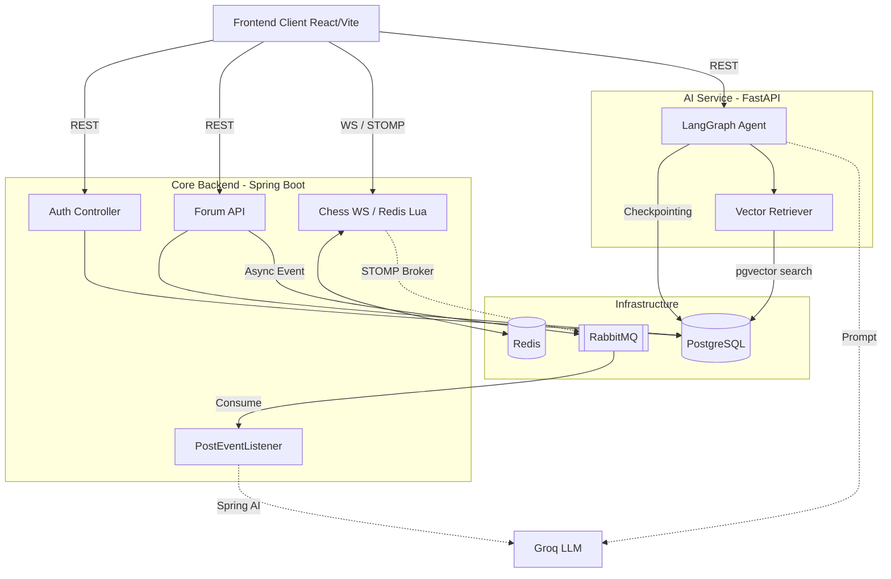

# ♟️ VieChess - Core Backend & AI Services

VieChess is a modern, real-time multiplayer chess platform with an integrated community forum and intelligent AI assistant. 

This repository contains the core services powering the platform, which together with the frontend make up the complete system:
1. **Core Backend (`backend`)**: A robust Java Spring Boot application handling real-time chess logic, community forums, and secure authentication.
2. **AI Service (`ai-service`)**: A Python FastAPI application providing a stateful, RAG-powered conversational assistant to answer user questions about the platform and chess rules.
3. **Frontend SPA**: Built with React + Vite, it is hosted separately at [https://viechess.vercel.app/](https://viechess.vercel.app/) and its source code is located at [ximofam/web_game_chess_online_frontend](https://github.com/ximofam/web_game_chess_online_frontend).

---

## 🌟 Key Features

### 🎮 Real-Time Chess Engine (Backend)
- **STOMP over WebSockets:** Low-latency bidirectional communication routed through a RabbitMQ STOMP relay.
- **High-Performance State Management:** In-game state (FEN, timers, turn control) is managed entirely in **Redis** using atomic Lua scripts and Redisson distributed locks to ensure zero race conditions during rapid play.
- **Game Mechanics:** Move validation via `chesslib`, draw offers, resignation, and automated timeouts via Spring TaskScheduler.
- **Matchmaking & Rooms:** Lobby management, spectator support, and presence tracking.

### 🤖 Intelligent AI Assistant (AI Service)
- **Stateful Conversational Agent:** Built with **LangGraph** to manage multi-turn chat sessions with automated memory pruning (summarizing history when context grows too large).
- **RAG Pipeline:** Integrates with **pgvector** to retrieve platform business rules and documentation. 
- **Smart Query Routing:** Uses a small LLM to classify incoming questions and route them to specific sub-graphs (RAG pipeline vs. direct chess knowledge vs. chitchat) to optimize LLM cost and speed.
- **Automated Content Moderation (Backend):** The Spring Boot backend independently utilizes Spring AI to automatically moderate forum posts via LLM before they are published.

### 💬 Community Forums (Backend)
- **Discussions:** Create posts, comment threads, and like content.
- **Media Uploads:** Seamless image hosting via Cloudinary.
- **Async Processing:** Event-driven architecture using RabbitMQ for post moderation and system notifications.

### 🔐 Security (Shared)
- **Stateless JWT Auth:** Access and refresh token flows.
- **Shared Trust:** Both the Java Backend and Python AI Service independently verify JWTs using a shared secret, allowing the frontend to securely communicate with both services without a heavy API Gateway.
- **Guest Access:** Support for temporary guest accounts with TTL-based expiration.

---

## 🏗️ System Architecture



---

## 🛠️ Tech Stack

### Core Backend
- **Framework:** Java 21, Spring Boot 3, Spring Security
- **Real-Time:** Spring WebSocket, STOMP Messaging
- **AI Integration:** Spring AI
- **Data & ORM:** Spring Data JPA, Hibernate, Flyway, `chesslib`

### AI Service
- **Framework:** Python 3.10+, FastAPI
- **AI / LLM:** LangChain, LangGraph, HuggingFace Embeddings
- **Vector Search:** `pgvector` (PostgreSQL)

### Shared Infrastructure
- **Database:** PostgreSQL 16 (with `pgvector` extension)
- **Cache & Locks:** Redis, Redisson
- **Message Broker:** RabbitMQ (Task queues & STOMP routing)
- **Storage:** Cloudinary

---

## 🚀 Getting Started

### 1. Prerequisites
- **Java 21** & **Maven**
- **Python 3.10+**
- **Docker & Docker Compose**

### 2. Start Local Infrastructure
The system relies on PostgreSQL, Redis, and RabbitMQ. 
Start them via Docker Compose from the `backend` directory:

```bash
cd backend
make dev-up
```
*Spins up PostgreSQL (port 5432), RabbitMQ (ports 5672, 15672, 61613), and Redis (port 6379).*

### 3. Setup & Run the Backend
Configure the backend environment variables:
```bash
cd backend
cp .env.example .env.dev
```
*(Ensure `JWT_SECRET_KEY`, `POSTGRES_PASSWORD`, `CLOUDINARY_*`, and `GROQ_API_KEY` are configured).*

Run the Spring Boot application:
```bash
./mvnw spring-boot:run -Dspring-boot.run.profiles=dev
```
*API available at `http://localhost:8080`.*

### 4. Setup & Run the AI Service
Configure the AI service environment variables:
```bash
cd ai-service
cp .env.example .env
```
*(Ensure `DATABASE_URL`, `GROQ_API_KEY`, and `JWT_SECRET` are configured to match the backend).*

Setup Python environment and dependencies:
```bash
python -m venv .venv
source .venv/bin/activate
make install
```

Apply database migrations and ingest the project documentation (`docs/business/viechess`) into the vector store:
```bash
make migrate
make ingest
```

Start the FastAPI server:
```bash
make run
```
*AI Service API available at `http://localhost:8000`.*

---

## 📚 Documentation
Detailed business rules, API interactions, state machines, and architectural decisions are located in the [`docs/`](./docs) directory. These Markdown files serve as the ground truth for developers and are actively ingested by the RAG AI Assistant.

---

## 📝 License
This is a personal graduation project. All rights reserved.