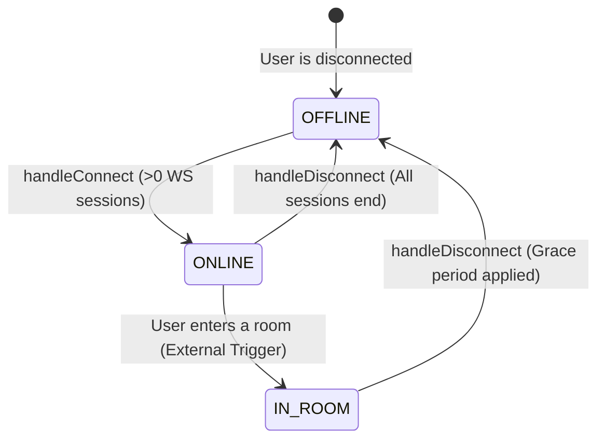
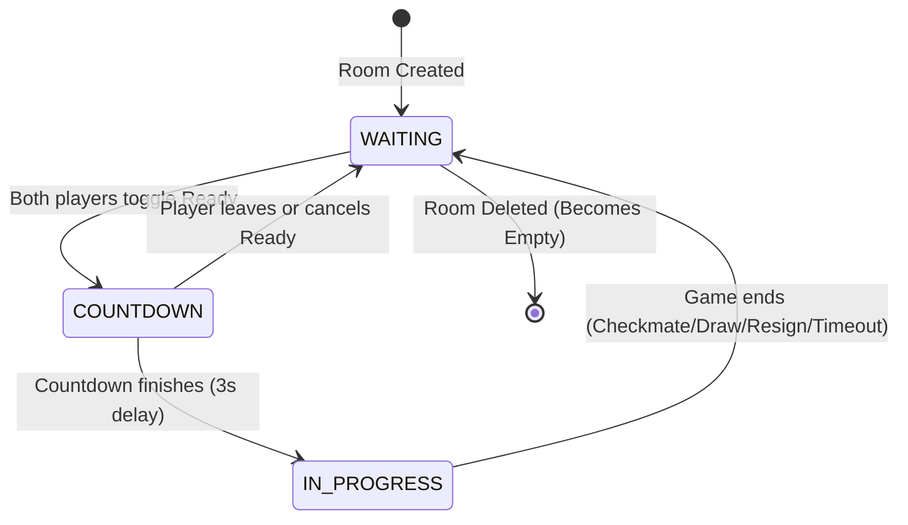
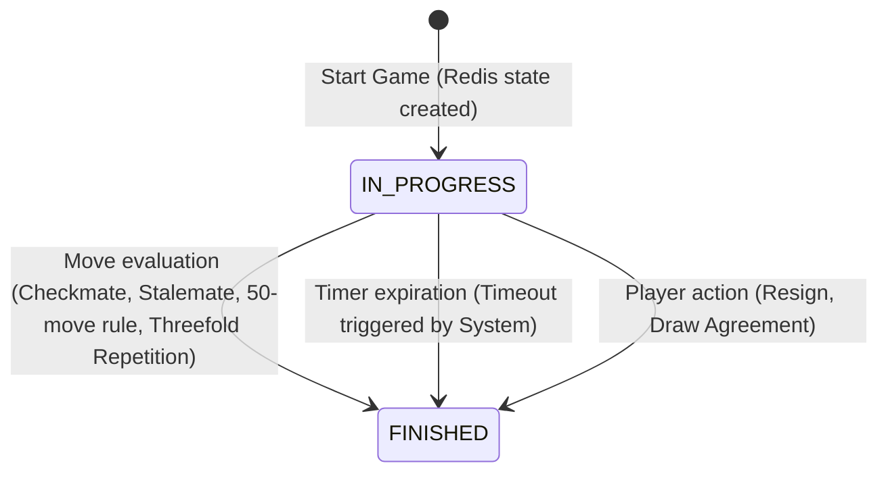
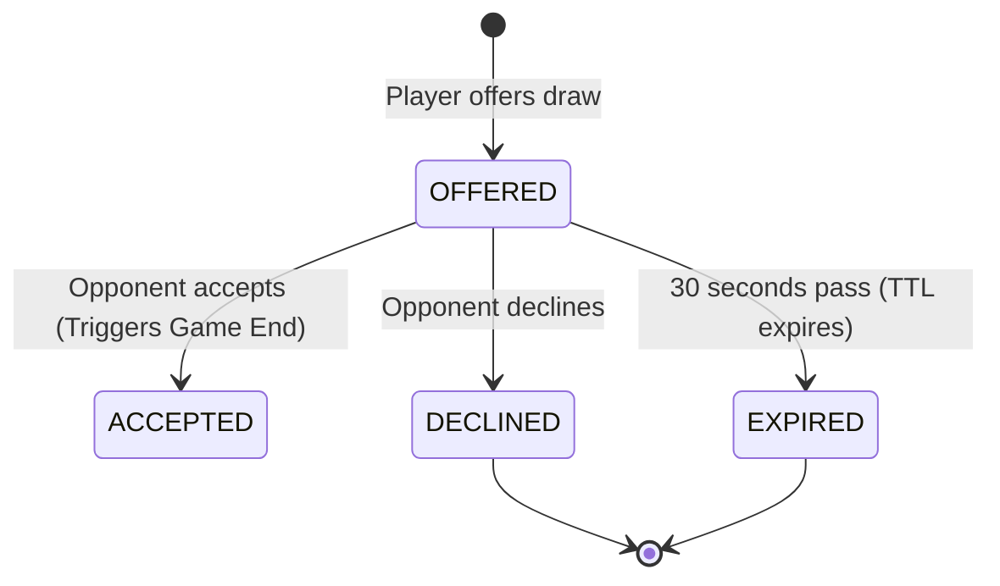
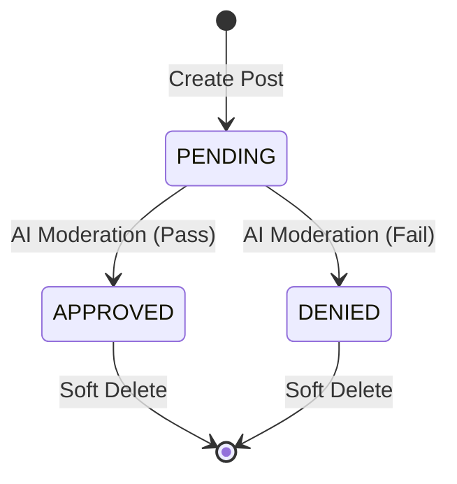
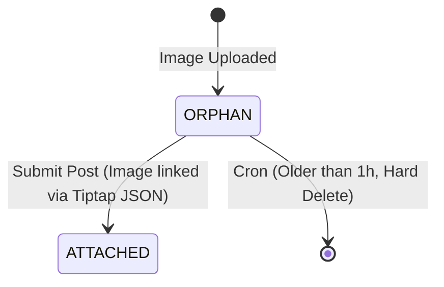

# State Machines

## 1. User Presence
Describes the real-time online status of a user. Source of truth is Redis.

## 2. Room Status
Describes the lifecycle of a real-time chess room.

## 3. Game State
Describes the lifecycle of an active chess match in Redis.

## 4. Draw Offer State
Describes the lifecycle of a proposal to draw.

## 5. Forum Post Status
Describes the lifecycle of a discussion post regarding moderation.

## 6. Forum Image Status
Describes the lifecycle of an uploaded image.

