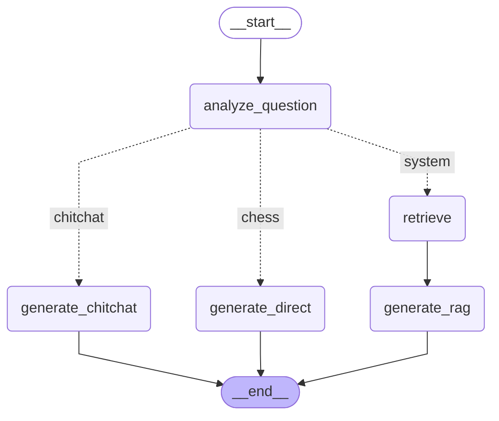

# RAG Chat — LangGraph

```mermaid
---
config:
  flowchart:
    curve: linear
---
graph TD;
	__start__([<p>__start__</p>]):::first
	analyze_question(analyze_question)
	retrieve(retrieve)
	generate_rag(generate_rag)
	generate_direct(generate_direct)
	generate_chitchat(generate_chitchat)
	__end__([<p>__end__</p>]):::last
	__start__ --> analyze_question;
	analyze_question -. &nbsp;chitchat&nbsp; .-> generate_chitchat;
	analyze_question -. &nbsp;chess&nbsp; .-> generate_direct;
	analyze_question -. &nbsp;system&nbsp; .-> retrieve;
	retrieve --> generate_rag;
	generate_chitchat --> __end__;
	generate_direct --> __end__;
	generate_rag --> __end__;
	classDef default fill:#f2f0ff,line-height:1.2
	classDef first fill-opacity:0
	classDef last fill:#bfb6fc
```
