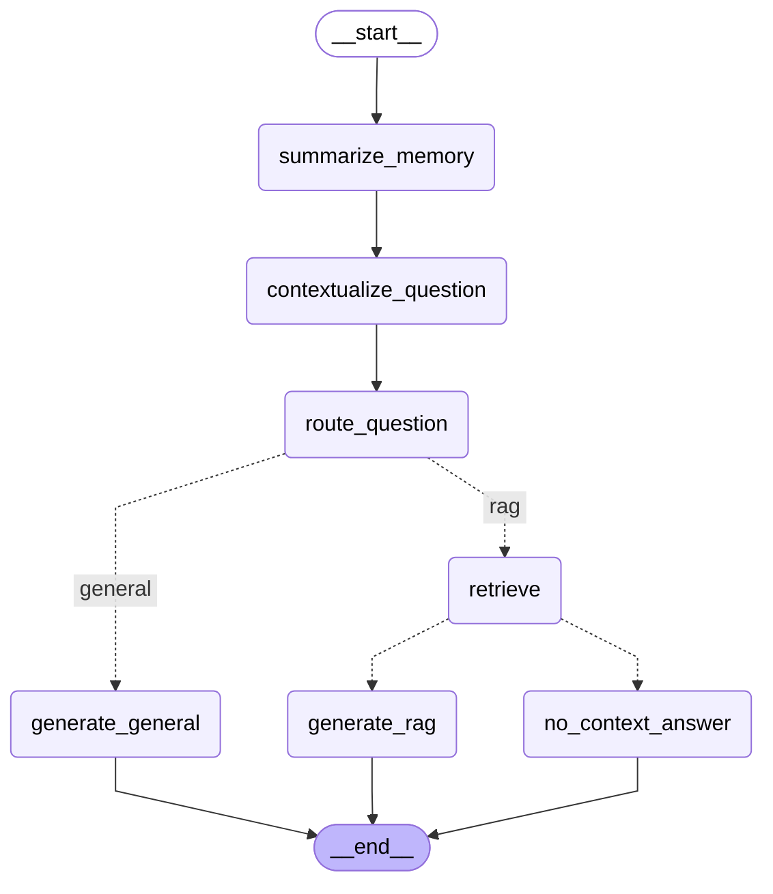

# RAG Chat — LangGraph

```mermaid
---
config:
  flowchart:
    curve: linear
---
graph TD;
	__start__([<p>__start__</p>]):::first
	summarize_memory(summarize_memory)
	contextualize_question(contextualize_question)
	route_question(route_question)
	retrieve(retrieve)
	generate_rag(generate_rag)
	no_context_answer(no_context_answer)
	generate_general(generate_general)
	__end__([<p>__end__</p>]):::last
	__start__ --> summarize_memory;
	contextualize_question --> route_question;
	retrieve -.-> generate_rag;
	retrieve -.-> no_context_answer;
	route_question -. &nbsp;general&nbsp; .-> generate_general;
	route_question -. &nbsp;rag&nbsp; .-> retrieve;
	summarize_memory --> contextualize_question;
	generate_general --> __end__;
	generate_rag --> __end__;
	no_context_answer --> __end__;
	classDef default color:#000000,fill:#f2f0ff,line-height:1.2
	classDef first fill-opacity:0
	classDef last fill:#bfb6fc

```
