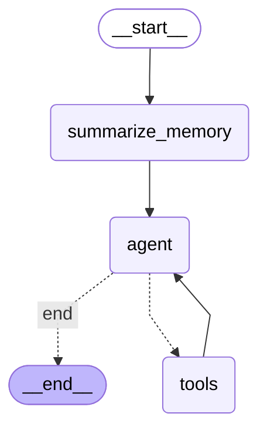

# RAG Chat — LangGraph

```mermaid
---
config:
  flowchart:
    curve: linear
---
graph TD;
	__start__([<p>__start__</p>]):::first
	summarize_memory(summarize_memory)
	agent(agent)
	tools(tools)
	__end__([<p>__end__</p>]):::last
	__start__ --> summarize_memory;
	agent -. &nbsp;end&nbsp; .-> __end__;
	agent -.-> tools;
	summarize_memory --> agent;
	tools --> agent;
	classDef default color:#000000,fill:#f2f0ff,line-height:1.2
	classDef first fill-opacity:0
	classDef last fill:#bfb6fc

```
