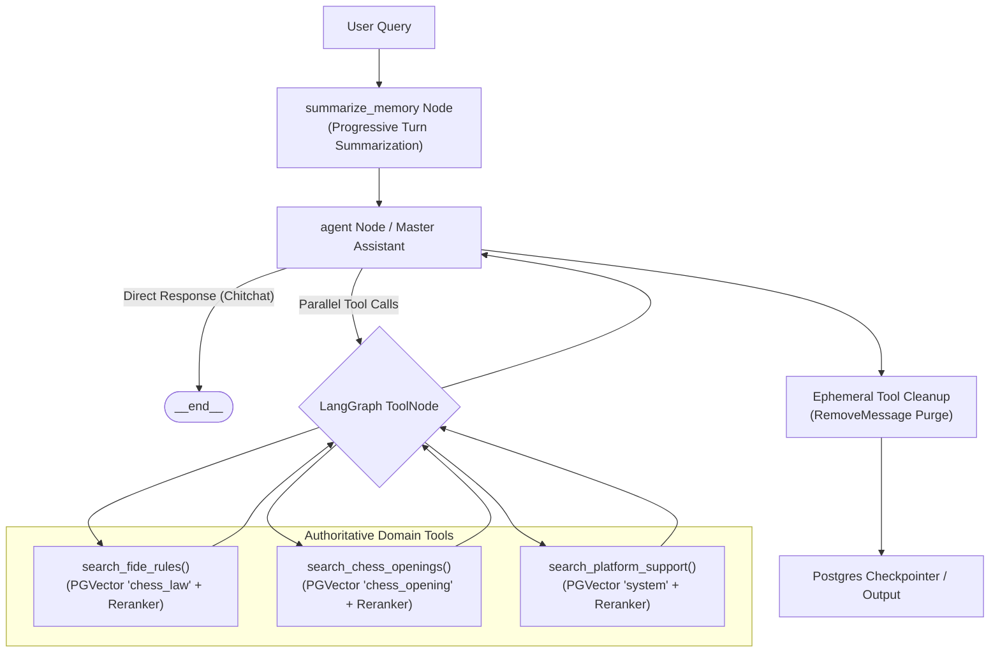
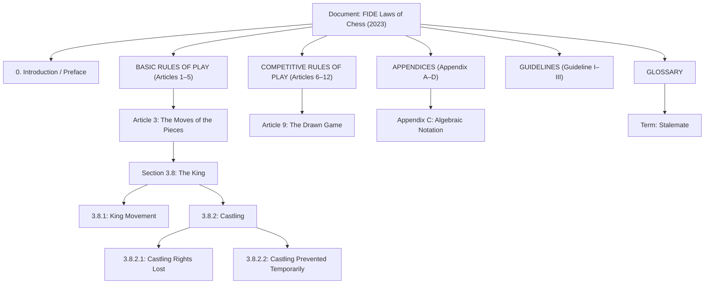
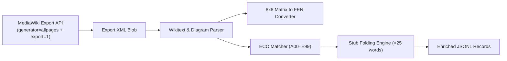

# RAG Pipeline Specification — Knowledge Indexing & Retrieval

## 1. Overview
This specification details the **Knowledge Indexing & Multi-Domain Retrieval** pipeline for the Chess AI Service.

Rather than treating regulatory and theoretical documents as unstructured text and applying uniform, fixed-size token slicing (naive chunking), the indexing pipeline implements **Structure-Aware Indexing** across two distinct chess domains and a platform knowledge domain:

1. **`chess_law` (FIDE Laws of Chess):** Models legal regulatory hierarchy (Document → Category → Article → Section → Subsection) with Vision LLM diagram extraction and contextual breadcrumbs.
2. **`chess_opening` (Chess Opening Theory & ECO Taxonomy):** Crawls Wikibooks Opening Theory via MediaWiki batch export, converts 8x8 diagram matrices deterministically to FEN, folds leaf stubs into parent continuations, and joins standardized ECO codes (A00–E99).
3. **`system` (Platform Knowledge):** Header-aware markdown splitting of platform features, matchmaking, WebSocket connections, auth, and error flows.




---

## 2. Source Document Profiles

### 2.1. FIDE Laws of Chess (`domain: "chess_law"`)
- **Source File:** `docs/chess/fide/20230101Laws-of-Chess.pdf`
- **Document Title:** FIDE Laws of Chess
- **Governing Body:** International Chess Federation (FIDE)
- **Version:** 2023 (Effective: 2023-01-01)
- **Primary Chunker:** `FideSplitter` (`app/rag/ingestion/fide_splitter.py`)

### 2.2. Chess Opening Theory (`domain: "chess_opening"`)
- **Source API:** MediaWiki API (`https://en.wikibooks.org/w/api.php`) under root `Chess Opening Theory`
- **ECO Database:** Lichess Openings dataset (`a.tsv`–`e.tsv` covering ECO codes `A00`–`E99`)
- **Processed Artifacts:**
  - `docs/chess/openings/chess_opening_theory.jsonl` (Processed opening documents)
  - `docs/chess/openings/eco_openings.tsv` (Cached ECO taxonomy)
- **Primary Crawler & Parser:** `OpeningCrawler` (`scripts/crawl_wikibooks.py`)

### 2.3. Platform Documentation (`domain: "system"`)
- **Source Directory:** `docs/business/viechess/`
- **Format:** Markdown files covering platform rules, matchmaking, room states, timeouts, forum regulations.
- **Primary Chunker:** `MarkdownHeaderTextSplitter` + `RecursiveCharacterTextSplitter`.

---

## 3. Structural Hierarchy & Chunking Strategies

### 3.1. FIDE Laws Hierarchy (`FideSplitter`)
The document is parsed into an in-memory N-ary tree (`SectionNode`):



- **Core Chunking Rule:** `Logical Boundary > Token Boundary`.
  - Target chunk size: 400–700 tokens (~1,600–2,800 chars).
  - Hard cap: ~1,000 tokens (4,000 chars) with 75-token overlap.
- **Diagram Extraction (`chess_vision.py`):**
  - PyMuPDF extracts images per page; Vision LLM generates FEN and descriptions.
  - Cached locally in `docs/chess/fide/diagrams_cache.json`.

---

### 3.2. Opening Theory Processing (`OpeningCrawler`)

The crawler processes 3,000+ Wikibooks opening pages via the MediaWiki export API:



#### 1. Batch API Export
Uses `action=query`, `generator=allpages`, `gapprefix=Chess Opening Theory`, `gaplimit=500`, `export=1` to download entire subtrees in ~7 round trips with automatic `continue` token pagination.

#### 2. Deterministic 8x8 Board Matrix to FEN Conversion
Templates such as `{{Chess Opening Theory/Position}}`, `{{Chess/board}}`, and `{{Chess diagram}}` contain 64 positional tokens (`rd`, `nd`, `bd`, `qd`, `kd`, `pd`, `rl`, `nl`, `bl`, `ql`, `kl`, `pl`, and empty squares).
- `squares_to_fen_board(squares)` converts ranks 8 down to 1 into standard FEN notation with 100% determinism and zero LLM cost:
  ```text
  [Diagram:
  - FEN: r1bqkbnr/pppppppp/2n5/1B6/4P3/8/PPPP1PPP/RNBQK1NR
  - Moves: 1. e4 Nc6 2. Bb5
  - Name: Pseudo-Spanish Variation]
  ```

#### 3. Standard PGN Move Derivation & ECO Joining
- Titles encode move paths: `Chess Opening Theory/1. e4/1...c5/2. Nf3/2...d6` → `1. e4 c5 2. Nf3 d6`.
- `match_eco_code` matches exact or longest prefix PGN strings against the cached Lichess dataset (`eco_openings.tsv`), injecting `eco_code` (e.g. `B20`) and `eco_name` (e.g. `Sicilian Defense`).

#### 4. Stub Folding Engine
Subpages with word count < 25 (e.g. rare sidelines with only 1 line of text) are folded into their direct parent document under `### Continuations & Sub-variations:` with their move, note, and FEN. This eliminates sparse/hollow chunks while preserving deep line context.

#### 5. Breadcrumb Context Injection
Each opening chunk is prepended with standard structured headers:
```text
[Opening: Sicilian Defense | ECO Code: B20]
[Path: Chess Opening Theory > 1. e4 > 1...c5 (Sicilian Defense)]
[PGN Moves: 1. e4 c5]
```

---

## 4. Metadata Schemas

### 4.1. FIDE Rules Chunk Metadata (`domain: "chess_law"`)
```json
{
  "document": "FIDE Laws of Chess",
  "version": "2023",
  "source": "FIDE",
  "effective_date": "2023-01-01",
  "domain": "chess_law",
  "level": "subsection",
  "section_id": "3.8.2",
  "title": "Castling",
  "category": "basic_rules",
  "article": "Article 3",
  "section": "3.8",
  "subsection": "3.8.2",
  "diagrams": [
    {
      "fen": "r3k2r/8/8/8/8/8/8/R3K2R w KQkq - 0 1",
      "description": "Vị trí ban đầu đủ điều kiện nhập thành của cả hai cánh Vua và Hậu.",
      "page": 6,
      "section_id": "3.8.2"
    }
  ]
}
```

### 4.2. Opening Theory Chunk Metadata (`domain: "chess_opening"`)
```json
{
  "title": "Chess Opening Theory/1. e4/1...c5",
  "source": "https://en.wikibooks.org/wiki/Chess_Opening_Theory/1._e4/1...c5",
  "domain": "chess_opening",
  "opening_family": "1. e4",
  "move_path": ["1. e4", "1...c5"],
  "depth": 2,
  "parent_title": "Chess Opening Theory/1. e4",
  "moves_pgn": "1. e4 c5",
  "eco_code": "B20",
  "eco_name": "Sicilian Defense",
  "is_stub": false,
  "license": "CC BY-SA 3.0 (Wikibooks contributors)"
}
```

---

## 5. Storage & CLI Ingestion Interface

### 5.1. Storage Layer
- **Vector Store:** PostgreSQL `PGVector` via `langchain-postgres` (Schema: `ai_service`, collection: `knowledge_doc`).
- **Batching:** 50–100 documents per insert batch with real-time progress logging.

### 5.2. CLI / Makefile Commands

| Command | Action |
|---|---|
| `make ingest-chess` | Ingest FIDE Laws of Chess PDF into Vector DB |
| `make ingest-chess-clear` | Clear Vector DB and re-ingest FIDE Laws PDF |
| `make crawl-openings` | Crawl 3,000+ Wikibooks pages and export to `docs/chess/openings/chess_opening_theory.jsonl` |
| `make ingest-openings` | Ingest `chess_opening_theory.jsonl` into Vector DB (`domain="chess_opening"`) |
| `make ingest-openings-clear`| Clear Vector DB and re-ingest Opening Theory |
| `make ingest` | Ingest platform Markdown documentation (`domain="system"`) |
### 5.3. Embedding Model Providers & Local Execution

| Provider (`EMBEDDING_PROVIDER`) | Engine | Required Variables | Description |
|---|---|---|---|
| `huggingface_local` / `local` | `HuggingFaceEmbeddings` | `EMBEDDING_MODEL`, `EMBEDDING_DEVICE` | Runs in-process via PyTorch / sentence-transformers (offline capable, no API key needed). Default: `sentence-transformers/all-MiniLM-L6-v2` on `cpu`. |
| `huggingface` | `HuggingFaceEndpointEmbeddings` | `HUGGINGFACE_API_KEY`, `EMBEDDING_MODEL` | Calls Hugging Face Serverless Inference API. |
| `openai` | `OpenAIEmbeddings` | `OPENAI_API_KEY`, `EMBEDDING_MODEL` | Calls OpenAI Embeddings API (e.g. `text-embedding-3-small`). |

> [!NOTE]
> When switching embedding models or providers with different vector dimensions (e.g., 384 vs 1536), existing vector store collections must be cleared and re-ingested (`make ingest-chess-clear` / `make ingest-openings-clear`).

---

## 6. Agentic Execution, Memory Management & 2-Stage Retrieval

### 6.1. Multi-Domain Agentic Tool Calling
The system uses an **Agentic ReAct Architecture** where the LLM Master Assistant (`agent_node`) dynamically selects zero, one, or multiple tools in parallel (**Parallel Tool Calling**):
- **`search_fide_rules(query)`**: Traverses `domain='chess_law'` for official FIDE laws, piece rules, and arbiter regulations.
- **`search_chess_openings(query)`**: Traverses `domain='chess_opening'` for ECO classifications (A00–E99), opening lines, and strategic plans.
- **`search_platform_support(query)`**: Traverses `domain='system'` for platform rules, room states, matchmaking, and WebSocket connectivity.

### 6.2. Embedded 2-Stage Retrieval & Semantic Reranking
Each tool executes a localized 2-stage retrieval pipeline:
1. **Stage 1 (Bi-Encoder Dense Candidate Pool):** Queries PGVector with metadata domain filtering (`{"domain": domain}`) retrieving the top `RERANKER_CANDIDATES_K` (default: 8) candidate documents.
2. **Stage 2 (Cross-Encoder Reranker):** `cross-encoder/ms-marco-MiniLM-L-6-v2` computes fine-grained cross-attention between query and chunk texts.
3. **Sigmoid Normalization & Filtering:** Normalizes logits to probabilities $[0.0, 1.0]$ via Sigmoid with overflow clamping $[-50, 50]$, discarding chunks below `RERANKER_SCORE_THRESHOLD = 0.05`.

### 6.3. Progressive Turn-Boundary Summarization (`summarize_memory` node)
To prevent infinite token accumulation in stateful multi-turn conversations:
- **Turn-based Threshold:** Controlled by `CHAT_SUMMARY_TURNS_THRESHOLD = 2` (completed past dialogue turns).
- **Progressive Merging:** Finds any existing `SystemMessage` summary and merges it with newly completed dialogue turns into `SUMMARIZE_PROMPT`.
- **Single Retained Summary:** Emits `RemoveMessage` for the old summary and all summarized dialogue turns, keeping exactly **1** consolidated `SystemMessage` summary in state.
- **Payload Sanitization:** Formats clean User/AI lines without dumping raw multi-thousand-token tool outputs into the summarization prompt.

### 6.4. Ephemeral Tool Cleanup (Strategy 2)
To optimize PostgreSQL checkpointer storage and avoid multi-turn context pollution:
- `ToolMessage` and `AIMessage(tool_calls)` exist **only ephemerally** during the turn they were executed.
- When `agent_node` completes synthesizing the final text answer, it returns `RemoveMessage` commands for all intermediate tool scratchpad messages of that turn.
- The PostgreSQL checkpointer only persists clean `[HumanMessage, AIMessage]` pairs, cutting multi-turn input token consumption by **up to 70%**.

### 6.5. LangSmith Tracing & Observability
- Integrated with LangSmith tracing via `LANGCHAIN_TRACING_V2=true`.
- Environment variables are automatically injected during the FastAPI lifespan startup (`app/main.py`), capturing execution traces, latency, and token breakdowns per node run.

