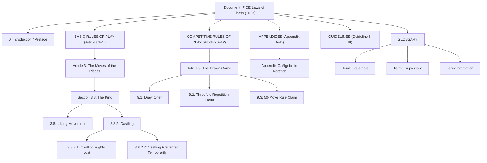

# RAG Pipeline Specification — Document Indexing (Chess Rules)

## 1. Overview
This specification details the **Document Indexing** phase of the RAG pipeline for the Chess domain in the AI Service. 

Rather than treating regulatory documents as unstructured text and applying uniform, fixed-size token slicing (naive chunking), the indexing pipeline implements **Structure-Aware Indexing**. It mirrors the legal hierarchy defined by the **FIDE Laws of Chess** (Document → Category → Article → Section → Subsection / Rule) to preserve logical cohesion, provide contextual breadcrumbs, and attach rich structural metadata for precise retrieval and citation.

---

## 2. Source Document Profile

- **Source File:** `docs/chess/fide/20230101Laws-of-Chess.pdf`
- **Document Title:** FIDE Laws of Chess
- **Governing Body:** International Chess Federation (FIDE)
- **Version:** 2023
- **Effective Date:** 2023-01-01
- **Domain Metadata:** `domain: "chess"`

---

## 3. Structural Hierarchy & Document Model

### 3.1. Hierarchy Layers
The document is parsed into an in-memory N-ary tree (`SectionNode`) reflecting the exact regulatory structure:



### 3.2. Data Structure (`SectionNode`)
Each recognized node in the document hierarchy tree holds:
- `section_id` (str): Unique hierarchical identifier (e.g. `"3"`, `"3.8"`, `"3.8.2.1"`, `"C"`, `"I"`, `"Glossary.Stalemate"`).
- `title` (str): Extracted title or rule heading.
- `level` (str): Granularity (`"article"`, `"section"`, `"subsection"`, `"appendix"`, `"guideline"`, `"glossary"`, `"glossary_term"`, `"introduction"`).
- `text` (str): Body text belonging directly to this node.
- `children` (list[SectionNode]): Direct descendants.
- `parent` (SectionNode | None): Link to parent node for breadcrumb tracing and parent-child retrieval.
- `page_start` & `page_end` (int | None): 0-indexed page bounds extracted from PDF.

---

## 4. Extraction & Structure Detection Engine

### 4.1. Extraction Engine
- Uses **PyMuPDF (`fitz`)** for clean, low-overhead layout-aware text extraction.
- Supports both continuous stream parsing and per-page boundary tracking (`parse_fide_pdf_by_page`).

### 4.2. Heading Detection Patterns
The parser identifies logical structural transitions using precise multi-line regular expressions:

| Entity | Pattern Regex | Example Match |
|---|---|---|
| **Category Header** | `^(BASIC RULES OF PLAY \| COMPETITIVE RULES OF PLAY \| APPENDICES \| GUIDELINES \| GLOSSARY)$` | `BASIC RULES OF PLAY` |
| **Article** | `^(?:ARTICLE\|Article)\s+(\d+)\s*[:\.\-–—]\s*(.+)` | `Article 3: The Moves of the Pieces` |
| **Subsection** | `^(\d+(?:\.\d+)+)\.?\s+(.*)` | `3.8.2.1 The right to castle has been lost...` |
| **Appendix** | `^(?:APPENDIX\|Appendix)\s+([A-Z])\s*[:\.\-–—]?\s*(.*)` | `Appendix C: Algebraic Notation` |
| **Guideline** | `^(?:GUIDELINES?\|Guidelines?)\s+(I{1,3}\|IV\|V)\s*[:\.\-–—]?\s*(.*)` | `Guideline I: Adjourned Games` |
| **Glossary Term** | Non-numeric capitalized line under Glossary context | `Stalemate`, `Promotion` |

---

## 5. Chunking Strategy: Logical Priority over Token Size

### 5.1. Core Rule: `Logical Boundary > Token Boundary`
Standard splitters blindly cut text at fixed token intervals (e.g. every 500 tokens), fragmenting interdependent legal rules. The FIDE structure-aware chunker applies the following order of precedence:

1. **Subtree Aggregation (Target Size: 400–700 tokens / ~1,600–2,800 chars):**
   - If an entire logical section and all its subsections fit within the target window (e.g. `Article 3.8.2` including `3.8.2.1` and `3.8.2.2`), they are kept as a **single unified chunk**.
2. **Sibling Grouping:**
   - Small leaf siblings under the same parent are merged sequentially until the target size threshold is met.
   - Example: Rules `3.7.3.1` (en passant condition) and `3.7.3.2` (en passant timing) remain in the same chunk.
3. **Graceful Overflow Splitting (Hard Cap: ~1,000 tokens / 4,000 chars):**
   - If an individual rule section exceeds the maximum character threshold, it is split along paragraph (`\n\n`) or sentence (`. `) boundaries with a sliding overlap of **~75 tokens (~300 chars)**.

---

## 6. Context Hierarchy Injection (Breadcrumbs)

Embedding raw sentences like *"The right to castle has been lost..."* lacks global context and confuses embedding models. Every emitted chunk is prefixed with its full ancestral path:

```text
FIDE Laws of Chess
Basic Rules of Play
3: The Moves of the Pieces
3.8: The King
3.8.2: Castling

3.8.2 by 'castling'. This is a move of the king and either rook...
3.8.2.1 The right to castle has been lost if:
a. the king has already moved, or
b. with a rook that has already moved.
3.8.2.2 Castling is prevented temporarily...
```

### 6.2. Chessboard Diagram & FEN Extraction (Vision LLM)

Regulatory rules frequently include visual board diagrams (e.g. valid moves for pieces, castling geometry, en passant setup, check/stalemate positions). The indexing pipeline integrates **Vision LLM Processing with Local Caching**:

1. **PDF Image Extraction & Filtering**:
   - PyMuPDF extracts images per page, discarding non-board icons (<150px or non-square aspect ratio).
2. **Vision LLM Parsing**:
   - The multimodal model evaluates the diagram image along with surrounding page text.
   - Generates a valid standard **FEN (Forsyth–Edwards Notation)** string, a human-readable explanation, and the target `section_id`.
3. **Local Cache (`docs/chess/fide/diagrams_cache.json`)**:
   - Extracted diagrams are cached locally for deterministic, low-cost re-ingestion and human verification.
4. **Chunk Content & Metadata Injection**:
   - Injected into `page_content` as:
     ```text
     [Diagram / Ví dụ bàn cờ:
     - FEN: r3k2r/8/8/8/8/8/8/R3K2R w KQkq - 0 1
     - Mô tả: Vị trí ban đầu đủ điều kiện nhập thành của cả hai cánh Vua và Hậu.]
     ```
   - Added to chunk metadata under `diagrams`: `[{"fen": "...", "description": "...", "page": 6, "section_id": "3.8.2.1"}]`.

---

## 7. Metadata Schema

Every indexed chunk in the vector store is decorated with comprehensive metadata for semantic and filtered retrieval:

```json
{
  "document": "FIDE Laws of Chess",
  "version": "2023",
  "source": "FIDE",
  "effective_date": "2023-01-01",
  "domain": "chess",
  "level": "subsection",
  "section_id": "3.8.2",
  "section_id_range": "3.8.2–3.8.2.2",
  "title": "Castling",
  "category": "basic_rules",
  "article": "Article 3",
  "article_number": "3",
  "section": "3.8",
  "subsection": "3.8.2",
  "parent_section_id": "3.8",
  "page_start": 6,
  "page_end": 7,
  "diagrams": [
    {
      "fen": "r3k2r/8/8/8/8/8/8/R3K2R w KQkq - 0 1",
      "description": "Vị trí ban đầu đủ điều kiện nhập thành của cả hai cánh Vua và Hậu.",
      "page": 6,
      "section_id": "3.8.2"
    }
  ]
}
```

### Metadata Field Reference:
- `domain`: Distinguishes chess regulatory documents (`chess`) from platform docs (`viechess`).
- `category`: Top-level regulatory category (`basic_rules`, `competitive_rules`, `appendix`, `other`).
- `article` / `article_number`: Top-level article classification for filtered scoped search.
- `section` / `subsection`: Pinpoints exact subsection boundaries for targeted citations.
- `parent_section_id`: Enables parent context expansion during response generation.
- `page_start` / `page_end`: Exact page citation for the frontend UI.
- `diagrams`: List of extracted chessboard diagrams associated with this chunk containing FEN strings and descriptions.

---

## 8. Dedicated Special Sections

### 8.1. Glossary (`level: "glossary_term"`)
- Definitions (e.g. *stalemate, illegal move, dead position, flag-fall, touched piece*) are indexed with their specific term names.
- Allows direct retrieval for questions like *"Thế nào là dead position?"* without retrieving entire article bodies.

### 8.2. Appendix C — Algebraic Notation (`level: "appendix", appendix: "C"`)
- Covers piece prefixes (`K, Q, R, B, N`) and notation symbols (`x, +, #, 0-0, e.p.`).
- Directly addresses syntax queries such as *"Ký hiệu 0-0 và e.p. nghĩa là gì?"*.

---

## 9. Storage & Ingestion Interface

### 9.1. Storage Layer
- **Production:** PostgreSQL `PGVector` (Schema: `ai_service`, collection: `knowledge_doc`).
- **Local/Test:** Chroma vector store.
- **Batching:** Documents are embedded and inserted in batches of 50 to maintain low memory pressure.

### 9.2. CLI / Ingestion Commands
- **Standard Ingestion:**
  ```bash
  make ingest-chess
  # Underlying command: python -m scripts.ingest_chess --path ./docs/chess/fide/20230101Laws-of-Chess.pdf
  ```
- **Clean Ingest (Wipe existing vectors before insert):**
  ```bash
  make ingest-chess-clear
  ```

---

## 10. Pipeline Query Routing & Retrieval Filtering

### 10.1. Query Analysis & Domain Routing (`route_question` node)
- **Router LLM:** Employs `get_router_llm()` to classify questions in 1 shot without additional latency.
- **Output Schema:** Structured JSON parsed via `_parse_router_output()`:
  - `question_type`: `"rag"` (needs knowledge retrieval) | `"general"` (casual chitchat/opinions).
  - `domain`: `"chess"` (FIDE rules, moves, notation) | `"system"` (platform features, rooms, websocket, auth) | `"all"` (cross-domain or ambiguous).

### 10.2. Filtered Retrieval (`retrieve_docs` node & `retriever.py`)
- **Strict Domain Filtering:**
  - `domain == "chess"`: Vector search with `filter={"domain": "chess"}`.
  - `domain == "system"`: Vector search with `filter={"domain": "system"}`.
  - `domain == "all"`: Unfiltered vector search across all indexed knowledge.
- **Relevance Cutoff:** Discards retrieved documents with score below `RETRIEVAL_SCORE_THRESHOLD` (default: 0.5), transitioning to `no_context_answer` if no documents qualify.

