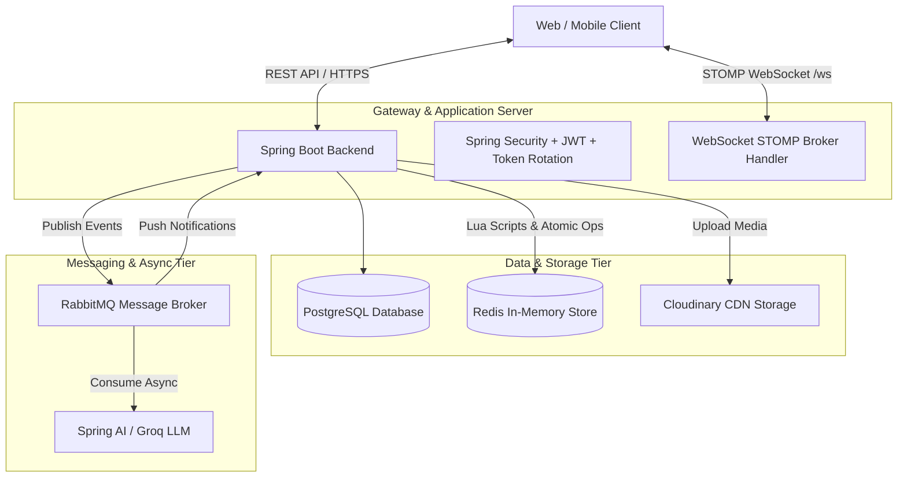

# ♟️ Web Game Chess Online & Community Platform - Backend

[](https://openjdk.org/projects/jdk/21/)
[](https://spring.io/projects/spring-boot)
[](https://spring.io/projects/spring-ai)
[-336791.svg?logo=postgresql&logoColor=white)](https://www.postgresql.org/)
[](https://redis.io/)
[](https://www.rabbitmq.com/)
[](https://www.docker.com/)

Hệ thống Backend phân tán, hướng sự kiện (Event-Driven) phục vụ cho nền tảng **Real-time Chess Game** kết hợp **Community Forum** và **AI Content Moderation**.

---

## 📑 Mục lục

- [1. Giới thiệu & Điểm nổi bật](#-1-giới-thiệu--điểm-nổi-bật)
- [2. Kiến trúc Hệ thống (System Architecture)](#-2-kiến-trúc-hệ-thống-system-architecture)
- [3. Tech Stack](#-3-tech-stack)
- [4. Phân hệ Tính năng & Domain Specs](#-4-phân-hệ-tính-năng--domain-specs)
  - [4.1. Auth & Identity](#41-auth--identity)
  - [4.2. Chess Engine, Lobby & Real-time Game](#42-chess-engine-lobby--real-time-game)
  - [4.3. Community Forum & Tiptap Rich-Text](#43-community-forum--tiptap-rich-text)
  - [4.4. Event-Driven AI Moderation](#44-event-driven-ai-moderation)
  - [4.5. Real-time Presence & Notifications](#45-real-time-presence--notifications)
- [5. Cấu trúc Thư mục (Project Structure)](#-5-cấu-trúc-thư-mục-project-structure)
- [6. Data Models & Redis Storage](#-6-data-models--redis-storage)
- [7. API & WebSocket Routes Summary](#-7-api--websocket-routes-summary)
- [8. Quick Start & Setup](#-8-quick-start--setup)
- [9. Testing & Quality Assurance](#-9-testing--quality-assurance)
- [10. Tài liệu Tham khảo (System Docs & Diagrams)](#-10-tài-liệu-tham-khảo-system-docs--diagrams)

---

## 🌟 1. Giới thiệu & Điểm nổi bật

Dự án được tối ưu hóa cho tương tác độ trễ thấp (Low Latency), an toàn dữ liệu và khả năng mở rộng:

- ⚡ **In-Memory State & Atomic Lua Scripts:** Toàn bộ trạng thái phòng cờ, sảnh chờ, ghế ngồi và đồng hồ nước đi được xử lý trên RAM thông qua **14+ Atomic Lua Scripts** trong Redis, loại bỏ triệt để Race Condition. Dữ liệu trong Redis chỉ lưu ID định danh, tầng Java batch hydration 1 truy vấn duy nhất về PostgreSQL trước khi phản hồi Client.
- ⏱️ **Server-Side Turn Timer:** Quản lý đồng hồ thời gian ván đấu chính xác tuyệt đối từ phía Server qua `TaskScheduler` (`ScheduledFuture`), tự động xử thua do `TIMEOUT` mà không phụ thuộc vào Client.
- 🛡️ **Dual-Token Auth & Token Rotation:** Hỗ trợ cả tài khoản `USER` và ẩn danh `GUEST`. Phiên được bảo vệ bằng Access Token ngắn hạn kết hợp Refresh Token lưu trong HttpOnly, Secure, SameSite=Strict Cookie, có cơ chế phát hiện Replay Attack.
- 🤖 **Automated AI Moderation:** Kết hợp Spring AI (Groq Llama 3.3 70B / 8B) và RabbitMQ sau khi giao dịch commit (`AFTER_COMMIT`) để tự động kiểm duyệt nội dung bài viết theo quy chuẩn cộng đồng.
- 💬 **STOMP Broker Relay:** Tích hợp RabbitMQ STOMP Broker Relay cho phép broadcast nước đi cờ vua, trạng thái sảnh, hiện diện người dùng và thông báo tức thời qua WebSocket.

---

## 🏗️ 2. Kiến trúc Hệ thống (System Architecture)



---

## 🛠️ 3. Tech Stack

| Thành phần | Công nghệ / Thư viện | Phiên bản / Mục đích |
| :--- | :--- | :--- |
| **Runtime & Language** | Java OpenJDK | `Java 21 (LTS)` |
| **Framework** | Spring Boot | `4.0.6` (Spring Framework 7) |
| **RDBMS** | PostgreSQL | `16` (pgvector, UUIDv7 time-ordered, Flyway V1-V7) |
| **In-Memory Store** | Redis & Redisson | `Redis 8.8.0`, Lettuce Pool, Redisson `4.0.0` (Distributed Locks) |
| **Message Broker** | RabbitMQ | `3-management` + `rabbitmq_stomp` plugin |
| **Realtime Messaging** | WebSocket / STOMP | Spring WebSocket + SockJS Fallback + RabbitMQ STOMP Relay |
| **Generative AI** | Spring AI | `2.0.0` (Groq API / Llama 3.3 70B & 8B) |
| **Chess Engine** | `chesslib` | `1.3.7` (Board representation, FEN/PGN, Move validation) |
| **Security & JWT** | Spring Security & JJWT | `jjwt 0.12.6`, BCrypt, HttpOnly Cookies, Token Rotation |
| **Media Storage** | Cloudinary SDK | `cloudinary-http5 2.4.0` (Avatars & Post attachments) |
| **Testing** | Testcontainers, JUnit 5 | Testcontainers `1.21.4` (PostgreSQL, RabbitMQ) |
| **Diagnostics** | P6Spy | `p6spy-spring-boot-starter 2.0.1` (SQL query logging) |

---

## 🚀 4. Phân hệ Tính năng & Domain Specs

> 💡 **Chi tiết đặc tả:** Vui lòng tham khảo các tài liệu chuyên sâu trong [`docs/specs/`](./docs/specs/) và [`docs/system/`](./docs/system/).

### 4.1. Auth & Identity
- **User & Guest Authentication:** Đăng ký/đăng nhập tài khoản thường và cấp phát định danh ẩn danh (`guestToken`) lưu tại Cookie với hạn dùng 30 ngày.
- **Token Rotation & Replay Attack Prevention:** Mỗi lần gọi refresh, hệ thống thu hồi `jti` cũ trong Redis và sinh cặp Access/Refresh Token mới.
- **Profile & Avatar:** Cập nhật thông tin cá nhân và upload ảnh đại diện lên Cloudinary (xóa ảnh cũ async).
- 📖 *Xem chi tiết:* [Auth Spec](./docs/specs/auth-spec.md) | [Users Spec](./docs/specs/users-spec.md) | [Auth Sequence](./docs/system/sequence/README.md#1-phân-hệ-xác-thực--quản-lý-phiên-authentication--session-management)

### 4.2. Chess Engine, Lobby & Real-time Game
- **Lobby & Room Management:** Tạo phòng với tùy chỉnh luật chơi (thời gian, increment, rated, private, chat/spectator lock), tìm kiếm sảnh siêu tốc bằng Lua script (`search_lobby.lua`), đổi ghế nguyên tử (`white`, `black`, `spectator`), tự động chuyển host khi chủ phòng rời.
- **International Chess Rules (`chesslib`):** Kiểm tra tính hợp lệ mọi nước đi (UCI format), hỗ trợ đếm ngược 3s chuẩn bị (`Ready`), nhận diện Chiếu hết (`Checkmate`), Pat (`Stalemate`), Luật 50 nước, Không đủ quân, Resign, Draw Offer/Accept (có spam guard TTL 30s) và xuất biên bản chuẩn PGN.
- **Server-Side Turn Timer:** Hệ thống Scheduler đếm lùi thời gian cho từng lượt đi; nếu kỳ thủ mất kết nối hoặc hết giờ, server tự động xử thua do `TIMEOUT`.
- 📖 *Xem chi tiết:* [Chess Spec](./docs/specs/chess-spec.md) | [Chess Sequence](./docs/system/sequence/README.md#4-phân-hệ-trận-đấu-cờ-vua-thời-gian-thực-chess-gameplay--clock-engine)

### 4.3. Community Forum & Tiptap Rich-Text
- **Tiptap JSON AST & Image Lifecycle:** Bài viết lưu dưới dạng JSON cây. Ảnh upload ban đầu mang trạng thái `ORPHAN`, sau khi lưu bài viết được cập nhật thành `ATTACHED`. Cron task định kỳ dọn dẹp ảnh mồ côi khỏi Cloudinary và CSDL.
- **Nested Comments & Interactions:** Cây bình luận đa cấp, hiển thị `replyCount`, `likeCount`. Hỗ trợ like/unlike bài viết và bình luận; Full-Text Search và đa dạng tiêu chí sắp xếp (`newest`, `mostViewed`, `mostLiked`).
- 📖 *Xem chi tiết:* [Forums Spec](./docs/specs/forums-spec.md) | [Post Images Spec](./docs/specs/post-images-spec.md) | [Forum Sequence](./docs/system/sequence/README.md#5-phân-hệ-diễn-đàn--kiểm-duyệt-nội-dung-forums--ai-moderation)

### 4.4. Event-Driven AI Moderation
- **Async AI Pipeline:** Sau khi lưu bài viết (`PENDING`), sự kiện `@TransactionalEventListener(AFTER_COMMIT)` đẩy message vào RabbitMQ `post.queue`. Spring AI Worker tiêu thụ message, gọi LLM phân tích theo quy chuẩn (`check_post.st`), cập nhật trạng thái `APPROVED` hoặc `DENIED` kèm lý do, sau đó gửi thông báo realtime tới tác giả.
- 📖 *Xem chi tiết:* [Forums Spec § 6](./docs/specs/forums-spec.md#6-quy-trình-vòng-đời-ảnh-bài-viết--tích-hợp-tiptap-editor) | [AI Sequence](./docs/system/sequence/README.md#51-tạo-bài-viết--kiểm-duyệt-tự-động-qua-spring-ai-create-post--ai-moderation)

### 4.5. Real-time Presence & Notifications
- **Presence Tracking:** Quản lý trạng thái trực tuyến (`ONLINE`, `IN_ROOM`, `PLAYING`, `OFFLINE`). Tự động khử trùng lặp nhiều kết nối từ cùng tài khoản. Cơ chế heartbeat 15s giữ kết nối và hỗ trợ reconnect khi đang trong trận (`PLAYING`).
- **Targeted Notifications:** Đẩy thông báo cá nhân hóa (likes, comments, kết quả duyệt bài) tức thời tới `/user/queue/notifications`.
- 📖 *Xem chi tiết:* [WebSocket Spec](./docs/specs/websocket-spec.md) | [Notifications Spec](./docs/specs/notifications-spec.md) | [Realtime Sequence](./docs/system/sequence/README.md#6-phân-hệ-thông-báo--đẩy-realtime-notifications--push-delivery)

---

## 📂 5. Cấu trúc Thư mục (Project Structure)

```text
backend/
├── src/main/java/com/ximofam/graduation_project/
│   ├── auth/                    # JWT, Refresh Token Rotation, UserDetails, Security Filters
│   ├── chess/                   # Chess Room, Board, Moves, PGN Generator, STOMP Handlers
│   ├── common/                  # Global Exceptions, RedisKeys, LuaErrorHandler, CloudinaryService
│   ├── configs/                 # Spring AI, Security, Redis, Redisson, RabbitMQ, WebSocket Configs
│   ├── forums/                  # Posts, Nested Comments, Tiptap AST Parser, AI Listeners
│   ├── notifications/           # Real-time Notification Service & Listeners
│   ├── seeds/                   # Superuser & Initial Data Seeder
│   └── users/                   # User Profile, Presence Tracking & Schedulers
├── src/main/resources/
│   ├── db/migration/            # Flyway SQL Migrations (V1__... -> V7__...)
│   ├── lua/
│   │   ├── scripts/             # 14+ Atomic Lua Scripts (create_room, join, move, leave, presence...)
│   │   └── utils/               # Shared Lua Helper Modules (rooms, status, user_presence)
│   ├── prompts/                 # AI Content Moderation Prompt Template (check_post.st)
│   └── application.yaml         # Application Configuration & Environment Profiles
├── docs/                        # Complete System Documentation, Specs & PlantUML Diagrams
├── docker-compose.yml           # Infrastructure Stack (PostgreSQL 16, Redis 8, RabbitMQ)
├── docker-compose.dev.yml       # Full App & Infrastructure Stack
├── Dockerfile                   # Multi-stage Docker Build (Java 21 Alpine)
├── Makefile                     # Shortcut Commands (Docker management, gen-diagrams)
└── pom.xml                      # Maven Build Dependencies
```

---

## 🗄️ 6. Data Models & Redis Storage

### 6.1. Relational Data (PostgreSQL)
Lược đồ quan hệ sử dụng khóa chính **UUIDv7** (Time-ordered Epoch) và hỗ trợ **Soft Delete** (`deleted_at`):
- `users` ➔ Quản lý tài khoản, phân quyền và hồ sơ nhúng `UserProfile`.
- `posts`, `comments`, `post_likes`, `comment_likes`, `post_images` ➔ Dữ liệu diễn đàn và hình ảnh.
- `games` ➔ Lưu trữ ván cờ hoàn tất kèm biên bản PGN chuẩn quốc tế.
- `notifications` ➔ Quản lý thông báo người dùng và metadata.
- 📖 *Xem sơ đồ miền thực thể:* [Domain Model Diagram](./docs/system/class/README.md#1-sơ-đồ-miền-thực-thể-toàn-hệ-thống-system-domain-model)

### 6.2. In-Memory Key Patterns (Redis)
Tất cả các khóa Redis được định nghĩa tập trung tại [`RedisKeys.java`](./src/main/java/com/ximofam/graduation_project/common/utils/RedisKeys.java):

| Key Pattern | Kiểu | Mô tả |
| :--- | :--- | :--- |
| `refresh_token:<jti>` | String (JSON) | Quản lý phiên đăng nhập và Token Rotation (`TokenService`). |
| `sys:online_users` | Set | Tập hợp `userId` đang trực tuyến (khử trùng lặp đa kết nối). |
| `user:<userId>:presence` | Hash | Trạng thái hiện diện (`status`, `roomId`, `role`) của người dùng. |
| `user:<userId>:sessions` | Set | Danh sách Session ID WebSocket đang hoạt động. |
| `room:idx:lobby` | ZSet | Sảnh chờ các phòng cờ, sắp xếp theo epoch `createdAt`. |
| `room:<roomId>` | Hash | Metadata chi tiết của phòng cờ (`status`, `hostId`, `whiteId`, `blackId`, `settings`). |
| `room:<roomId>:game` | Hash | Trạng thái ván đấu (`fen`, `turn`, `whiteRemainingMillis`, `blackRemainingMillis`). |
| `room:<roomId>:game:moves` | List | Danh sách nước đi UCI notation trong ván đấu. |
| `room:<roomId>:game:draw_offer`| String | `userId` đề nghị hòa kèm TTL 30s (Spam guard). |
| `room:<roomId>:spectators` | ZSet | Danh sách khán giả theo dõi phòng cờ. |
| `room:<roomId>:chat` | List | Lịch sử 10 tin nhắn chat gần nhất trong phòng (`LTRIM`). |
| `lock:<key>` | String | Redisson Distributed Lock (ví dụ `lock:game:<roomId>`). |

---

## 📡 7. API & WebSocket Routes Summary

### 7.1. REST Endpoints Overview

| Module | Base Path | Endpoints & Chức năng chính | Tài liệu Đặc tả |
| :--- | :--- | :--- | :--- |
| **Auth** | `/api/auth` | Đăng ký, đăng nhập User/Guest, Token Rotation, Logout | [auth-spec.md](./docs/specs/auth-spec.md) |
| **Users** | `/api/users` | Xem profile công khai/cá nhân, cập nhật thông tin, upload avatar | [users-spec.md](./docs/specs/users-spec.md) |
| **Presence** | `/api/presence` | Đếm số lượng online, tra cứu trạng thái hiện diện người dùng | [users-spec.md](./docs/specs/users-spec.md) |
| **Rooms** | `/api/rooms` | Tìm kiếm sảnh, tạo phòng, xem chi tiết, join/switch-seat/leave phòng, chat | [chess-spec.md](./docs/specs/chess-spec.md) |
| **Games** | `/api/games` | Báo cáo sẵn sàng / bắt đầu đếm ngược ván đấu | [chess-spec.md](./docs/specs/chess-spec.md) |
| **Forums** | `/api/posts`, `/api/comments` | Tạo/xem bài viết (AI check), bình luận phân cấp, like/unlike | [forums-spec.md](./docs/specs/forums-spec.md) |
| **Images** | `/api/post-images` | Upload & xóa ảnh đính kèm bài viết Tiptap | [post-images-spec.md](./docs/specs/post-images-spec.md) |
| **Notifications**| `/api/notifications` | Lấy danh sách phân trang, đếm chưa đọc, đánh dấu đọc, xóa | [notifications-spec.md](./docs/specs/notifications-spec.md) |

### 7.2. WebSocket STOMP Overview (`/ws`)

| Hướng | Destination | Sự kiện & Mục đích | Tài liệu Đặc tả |
| :--- | :--- | :--- | :--- |
| **Sub** | `/topic/lobbies` | Nhận cập nhật sảnh (`ROOM_CREATED`, `ROOM_DELETED`, `ROOM_UPDATED`) | [chess-spec.md](./docs/specs/chess-spec.md) |
| **Sub** | `/topic/room.{roomId}` | Sự kiện trong phòng (`PLAYER_JOINED`, `MOVE_MADE`, `GAME_OVER`, v.v.) | [chess-spec.md](./docs/specs/chess-spec.md) |
| **Sub** | `/topic/user.{userId}` | Theo dõi thay đổi trạng thái hiện diện của người dùng | [websocket-spec.md](./docs/specs/websocket-spec.md) |
| **Sub** | `/user/queue/notifications` | Nhận thông báo cá nhân thời gian thực | [websocket-spec.md](./docs/specs/websocket-spec.md) |
| **Send**| `/app/presence.heartbeat` | Gửi nhịp tim định kỳ 15s duy trì phiên kết nối | [websocket-spec.md](./docs/specs/websocket-spec.md) |
| **Send**| `/app/room.{roomId}.move` | Gửi nước đi cờ vua UCI notation (`e2e4`) | [chess-spec.md](./docs/specs/chess-spec.md) |
| **Send**| `/app/room.{roomId}.resign` | Đầu hàng ván đấu | [chess-spec.md](./docs/specs/chess-spec.md) |
| **Send**| `/app/room.{roomId}.draw.*` | Đề nghị hòa (`offer`), chấp nhận (`accept`), từ chối (`decline`) | [chess-spec.md](./docs/specs/chess-spec.md) |
| **Send**| `/app/room.{roomId}.chat` | Gửi tin nhắn trò chuyện trong phòng đấu | [chess-spec.md](./docs/specs/chess-spec.md) |

---

## 💻 8. Quick Start & Setup

### 8.1. Yêu cầu Tiên quyết
- **Java 21 (LTS)** & **Maven 3.9+** (hoặc dùng `./mvnw`).
- **Docker & Docker Compose**.
- **Make** (tùy chọn).

### 8.2. Cấu hình Môi trường
Tạo tệp `.env.dev` từ mẫu `.env.example`:

```bash
cp .env.example .env.dev
```

Các biến môi trường chính:
```ini
# PostgreSQL
POSTGRES_DB=chess_online_db
POSTGRES_USER=postgres
POSTGRES_PASSWORD=your_password

# Redis
REDIS_HOST=localhost
REDIS_PORT=6379
REDIS_PASSWORD=your_redis_password

# RabbitMQ & STOMP
RABBITMQ_HOST=localhost
RABBITMQ_PORT=5672
RABBITMQ_STOMP_PORT=61613
RABBITMQ_USERNAME=guest
RABBITMQ_PASSWORD=guest

# JWT Security
JWT_SECRET_KEY=RGF5TGFNb3RDaHVvaUJpTWF0RGFuaENob01vaVRydW9uZ1Rlc3REdURhaTI1NkJpdA==
ACCESS_TOKEN_EXP_SEC=900
REFRESH_TOKEN_EXP_DAYS=7

# Spring AI (Groq LLM)
GROQ_API_KEY=gsk_your_groq_api_key_here
GROQ_MODEL=llama-3.3-70b-versatile

# Cloudinary
CLOUDINARY_CLOUD_NAME=your_cloud_name
CLOUDINARY_API_KEY=your_api_key
CLOUDINARY_API_SECRET=your_api_secret
```

### 8.3. Khởi chạy Ứng dụng

#### Option 1: Docker Services + Local Spring Boot (Khuyến nghị cho Development)

```bash
# 1. Khởi chạy PostgreSQL, Redis, RabbitMQ
make docker-up

# 2. Khởi chạy Spring Boot Backend
./mvnw spring-boot:run
```

- **Swagger UI:** `http://localhost:8080/swagger-ui/index.html`
- **OpenAPI Docs:** `http://localhost:8080/v3/api-docs`
- **RabbitMQ Management:** `http://localhost:15672` (`guest`/`guest`)

#### Option 2: Khởi chạy Toàn bộ bằng Docker Compose

```bash
make dev-up      # Khởi chạy full stack (Backend + DB + Redis + RabbitMQ)
make dev-logs    # Xem live logs
make dev-down    # Dừng hệ thống
```

---

## 🧪 9. Testing & Quality Assurance

- **Unit & Integration Tests (với Testcontainers tự động dựng CSDL và RabbitMQ cô lập):**
  ```bash
  ./mvnw clean test
  ```
- **Kiểm tra Code Style (Checkstyle):**
  ```bash
  ./mvnw checkstyle:check
  ```
---

## 📚 10. Tài liệu Tham khảo (System Docs & Diagrams)

| Thư mục / Tài liệu | Nội dung Đặc tả |
| :--- | :--- |
| 📖 [**System Design Overview**](./docs/system/README.md) | Tổng quan kiến trúc, Use Cases, Class và Sequence Diagrams |
| 🎯 [**Use Case Specifications**](./docs/system/usecase/README.md) | Đặc tả chi tiết 58 Ca sử dụng trên 4 phân hệ chính (Mermaid Use Cases) |
| 🧩 [**Class & Domain Models**](./docs/system/class/README.md) | Sơ đồ miền thực thể JPA Entities, Redis Models (Mermaid Class Diagrams) |
| 🔄 [**Sequence Diagrams**](./docs/system/sequence/README.md) | 21 Sơ đồ tuần tự chi tiết các luồng realtime và async (Mermaid Sequences) |
| 📝 [**Auth Specification**](./docs/specs/auth-spec.md) | Đặc tả API xác thực, JWT, Refresh Token Rotation |
| ♟️ [**Chess Specification**](./docs/specs/chess-spec.md) | Đặc tả phòng chơi, sảnh chờ, ván đấu cờ vua, timer và WS topics |
| 🗣️ [**Forums Specification**](./docs/specs/forums-spec.md) | Đặc tả diễn đàn, bình luận đa cấp, kiểm duyệt AI qua RabbitMQ |
| 🖼️ [**Post Images Spec**](./docs/specs/post-images-spec.md) | Vòng đời ảnh Tiptap và cơ chế Cron dọn dẹp ảnh mồ côi |
| 👤 [**Users Specification**](./docs/specs/users-spec.md) | Đặc tả hồ sơ người dùng và hệ thống theo dõi hiện diện (Presence) |
| ⚡ [**WebSocket Specification**](./docs/specs/websocket-spec.md) | Cấu hình STOMP Relay, heartbeat, bảo mật kết nối và format message |

---

<div align="center">
  <b>Web Game Chess Online & Community Platform</b> &copy; 2026. Developed by <a href="https://github.com/ximofam">ximofam</a>.
</div>
