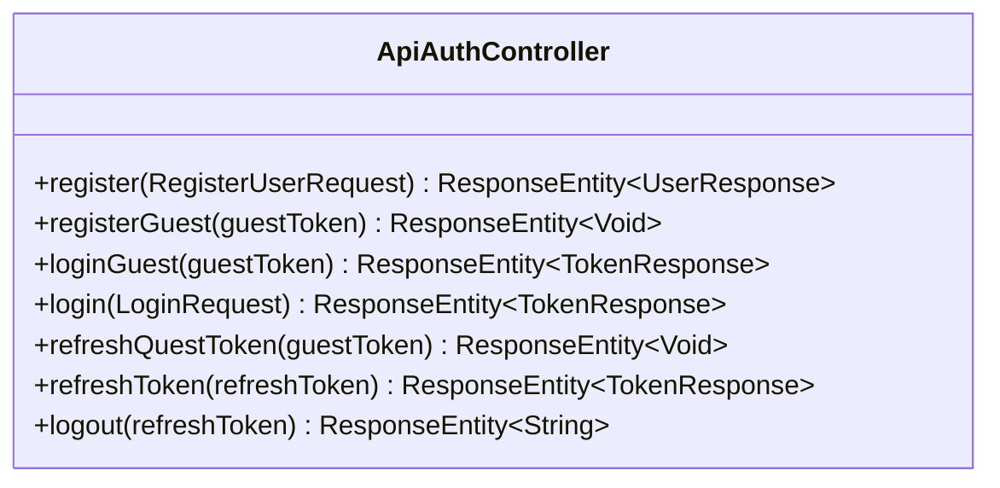
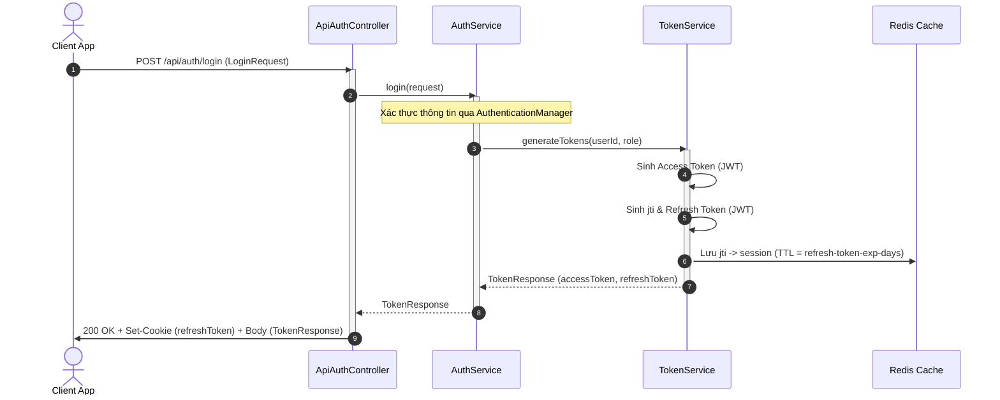
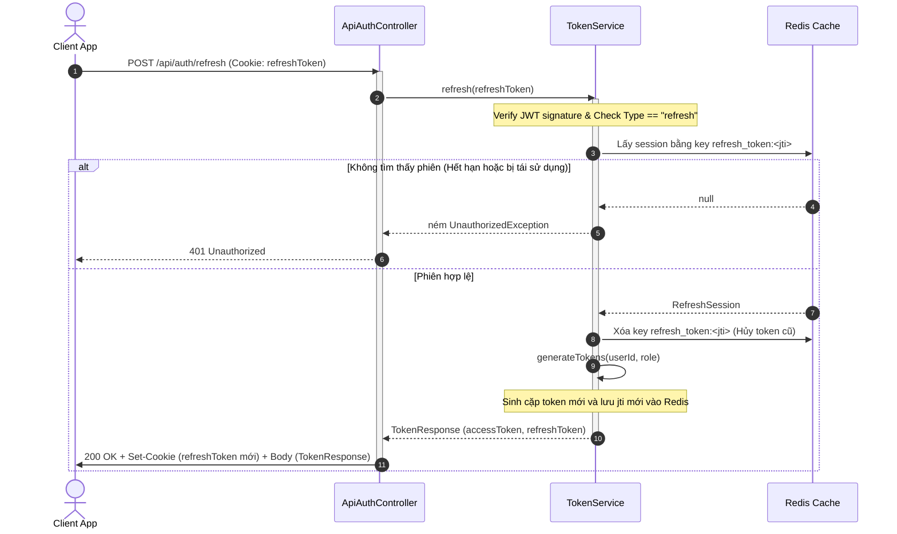

# Đặc tả API: Authentication (Auth API Specification)

Tài liệu này đặc tả chi tiết về hệ thống xác thực (Authentication) của dự án, hỗ trợ đăng nhập/đăng ký cho người dùng
thông thường (**User**) và người dùng ẩn danh (**Guest**).

---

## 1. Tổng quan & Cơ chế xác thực

Hệ thống sử dụng cơ chế xác thực dựa trên **JSON Web Token (JWT)** kết hợp với **Redis** để quản lý phiên và xoay vòng
Refresh Token (Token Rotation).

### Cơ chế Access Token

- **Kiểu:** Bearer JWT (gửi qua header `Authorization: Bearer <token>`).
- **Nơi lưu trữ ở Client:** Bộ nhớ ứng dụng (Memory) hoặc LocalStorage/SessionStorage.
- **Claims:**
    - `sub` (Subject): ID người dùng (`userId`).
    - `role`: Vai trò của người dùng (ví dụ: `USER`, `ADMIN`).
    - `type`: `"access"`.

### Cơ chế Refresh Token

- **Kiểu:** JWT chứa ID phiên làm việc (`jti`).
- **Nơi lưu trữ ở Client:** Cookie `refreshToken` (thuộc tính `HttpOnly`, `Secure`, `SameSite=Strict`,
  `Path=/api/auth`).
- **Xác thực phiên (Session-backed):** Lưu trữ thông tin phiên (`userId`, `userRole`) trong Redis với key
  `refresh_token:<jti>`.
- **Cơ chế xoay vòng (Token Rotation):** Mỗi lần gọi API `/refresh`, `refreshToken` cũ sẽ bị xóa khỏi Redis và một cặp
  token mới (Access + Refresh) được sinh ra để thay thế.

### Cơ chế Guest Token

- **Kiểu:** JWT lưu thông tin khách ẩn danh (`guestId`).
- **Nơi lưu trữ ở Client:** Cookie `guestToken` (thuộc tính `Max-Age` dài hạn cấu hình từ hệ thống).
- **Claims:**
    - `sub`: ID của tài khoản khách (`guestId`).
    - `type`: `"guest"`.

---

## 2. Cấu hình Cookie

| Tên Cookie     | Path        | SameSite                  | HttpOnly    | Mô tả                                                            |
|:---------------|:------------|:--------------------------|:------------|:-----------------------------------------------------------------|
| `guestToken`   | `/`         | `Lax` (hoặc tùy cấu hình) | Có (`true`) | Lưu JWT chứa thông tin tài khoản khách ẩn danh.                  |
| `refreshToken` | `/api/auth` | `Strict`                  | Có (`true`) | Lưu JWT chứa `jti` để thực hiện gia hạn (refresh) token bảo mật. |

---

## 3. Danh sách các API Endpoints

Tất cả các API dưới đây có tiền tố (base path) là `/api/auth`.



### 3.1. Đăng ký tài khoản thường (User Registration)

- **Endpoint:** `POST /api/auth/register`
- **Mô tả:** Đăng ký tài khoản người dùng thường mới.
- **Request Body (JSON):** `RegisterUserRequest`
  ```json
  {
    "username": "example_user",
    "email": "user@example.com",
    "password": "strongpassword123"
  }
  ```
  *Ràng buộc:*
    - `username`: Không trống, độ dài từ 3 đến 50 ký tự.
    - `email`: Không trống, đúng định dạng email.
    - `password`: Không trống.

- **Response:**
    - **Success:** `201 Created`
      ```json
      {
        "id": 1,
        "username": "example_user",
        "email": "user@example.com",
        "avatarUrl": "https://example.com/avatar.jpg",
        "profile": {
          "fullName": "Nguyen Van A",
          "gender": "MALE",
          "dateOfBirth": "16/07/2000"
        }
      }
      ```
    - **Error (Validation failed):** `400 Bad Request` hoặc `422 Unprocessable Entity`.
    - **Error (Email/Username already exists):** `409 Conflict`.

---

### 3.2. Đăng ký tài khoản khách (Register Guest)

- **Endpoint:** `POST /api/auth/register/guest`
- **Mô tả:** Đăng ký tài khoản khách ẩn danh mới nếu trình duyệt chưa có token khách hợp lệ.
- **Headers / Cookies:**
    - Cookie (tùy chọn): `guestToken=<JWT>`
- **Response:**
    - **Trường hợp đã có `guestToken` hợp lệ:** `200 OK` (Không tạo mới).
    - **Trường hợp chưa có hoặc token không hợp lệ:** `201 Created`
        - Set-Cookie: `guestToken=<New_JWT>; Max-Age=<Config_Days>; Path=/`
- **Lưu ý:** API này không trả về dữ liệu body.

---

### 3.3. Đăng nhập tài khoản khách (Login Guest)

- **Endpoint:** `POST /api/auth/login/guest`
- **Mô tả:** Đăng nhập dưới quyền Guest bằng `guestToken` có sẵn từ Cookie.
- **Headers / Cookies:**
    - Cookie (bắt buộc): `guestToken=<JWT>`
- **Response:**
    - **Success:** `200 OK`
        - Set-Cookie: `refreshToken=<JWT>; Path=/api/auth; HttpOnly; SameSite=Strict`
        - Body JSON: `TokenResponse`
          ```json
          {
            "accessToken": "eyJhbGciOi...",
            "refreshToken": "eyJhbGciOi..."
          }
          ```
    - **Error (Token invalid/expired):** `401 Unauthorized`.

---

### 3.4. Đăng nhập tài khoản thường (User Login)

- **Endpoint:** `POST /api/auth/login`
- **Mô tả:** Đăng nhập bằng tài khoản thường (Username/Email và Mật khẩu).
- **Request Body (JSON):** `LoginRequest`
  ```json
  {
    "usernameOrEmail": "user@example.com",
    "password": "strongpassword123"
  }
  ```
  *Ràng buộc:* Các trường không được để trống.
- **Response:**
    - **Success:** `200 OK`
        - Set-Cookie: `refreshToken=<JWT>; Path=/api/auth; HttpOnly; SameSite=Strict`
        - Body JSON: `TokenResponse`
          ```json
          {
            "accessToken": "eyJhbGciOi...",
            "refreshToken": "eyJhbGciOi..."
          }
          ```
    - **Error (Invalid credentials / Locked / Disabled):** `401 Unauthorized`.

---

### 3.5. Gia hạn Guest Token (Refresh Guest Token)

- **Endpoint:** `POST /api/auth/refresh/guest-token`
- **Mô tả:** Kiểm tra và cấp lại (gia hạn) `guestToken` mới để duy trì trạng thái khách dài hạn.
- **Headers / Cookies:**
    - Cookie (bắt buộc): `guestToken=<JWT>`
- **Response:**
    - **Success:** `200 OK`
        - Set-Cookie: `guestToken=<New_JWT>; Max-Age=<Config_Days>; Path=/`
    - **Error:** `401 Unauthorized`.

---

### 3.6. Gia hạn Tokens (Refresh Token Rotation)

- **Endpoint:** `POST /api/auth/refresh`
- **Mô tả:** Sử dụng `refreshToken` từ cookie để đổi cặp Access Token và Refresh Token mới (áp dụng cơ chế xoay vòng).
- **Headers / Cookies:**
    - Cookie (bắt buộc): `refreshToken=<JWT>`
- **Response:**
    - **Success:** `200 OK`
        - Set-Cookie: `refreshToken=<New_JWT>; Path=/api/auth; HttpOnly; SameSite=Strict`
        - Body JSON: `TokenResponse`
          ```json
          {
            "accessToken": "eyJhbGciOi...",
            "refreshToken": "eyJhbGciOi..."
          }
          ```
    - **Error (Token expired / Session not found in Redis / Reuse detected):** `401 Unauthorized`.

---

### 3.7. Đăng xuất (Logout)

- **Endpoint:** `POST /api/auth/logout`
- **Mô tả:** Đăng xuất khỏi hệ thống, hủy phiên làm việc trong Redis và xóa cookie ở Client.
- **Headers / Cookies:**
    - Cookie (tùy chọn): `refreshToken=<JWT>`
- **Response:**
    - **Success:** `200 OK`
        - Clear-Cookie: `refreshToken` (set Max-Age = 0)
        - Body: `"Logged out successfully"`

---

## 4. Luồng hoạt động chính (Workflows)

### 4.1. Đăng nhập hệ thống (User Login)



### 4.2. Xoay vòng Refresh Token (Token Rotation)



---

## 5. Ràng buộc & Xử lý lỗi chung

### Định dạng lỗi thống nhất (Error Response Format)

Hệ thống sử dụng cấu trúc lỗi tiêu chuẩn:

```json
{
  "status": 401,
  "error": "Unauthorized",
  "message": "Refresh token is invalid or has expired.",
  "path": "/api/auth/refresh",
  "timestamp": "2026-07-16T15:47:22.000+00:00"
}
```

### HTTP Status Code thông dụng

- `200 OK`: Yêu cầu xử lý thành công.
- `201 Created`: Tạo mới tài nguyên thành công (Đăng ký tài khoản/khách).
- `400 Bad Request`: Định dạng request không hợp lệ (ví dụ: thiếu body, sai kiểu dữ liệu).
- `401 Unauthorized`: Xác thực không thành công (sai mật khẩu, token hết hạn, token không hợp lệ).
- `409 Conflict`: Xung đột dữ liệu (ví dụ: trùng username hoặc email khi đăng ký).
- `422 Unprocessable Entity`: Dữ liệu không thỏa mãn các điều kiện Validation (ví dụ: mật khẩu quá ngắn, email sai định
  dạng).
