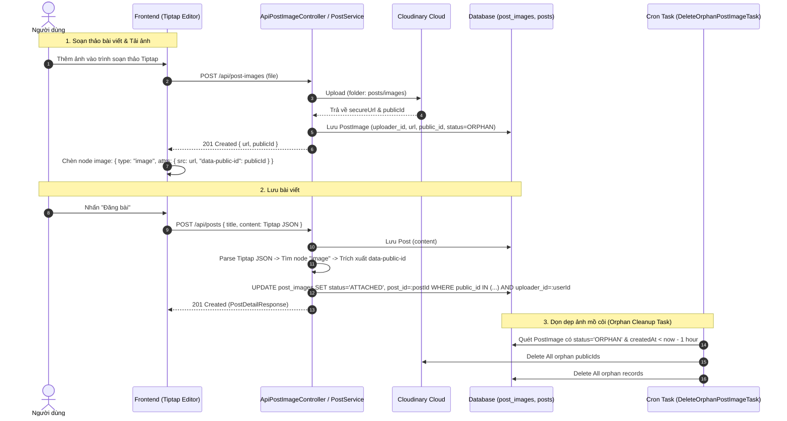

# Đặc tả API: Forums (Forums API Specification)

Tài liệu này đặc tả chi tiết về các API liên quan đến diễn đàn (Bài viết, Bình luận, Lượt thích bài viết/bình luận).

---

## 1. Tổng quan & Xác thực

- Các API liên quan đến bài viết có tiền tố (base path) là `/api/posts`.
- Các API liên quan đến bình luận có tiền tố (base path) là `/api/comments`.
- Các API liên quan đến hình ảnh bài viết có tiền tố (base path) là `/api/post-images`.
- Một số API thay đổi dữ liệu hoặc tương tác (tạo bài viết, thích bài viết, bình luận, quản lý hình ảnh) yêu cầu xác
  thực bằng Access Token thông qua Header `Authorization: Bearer <token>`.
- Trạng thái bài viết (`PostStatus`) bao gồm: `PENDING`, `APPROVED`, `DENIED`.
- Trạng thái ảnh bài viết (`ImageStatus`) bao gồm: `ORPHAN` (ảnh mới upload, chưa gắn vào bài) và `ATTACHED` (ảnh đã gắn
  vào bài viết).
- Khi bài viết mới được tạo, hệ thống sẽ đẩy vào hàng đợi RabbitMQ để thực hiện kiểm duyệt tự động thông qua AI (chuyển
  sang trạng thái `PENDING` rồi cập nhật thành `APPROVED` hoặc `DENIED`).
- Tài khoản có vai trò `GUEST` bị hạn chế không được phép gọi các API tạo bài viết, bình luận, tương tác thích (like)
  hoặc upload/xóa hình ảnh.

---

## 2. Sơ đồ các API Controllers

```mermaid
classDiagram
    class ApiPostController {
        +getPost(Long postId) ResponseEntity~PostResponse~
        +getMyPost(Long postId) ResponseEntity~PostDetailResponse~
        +createPost(CreatePostRequest request) ResponseEntity~PostDetailResponse~
        +deletePost(Long postId) ResponseEntity~ApiResponse~
        +getComments(Long postId, String sortBy, Pageable pageable) ResponseEntity~Page~CommentResponse~~
        +likePost(Long postId, boolean isLike) ResponseEntity~ApiResponse~
        +getPosts(String search, String sortBy, boolean mine, String status, Pageable pageable) ResponseEntity~Page~PostSimpleResponse~~
    }
    class ApiCommentController {
        +getReplies(Long id, String sortBy, Pageable pageable) ResponseEntity~Page~CommentResponse~~
        +createComment(CreateCommentRequest request) ResponseEntity~CommentResponse~
        +likeComment(Long commentId, boolean isLike) ResponseEntity~ApiResponse~
    }
    class ApiPostImageController {
        +uploadPostImage(MultipartFile file) ResponseEntity~Map~String, String~~
        +deletePostImage(String publicId) ResponseEntity~Void~
    }
```



---

## 3. Chi tiết API Endpoints - Posts (/api/posts)

### 3.1. Lấy danh sách bài viết (Get List of Posts)

- **Endpoint:** `GET /api/posts`
- **Mô tả:** Lấy danh sách bài viết có hỗ trợ phân trang, tìm kiếm, sắp xếp và lọc bài viết của chính mình.
    - Mặc định: chỉ trả về bài viết đã được phê duyệt (`APPROVED`).
    - Khi `mine=true`: trả về tất cả bài viết của người dùng đang đăng nhập (mọi trạng thái), có thể lọc thêm theo
      `status`.
- **Headers:**
    - `Authorization: Bearer <Access_Token>` (Không bắt buộc cho listing công khai. **Bắt buộc** khi `mine=true`. Nếu
      có, hệ thống sẽ kiểm tra trạng thái thích của người dùng đối với các bài viết qua trường `liked`).
- **Query Parameters:**
    - `page` (int, default: 0): Số thứ tự trang cần lấy.
    - `size` (int, default: 20): Số lượng phần tử trên mỗi trang.
    - `search` (String, tùy chọn): Từ khóa tìm kiếm theo tiêu đề bài viết (Full-Text Search + ILIKE fallback).
    - `sortBy` (String, default: `"newest"`): Kiểu sắp xếp. Giá trị hợp lệ:
        - `newest` — Mới nhất (`createdAt DESC`).
        - `mostViewed` — Nhiều lượt xem nhất (`viewCount DESC`, `createdAt DESC`).
        - `mostLiked` — Nhiều lượt thích nhất (`likeCount DESC`, `viewCount DESC` nếu bằng nhau, `createdAt DESC`).
    - `mine` (boolean, default: `false`): Nếu `true`, chỉ trả về bài viết của người dùng đang đăng nhập (yêu cầu xác
      thực).
    - `status` (String, tùy chọn): Lọc theo trạng thái bài viết (`PENDING`, `APPROVED`, `DENIED`). Chỉ có hiệu
      lực khi `mine=true`.
- **Response:**
    - **Success:** `200 OK` (Cấu trúc phân trang chứa danh sách `PostSimpleResponse`)
      ```json
      {
        "content": [
          {
            "id": 1,
            "author": {
              "id": 10,
              "username": "nguyenvana",
              "avatarUrl": "https://res.cloudinary.com/.../avatar.jpg"
            },
            "title": "Làm thế nào để bắt đầu với Spring Boot?",
            "viewCount": 150,
            "likeCount": 24,
            "commentCount": 5,
            "createdAt": "2026-07-17T14:16:28Z",
            "liked": true,
            "status": null
          }
        ],
        "page": {
          "size": 20,
          "number": 0,
          "totalElements": 1,
          "totalPages": 1
        }
      }
      ```
      *Lưu ý:* Trường `status` chỉ có giá trị khi `mine=true`, trả về `null` cho listing công khai.
    - **Error (Bad Request):** `400 Bad Request` (khi `mine=true` nhưng chưa đăng nhập).

---

### 3.2. Tạo bài viết mới (Create Post)

- **Endpoint:** `POST /api/posts`
- **Mô tả:** Tạo bài viết mới ở trạng thái chờ duyệt (`PENDING`) và kích hoạt quy trình kiểm duyệt tự động thông qua AI.
- **Headers:**
    - `Authorization: Bearer <Access_Token>` (Bắt buộc)
- **Quyền truy cập:** Không cho phép tài khoản có vai trò `GUEST`.
- **Request Body (JSON):** `CreatePostRequest`
  ```json
  {
    "title": "Tìm hiểu về kiến trúc Event-Driven với RabbitMQ",
    "content": "Nội dung bài viết chi tiết ở đây..."
  }
  ```
  *Ràng buộc:*
    - `title`: Không được để trống, tối đa 100 kí tự.
    - `content`: Không được để trống, tối đa 10000 kí tự.
- **Response:**
    - **Success:** `201 Created` (`PostDetailResponse`)
      ```json
      {
        "id": 2,
        "title": "Tìm hiểu về kiến trúc Event-Driven với RabbitMQ",
        "content": "Nội dung bài viết chi tiết ở đây...",
        "status": "PENDING",
        "viewCount": 0,
        "likeCount": 0,
        "commentCount": 0,
        "approvalInfo": null
      }
      ```
    - **Error (Validation failed):** `400 Bad Request`.
    - **Error (Unauthorized / Forbidden):** `401 Unauthorized` / `403 Forbidden` (đối với GUEST).

---

### 3.3. Xem chi tiết bài viết (Get Post Detail)

- **Endpoint:** `GET /api/posts/{postId}`
- **Mô tả:** Lấy thông tin chi tiết của một bài viết đã được phê duyệt và tự động tăng số lượng xem (`viewCount`) lên 1.
- **Path Parameters:**
    - `postId` (Long): ID của bài viết cần xem.
- **Headers:**
    - `Authorization: Bearer <Access_Token>` (Không bắt buộc. Nếu có, trả về trạng thái đã thích của người dùng thông
      qua trường `liked`).
- **Response:**
    - **Success:** `200 OK` (`PostResponse`)
      ```json
      {
        "id": 1,
        "author": {
          "id": 10,
          "username": "nguyenvana",
          "avatarUrl": "https://res.cloudinary.com/.../avatar.jpg"
        },
        "title": "Làm thế nào để bắt đầu với Spring Boot?",
        "content": "Nội dung chi tiết của bài viết hướng dẫn Spring Boot...",
        "viewCount": 151,
        "likeCount": 24,
        "commentCount": 5,
        "createdAt": "2026-07-17T14:16:28Z",
        "liked": false
      }
      ```
    - **Error (Not Found):** `404 Not Found` (Khi bài viết không tồn tại hoặc chưa được duyệt).

---

### 3.4. Xem chi tiết bài viết của mình (Get My Post Detail)

- **Endpoint:** `GET /api/posts/{postId}/my`
- **Mô tả:** Lấy thông tin chi tiết bài viết của người dùng đang đăng nhập (mọi trạng thái: `PENDING`,
  `APPROVED`, `DENIED`). Không tăng lượt xem.
- **Path Parameters:**
    - `postId` (Long): ID của bài viết cần xem.
- **Headers:**
    - `Authorization: Bearer <Access_Token>` (Bắt buộc)
- **Quyền truy cập:** Không cho phép tài khoản có vai trò `GUEST`.
- **Response:**
    - **Success:** `200 OK` (`PostDetailResponse`)
      ```json
      {
        "id": 1,
        "title": "Làm thế nào để bắt đầu với Spring Boot?",
        "content": "Nội dung chi tiết của bài viết hướng dẫn Spring Boot...",
        "status": "APPROVED",
        "viewCount": 150,
        "likeCount": 24,
        "commentCount": 5,
        "approvalInfo": {
          "approvalNote": "Bài viết phù hợp với quy định cộng đồng.",
          "approvedAt": "2026-07-17T14:20:00Z"
        }
      }
      ```
    - **Error (Bad Request):** `400 Bad Request` (khi chưa đăng nhập).
    - **Error (Not Found):** `404 Not Found` (bài viết không tồn tại hoặc không phải của người dùng).
    - **Error (Forbidden):** `403 Forbidden` (đối với GUEST).

---

### 3.5. Thích / Bỏ thích bài viết (Like / Unlike Post)

- **Endpoint:** `POST /api/posts/{postId}/likes`
- **Mô tả:** Thích hoặc bỏ thích một bài viết đã được phê duyệt.
- **Path Parameters:**
    - `postId` (Long): ID của bài viết.
- **Query Parameters:**
    - `isLike` (boolean, default: true): `true` để thích bài viết, `false` để bỏ thích.
- **Headers:**
    - `Authorization: Bearer <Access_Token>` (Bắt buộc)
- **Quyền truy cập:** Không cho phép tài khoản có vai trò `GUEST`.
- **Response:**
    - **Success:** `200 OK`
      ```json
      {
        "message": "Liked bài viết thành công"
      }
      ```
      hoặc:
      ```json
      {
        "message": "Unliked bài viết thành công"
      }
      ```
    - **Error (Unauthorized / Forbidden):** `401 Unauthorized` / `403 Forbidden` (đối với GUEST).
    - **Error (Not Found):** `404 Not Found` (Bài viết không tồn tại hoặc chưa được phê duyệt).

---

### 3.6. Lấy danh sách bình luận của bài viết (Get Comments of Post)

- **Endpoint:** `GET /api/posts/{postId}/comments`
- **Mô tả:** Lấy danh sách các bình luận cấp 1 (bình luận trực tiếp vào bài viết) có hỗ trợ phân trang.
- **Path Parameters:**
    - `postId` (Long): ID của bài viết.
- **Query Parameters:**
    - `sortBy` (String, default: "createdAt"): Trường sắp xếp (ví dụ: `createdAt`).
    - `page` (int, default: 0): Số thứ tự trang.
    - `size` (int, default: 10): Số phần tử trên mỗi trang.
- **Response:**
    - **Success:** `200 OK` (Cấu trúc phân trang chứa danh sách `CommentResponse`)
      ```json
      {
        "content": [
          {
            "id": 5,
            "content": "Bài viết rất hữu ích, cảm ơn tác giả!",
            "parentId": null,
            "replyCount": 2,
            "likeCount": 8,
            "createdAt": "2026-07-17T15:00:00Z",
            "liked": false,
            "author": {
              "id": 11,
              "username": "nguyenvanb",
              "avatarUrl": "https://res.cloudinary.com/.../avatar2.jpg"
            }
          }
        ],
        "page": {
          "size": 10,
          "number": 0,
          "totalElements": 1,
          "totalPages": 1
        }
      }
      ```

---

### 3.7. Xóa bài viết của mình (Delete My Post)

- **Endpoint:** `DELETE /api/posts/{postId}`
- **Mô tả:** Xóa (soft delete) bài viết của người dùng đang đăng nhập. Chỉ chủ bài viết mới có quyền xóa.
- **Path Parameters:**
    - `postId` (Long): ID của bài viết cần xóa.
- **Headers:**
    - `Authorization: Bearer <Access_Token>` (Bắt buộc)
- **Quyền truy cập:** Không cho phép tài khoản có vai trò `GUEST`. Chỉ tác giả của bài viết mới được phép xóa.
- **Response:**
    - **Success:** `200 OK`
      ```json
      {
        "message": "Xóa bài viết thành công"
      }
      ```
    - **Error (Unauthorized):** `401 Unauthorized` (chưa đăng nhập).
    - **Error (Forbidden):** `403 Forbidden` (tài khoản GUEST hoặc không phải chủ bài viết).
    - **Error (Not Found):** `404 Not Found` (bài viết không tồn tại).

---

## 4. Chi tiết API Endpoints - Comments (/api/comments)

### 4.1. Tạo bình luận mới (Create Comment)

- **Endpoint:** `POST /api/comments`
- **Mô tả:** Viết bình luận mới cho bài viết hoặc phản hồi bình luận khác (reply).
- **Headers:**
    - `Authorization: Bearer <Access_Token>` (Bắt buộc)
- **Quyền truy cập:** Không cho phép tài khoản có vai trò `GUEST`.
- **Request Body (JSON):** `CreateCommentRequest`
  ```json
  {
    "postId": 1,
    "content": "Tôi hoàn toàn đồng ý với ý kiến của bạn.",
    "commentParentId": 5
  }
  ```
  *Ràng buộc:*
    - `postId`: Bắt buộc.
    - `content`: Không được để trống, tối đa 5000 kí tự.
    - `commentParentId` (Long, tùy chọn): Truyền ID của bình luận cha để tạo phản hồi (reply), để `null` hoặc không
      truyền nếu là bình luận cấp 1.
- **Response:**
    - **Success:** `201 Created` (`CommentResponse`)
      ```json
      {
        "id": 6,
        "content": "Tôi hoàn toàn đồng ý với ý kiến của bạn.",
        "parentId": 5,
        "replyCount": 0,
        "likeCount": 0,
        "createdAt": "2026-07-17T15:05:00Z",
        "liked": false,
        "author": {
          "id": 12,
          "username": "nguyenvanc",
          "avatarUrl": "https://res.cloudinary.com/.../avatar3.jpg"
        }
      }
      ```
    - **Error (Validation failed):** `400 Bad Request`.
    - **Error (Unauthorized / Forbidden):** `401 Unauthorized` / `403 Forbidden` (đối với GUEST).

---

### 4.2. Thích / Bỏ thích bình luận (Like / Unlike Comment)

- **Endpoint:** `POST /api/comments/{commentId}/likes`
- **Mô tả:** Thích hoặc bỏ thích một bình luận.
- **Path Parameters:**
    - `commentId` (Long): ID của bình luận.
- **Query Parameters:**
    - `isLike` (boolean, default: true): `true` để thích bình luận, `false` để bỏ thích.
- **Headers:**
    - `Authorization: Bearer <Access_Token>` (Bắt buộc)
- **Quyền truy cập:** Không cho phép tài khoản có vai trò `GUEST`.
- **Response:**
    - **Success:** `200 OK`
      ```json
      {
        "message": "Liked bình luận thành công"
      }
      ```
      hoặc:
      ```json
      {
        "message": "Unliked bình luận thành công"
      }
      ```
    - **Error (Unauthorized / Forbidden):** `401 Unauthorized` / `403 Forbidden` (đối với GUEST).

---

### 4.3. Lấy danh sách phản hồi của một bình luận (Get Replies of Comment)

- **Endpoint:** `GET /api/comments/{id}/replies`
- **Mô tả:** Lấy danh sách các bình luận con (replies/phản hồi) của một bình luận cha cụ thể.
- **Path Parameters:**
    - `id` (Long): ID của bình luận cha.
- **Query Parameters:**
    - `sortBy` (String, default: "createdAt"): Sắp xếp theo trường chỉ định.
    - `page` (int, default: 0): Số thứ tự trang.
    - `size` (int, default: 10): Số lượng phần tử mỗi trang.
- **Response:**
    - **Success:** `200 OK` (Cấu trúc phân trang chứa danh sách các `CommentResponse` con)
      ```json
      {
        "content": [
          {
            "id": 6,
            "content": "Tôi hoàn toàn đồng ý với ý kiến của bạn.",
            "parentId": 5,
            "replyCount": 0,
            "likeCount": 1,
            "createdAt": "2026-07-17T15:05:00Z",
            "liked": false,
            "author": {
              "id": 12,
              "username": "nguyenvanc",
              "avatarUrl": "https://res.cloudinary.com/.../avatar3.jpg"
            }
          }
        ],
         "page": {
            "size": 2,
            "number": 0,
            "totalElements": 1,
            "totalPages": 1 
          }
      }
      ```

---

## 5. Chi tiết API Endpoints - Post Images (/api/post-images)

### 5.1. Tải lên hình ảnh bài viết (Upload Post Image)

- **Endpoint:** `POST /api/post-images`
- **Mô tả:** Tải lên tệp hình ảnh để chèn vào trình soạn thảo bài viết (Tiptap / Rich Text). Hình ảnh được tải lên dịch
  vụ Cloudinary (folder: `posts/images`) và lưu bản ghi vào cơ sở dữ liệu với trạng thái ban đầu là `ORPHAN`.
- **Headers:**
    - `Authorization: Bearer <Access_Token>` (Bắt buộc)
- **Quyền truy cập:** Không cho phép tài khoản có vai trò `GUEST`.
- **Request Format:** `multipart/form-data`
    - `file` (MultipartFile, Bắt buộc): Tệp hình ảnh đính kèm.
- **Response:**
    - **Success:** `201 Created`
      ```json
      {
        "url": "https://res.cloudinary.com/cloud_name/image/upload/v1234567890/posts/images/sample.jpg",
        "publicId": "posts/images/sample"
      }
      ```
    - **Error (Unauthorized / Forbidden):** `401 Unauthorized` / `403 Forbidden` (khi chưa đăng nhập hoặc vai trò
      GUEST).
    - **Error (Bad Request / Internal Error):** `400 Bad Request` hoặc `500 Internal Server Error` (nếu tệp không hợp lệ
      hoặc lỗi kết nối Cloudinary).

---

### 5.2. Xóa hình ảnh bài viết (Delete Post Image)

- **Endpoint:** `DELETE /api/post-images`
- **Mô tả:** Xóa hình ảnh đã tải lên khỏi Cloudinary và xóa bản ghi tương ứng trong cơ sở dữ liệu dựa theo `publicId`.
- **Headers:**
    - `Authorization: Bearer <Access_Token>` (Bắt buộc)
- **Quyền truy cập:** Không cho phép tài khoản có vai trò `GUEST`.
- **Query Parameters:**
    - `publicId` (String, Bắt buộc): Định danh `public_id` của ảnh trên Cloudinary (ví dụ: `posts/images/sample`).
- **Response:**
    - **Success:** `204 No Content`
    - **Error (Unauthorized / Forbidden):** `401 Unauthorized` / `403 Forbidden`.

---

## 6. Quy trình Vòng đời Ảnh Bài viết & Tích hợp Tiptap Editor

### 6.1. Luồng xử lý hình ảnh (Image Lifecycle Flow)



### 6.2. Cơ chế Dọn dẹp Ảnh Mồ côi (`DeleteOrphanPostImageTask`)

- **Tần suất chạy:** Mỗi 1 giờ (`fixedRate = 1 hour`).
- **Điều kiện quét:** Tìm các bản ghi `PostImage` có `status = 'ORPHAN'` và `createdAt` tạo trước 1 giờ tính từ thời
  điểm chạy.
- **Hành động:**
    1. Gọi API Cloudinary xóa hàng loạt các ảnh theo danh sách `public_id`.
    2. Xóa các bản ghi `PostImage` tương ứng khỏi cơ sở dữ liệu.

