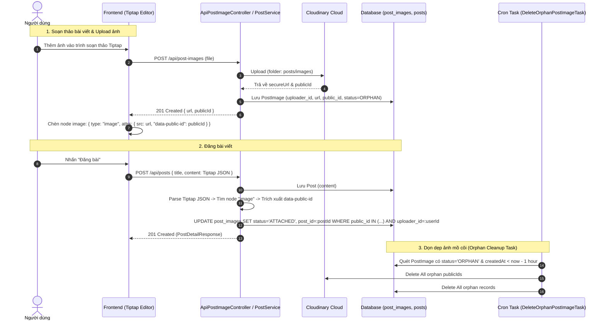

# Đặc tả API: Hình ảnh bài viết (Post Images API Specification)

Tài liệu này đặc tả chi tiết về các API quản lý hình ảnh trong bài viết (`/api/post-images`), luồng tích hợp với trình
soạn thảo Tiptap (ProseMirror JSON) và cơ chế dọn dẹp ảnh mồ côi (Orphan Image Cleanup).

---

## 1. Tổng quan & Xác thực

- **Base Path:** `/api/post-images`
- **Xác thực:** Yêu cầu Header `Authorization: Bearer <Access_Token>`.
- **Phân quyền:** Không cho phép tài khoản có vai trò `GUEST` (`@PreAuthorize("!hasRole('GUEST')")`).
- **Trạng thái hình ảnh (`ImageStatus`):**
    - `ORPHAN`: Ảnh vừa upload lên Cloudinary, chưa được liên kết với bài viết nào.
    - `ATTACHED`: Ảnh đã được gắn vào bài viết sau khi tạo/cập nhật bài viết thành công.

---

## 2. Sơ đồ Kiến trúc & Sequence Diagram



---

## 3. Chi tiết API Endpoints

### 3.1. Tải lên hình ảnh bài viết (Upload Image)

- **Endpoint:** `POST /api/post-images`
- **Content-Type:** `multipart/form-data`
- **Security:** Requires Bearer Token (Non-GUEST)
- **Form Parameters:**
    - `file` (`MultipartFile`, required): Tệp hình ảnh đính kèm (JPEG, PNG, WebP, GIF...).

#### Request Example (cURL)

```bash
curl -X POST http://localhost:8080/api/post-images \
  -H "Authorization: Bearer <access_token>" \
  -F "file=@/path/to/image.jpg"
```

#### Response Success (`201 Created`)

```json
{
  "url": "https://res.cloudinary.com/cloud_name/image/upload/v1721345678/posts/images/abc123xyz.jpg",
  "publicId": "posts/images/abc123xyz"
}
```

#### Error Responses

- **`400 Bad Request`**: Tệp tải lên rỗng hoặc không đúng định dạng.
- **`401 Unauthorized`**: Chưa đăng nhập hoặc Access Token không hợp lệ / hết hạn.
- **`403 Forbidden`**: Tài khoản mang vai trò `GUEST`.
- **`500 Internal Server Error`**: Lỗi kết nối đến dịch vụ Cloudinary.

---

### 3.2. Xóa hình ảnh bài viết (Delete Image)

- **Endpoint:** `DELETE /api/post-images`
- **Security:** Requires Bearer Token (Non-GUEST)
- **Query Parameters:**
    - `publicId` (`String`, required): `public_id` của ảnh trên Cloudinary (ví dụ: `posts/images/abc123xyz`).

#### Request Example (cURL)

```bash
curl -X DELETE "http://localhost:8080/api/post-images?publicId=posts/images/abc123xyz" \
  -H "Authorization: Bearer <access_token>"
```

#### Response Success (`204 No Content`)

*(Không có body)*

#### Error Responses

- **`401 Unauthorized`**: Chưa xác thực.
- **`403 Forbidden`**: Không có quyền (GUEST).

---

## 4. Tích hợp với Trình soạn thảo Tiptap & Quy trình xử lý JSON

### 4.1. Cấu trúc Tiptap Image Node

Khi frontend chèn ảnh vào trình soạn thảo Tiptap, node `image` trong ProseMirror JSON phải bao gồm attribute
`data-public-id`:

```json
{
  "type": "doc",
  "content": [
    {
      "type": "paragraph",
      "content": [
        {
          "type": "text",
          "text": "Nội dung bài viết mẫu..."
        }
      ]
    },
    {
      "type": "image",
      "attrs": {
        "src": "https://res.cloudinary.com/cloud_name/image/upload/v1721345678/posts/images/abc123xyz.jpg",
        "alt": "Mô tả ảnh",
        "title": "Tiêu đề ảnh",
        "data-public-id": "posts/images/abc123xyz"
      }
    }
  ]
}
```

### 4.2. Xử lý phía Backend (`PostService.createPost`)

1. Backend nhận `content` dưới dạng chuỗi JSON Tiptap.
2. `parseTiptapContent()` sử dụng `ObjectMapper.readTree()` để kiểm tra tính hợp lệ và xác nhận root node có
   `type = "doc"`. (Trả về `400 Bad Request` nếu JSON không hợp lệ).
3. Duyệt cây JSON (DFS) để tìm tất cả các node có `type = "image"` và trích xuất danh sách `attrs.data-public-id`.
4. Gọi `postImageRepository.attachToPost(postId, currentUserId, publicIds)` để cập nhật hàng loạt:
   ```sql
   UPDATE post_images 
   SET status = 'ATTACHED', post_id = :postId 
   WHERE public_id IN (:publicIds) 
     AND uploader_id = :currentUserId 
     AND status = 'ORPHAN';
   ```

---

## 5. Tự động dọn dẹp ảnh mồ côi (`DeleteOrphanPostImageTask`)

Để tránh lãng phí dung lượng lưu trữ trên Cloudinary và DB do người dùng upload ảnh nhưng không đăng bài (hoặc hủy bài
viết):

- **Cron Task:** `DeleteOrphanPostImageTask`
- **Lịch chạy:** Tự động chạy mỗi **1 giờ** (`@Scheduled(fixedRateString = "1h")`).
- **Logic:**
    1. Quét các bản ghi `PostImage` trong DB thỏa mãn: `status = 'ORPHAN'` AND `createdAt < now() - 1 hour`.
    2. Nếu tìm thấy:
        - Gọi `cloudinaryService.deleteAll(orphanPublicIds)` để xóa ảnh trên Cloudinary.
        - Xóa các bản ghi tương ứng khỏi bảng `post_images` trong DB.
