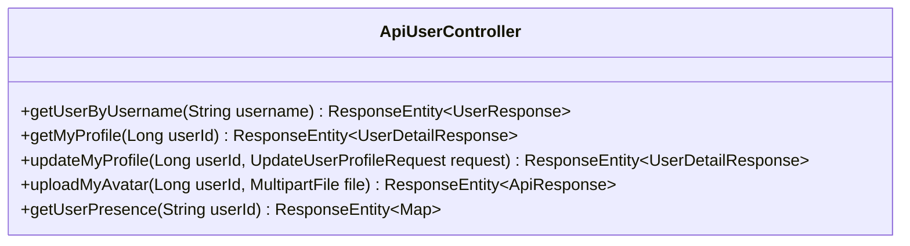

# Đặc tả API: Users (Users API Specification)

Tài liệu này đặc tả chi tiết về các API liên quan đến quản lý thông tin người dùng (User Profile, Avatar).

---

## 1. Tổng quan & Xác thực

Tất cả các API dưới đây có tiền tố (base path) là `/api/users`.
Các API cập nhật thông tin yêu cầu xác thực bằng Access Token thông qua Header `Authorization: Bearer <token>`.
Riêng vai trò `GUEST` bị hạn chế không được phép gọi một số API như cập nhật thông tin cá nhân hoặc tải lên avatar.

---

## 2. Danh sách các API Endpoints



### 2.1. Lấy thông tin người dùng bằng Username (Get User by Username)

- **Endpoint:** `GET /api/users/{username}`
- **Mô tả:** Lấy thông tin công khai của một người dùng dựa trên `username`.
- **Headers:** Không yêu cầu xác thực.
- **Path Parameters:**
    - `username` (String): Tên đăng nhập của người dùng cần tìm kiếm.
- **Response:**
    - **Success:** `200 OK`
      ```json
      {
        "id": 1,
        "username": "example_user",
        "email": "user@example.com",
        "avatarUrl": "https://example.com/avatar.jpg",
        "profile": {
          "fullName": "Nguyen Van A",
          "gender": "MALE",
          "dateOfBirth": "16/07/2000"
        }
      }
      ```
    - **Error (Not Found):** `404 Not Found` (nếu không tìm thấy người dùng).

---

### 2.2. Lấy thông tin cá nhân của người dùng hiện tại (Get My Profile)

- **Endpoint:** `GET /api/users/me`
- **Mô tả:** Lấy thông tin chi tiết của người dùng đang đăng nhập dựa trên JWT token.
- **Headers:**
    - `Authorization: Bearer <Access_Token>` (Bắt buộc)
- **Response:**
    - **Success:** `200 OK`
      ```json
      {
        "id": 1,
        "username": "example_user",
        "email": "user@example.com",
        "avatarUrl": "https://example.com/avatar.jpg",
        "role": "USER",
        "profile": {
          "fullName": "Nguyen Van A",
          "gender": "MALE",
          "dateOfBirth": "16/07/2000"
        }
      }
      ```
    - **Error:** `401 Unauthorized`.

---

### 2.3. Cập nhật thông tin cá nhân (Update My Profile)

- **Endpoint:** `PATCH /api/users/me`
- **Mô tả:** Cập nhật thông tin cá nhân của người dùng hiện tại.
- **Headers:**
    - `Authorization: Bearer <Access_Token>` (Bắt buộc)
- **Quyền truy cập:** Không cho phép tài khoản có vai trò `GUEST`.
- **Request Body (JSON):** `UpdateUserProfileRequest`
  ```json
  {
    "fullName": "Nguyen Van B",
    "gender": "MALE",
    "dateOfBirth": "20/08/2000"
  }
  ```
  *Ràng buộc:*
    - `dateOfBirth`: Định dạng `dd/MM/yyyy`.
- **Response:**
    - **Success:** `200 OK`
      ```json
      {
        "id": 1,
        "username": "example_user",
        "email": "user@example.com",
        "avatarUrl": "https://example.com/avatar.jpg",
        "role": "USER",
        "profile": {
          "fullName": "Nguyen Van B",
          "gender": "MALE",
          "dateOfBirth": "20/08/2000"
        }
      }
      ```
    - **Error (Validation failed):** `400 Bad Request`.
    - **Error (Unauthorized / Forbidden):** `401 Unauthorized` / `403 Forbidden` (đối với GUEST).

---

### 2.4. Tải lên ảnh đại diện (Upload My Avatar)

- **Endpoint:** `PATCH /api/users/me/avatar`
- **Mô tả:** Tải lên ảnh đại diện mới của người dùng và lưu trên dịch vụ Cloudinary.
- **Headers:**
    - `Authorization: Bearer <Access_Token>` (Bắt buộc)
    - `Content-Type: multipart/form-data`
- **Quyền truy cập:** Không cho phép tài khoản có vai trò `GUEST`.
- **Request Parameters (Multipart Form Data):**
    - `file` (MultipartFile): Tệp hình ảnh cần tải lên.
- **Response:**
    - **Success:** `200 OK`
      ```json
      {
        "avatarUrl": "https://res.cloudinary.com/.../image.jpg"
      }
      ```
    - **Error (Bad Request):** `400 Bad Request` (nếu không có tệp hoặc tệp không hợp lệ).
    - **Error (Unauthorized / Forbidden):** `401 Unauthorized` / `403 Forbidden` (đối với GUEST).

---

## 3. Định dạng lỗi & Xử lý lỗi chung

*(Tham chiếu cấu trúc lỗi chung từ Auth API Specification)*

---

## 4. Quản lý trạng thái trực tuyến (Presence)

Hệ thống cung cấp cơ chế theo dõi trạng thái trực tuyến của người dùng (Presence) thông qua STOMP WebSocket và các REST
APIs phụ trợ.

Các trạng thái `PresenceStatus` hợp lệ:

- **`ONLINE`**: User đang mở ứng dụng, duyệt web hoặc ở sảnh (Lobby). Không nằm trong phòng cụ thể nào. Dữ liệu presence
  thông thường chỉ bao gồm `{"status": "ONLINE"}`.
- **`IN_ROOM`**: User đang ở trong một phòng chờ. Có thể với tư cách là người chơi (chưa bắt đầu ván) hoặc khán giả (
  spectator). Dữ liệu presence sẽ có thêm các trường như `{"status": "IN_ROOM", "roomId": "...", "role": "white"}`.
- **`PLAYING`**: User đang thực sự chơi một ván cờ đang diễn ra (In-game). Nếu user bị rớt mạng trong lúc này, hệ thống
  sẽ tạm thời gán TTL (15 phút) cho presence hash để giữ trạng thái `PLAYING` phòng hờ user reconnect lại.
- **`OFFLINE`**: User không còn kết nối với server (đóng web, rớt mạng quá lâu). Khi user OFFLINE, presence hash thường
  sẽ bị xóa khỏi Redis (trừ trường hợp rớt mạng khi đang `PLAYING`). Dữ liệu presence khi gọi REST API hoặc WS trả về
  mặc định là `{"status": "OFFLINE"}`.

### 4.1. REST APIs

**1. Lấy số lượng người dùng đang trực tuyến**

- **Endpoint:** `GET /api/presence/online-count`
- **Mô tả:** Trả về tổng số lượng người dùng đang kết nối (không đếm trùng lặp thiết bị).
- **Response:** `200 OK`
  ```json
  120
  ```

**2. Lấy trạng thái trực tuyến của người dùng (Get User Presence)**

- **Endpoint:** `GET /api/presence/{userId}`
- **Mô tả:** Lấy thông tin trạng thái trực tuyến (presence) của một người dùng thông qua REST API.
- **Headers:** Không yêu cầu xác thực.
- **Path Parameters:**
    - `userId` (String): ID của người dùng.
- **Response:**
    - **Success:** `200 OK`
      ```json
      {
        "status": "IN_ROOM",
        "roomId": "room-uuid",
        "role": "white"
      }
      ```
      *(Lưu ý: Dữ liệu trả về phụ thuộc vào trạng thái của user, nếu user offline sẽ trả về `{"status": "OFFLINE"}`)*

### 4.2. STOMP WebSocket Endpoints

**1. Subscribe nhận cập nhật trạng thái người dùng (Real-time)**

- **Topic:** `/topic/user.{userId}`
- **Mô tả:** Client subscribe vào topic này để nhận broadcast mỗi khi trạng thái của `userId` thay đổi (vd: từ `ONLINE`
  sang `PLAYING`, hoặc bị rớt mạng `OFFLINE`).
- **Event:**
  ```json
  {
    "type": "USER_PRESENCE",
    "data": {
      "status": "OFFLINE"
    }
  }
  ```

**2. Gửi Heartbeat (Giữ kết nối)**

- **Destination:** `/app/presence.heartbeat`
- **Mô tả:** Định kỳ gửi heartbeat (vd: mỗi 15 giây) để gia hạn TTL của session trên Redis, tránh bị đánh dấu là OFFLINE
  nếu mất kết nối websocket ảo.
- **Payload Request:** Không cần gửi payload.
