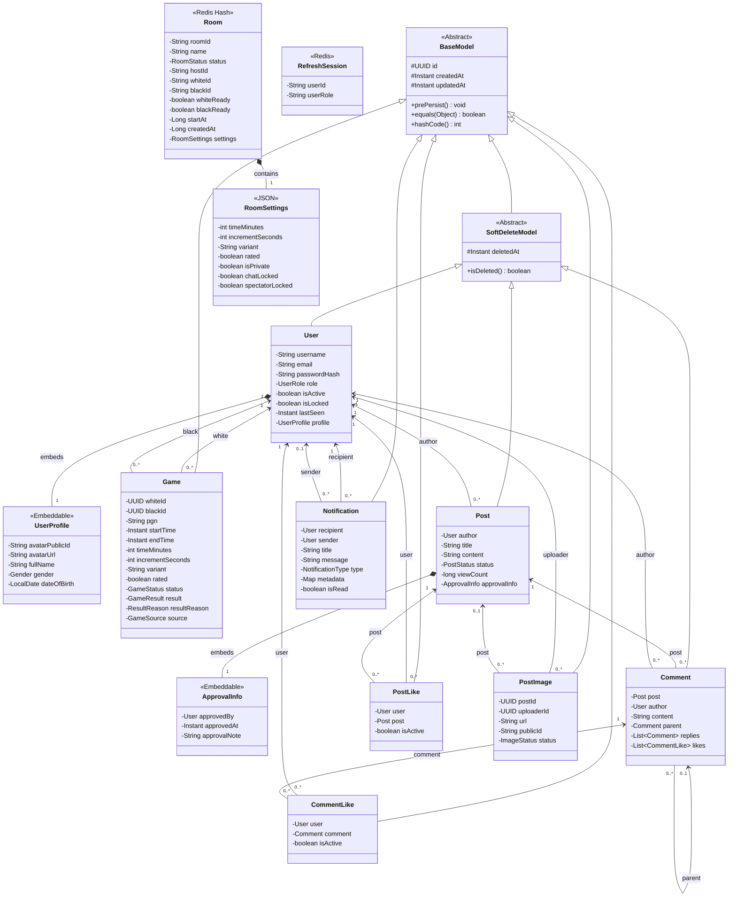
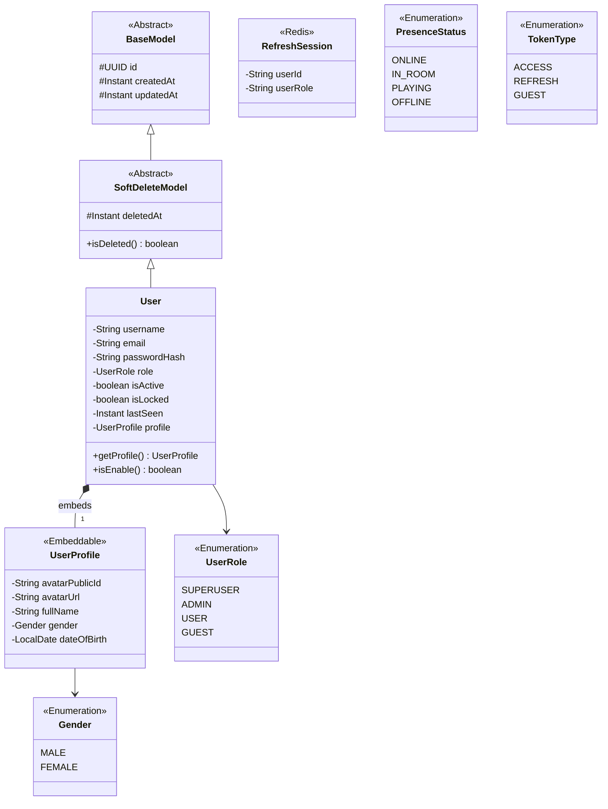
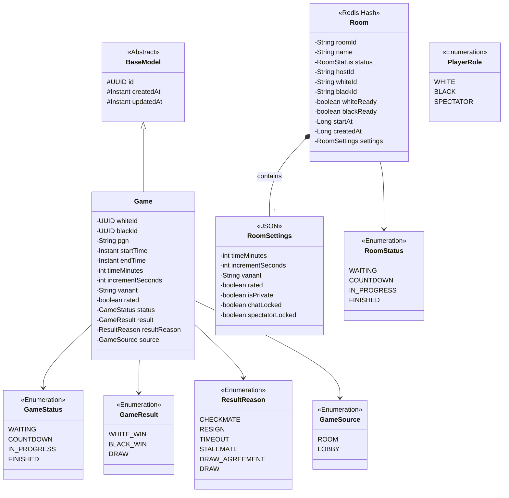
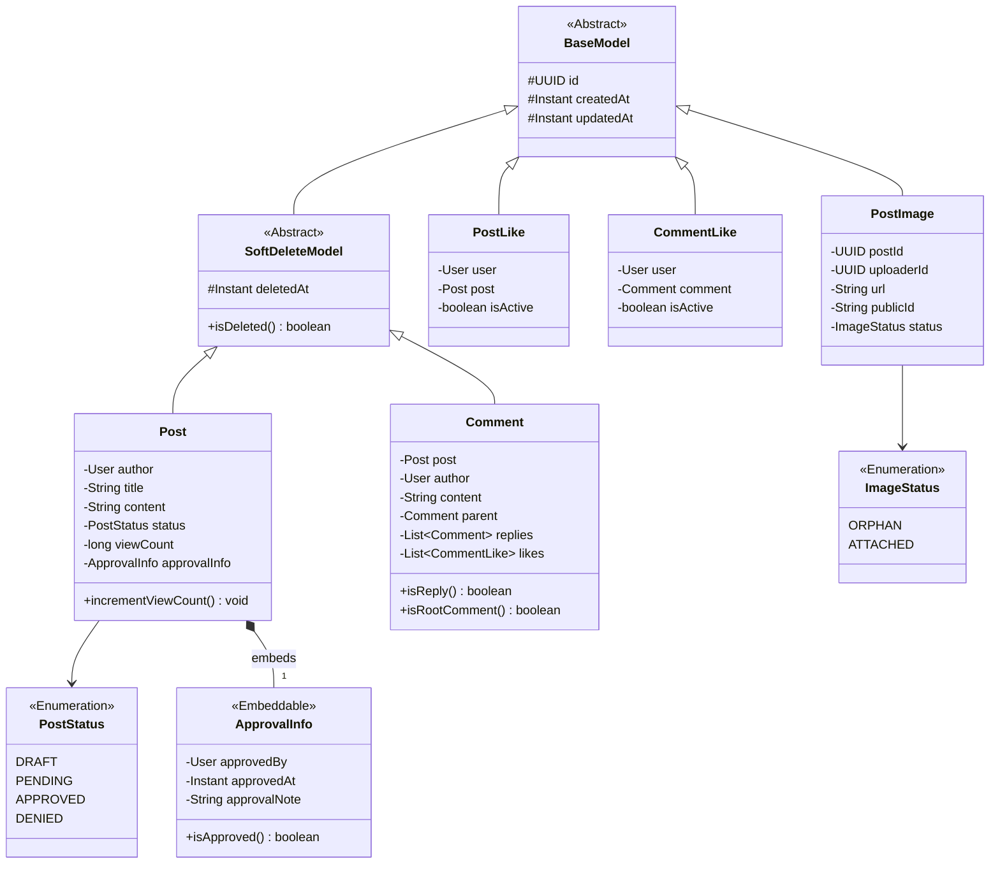
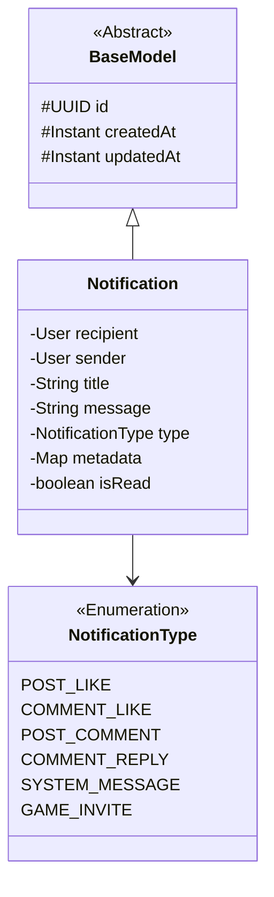

# Tài liệu Sơ đồ Thực thể & Mô hình Miền (Domain Models & Entities)
## Dự án: Web Game Chess Online & Community Platform

Tài liệu này tổng hợp toàn bộ các **Sơ đồ Miền Thực thể (Domain Models & Entities)** của hệ thống dưới dạng **Mermaid Class Diagram** hiển thị trực tiếp trong Markdown.

---

## 📑 Danh mục Sơ đồ Miền Thực thể

1. [**00. Sơ đồ Miền Thực thể Toàn hệ thống (System Domain Model)**](#1-sơ-đồ-miền-thực-thể-toàn-hệ-thống-system-domain-model)
2. [**01. User & Identity Domain Model**](#2-user--identity-domain-model)
3. [**02. Chess Domain Model (Rooms & Game Entities)**](#3-chess-domain-model-rooms--game-entities)
4. [**03. Forum Domain Model (Posts, Comments & Image Lifecycle)**](#4-forum-domain-model-posts-comments--image-lifecycle)
5. [**04. Notification Domain Model**](#5-notification-domain-model)

---

## 1. Sơ đồ Miền Thực thể Toàn hệ thống (System Domain Model)

Sơ đồ tổng quan mô tả toàn bộ cấu trúc dữ liệu, quan hệ giữa các thực thể (Kế thừa, Kết tập, Thành phần, Liên kết 1-1, 1-N) trên 4 phân hệ chính: **User & Identity**, **Chess**, **Forum**, và **Notification**.

---

## 2. User & Identity Domain Model

Mô tả thực thể người dùng `User`, hồ sơ cá nhân nhúng `UserProfile`, mô hình phiên làm việc trên Redis `RefreshSession` và các Enums định danh (`UserRole`, `Gender`, `PresenceStatus`, `TokenType`).

---

## 3. Chess Domain Model (Rooms & Game Entities)

Mô tả thực thể lưu trữ ván cờ `Game` trong PostgreSQL (lưu biên bản PGN, thời gian, kết quả), cấu trúc phòng chơi thời gian thực trên Redis Hash `Room`, cấu hình phòng `RoomSettings` và các Enums luật cờ.

---

## 4. Forum Domain Model (Posts, Comments & Image Lifecycle)

Mô tả thực thể bài viết `Post`, thông tin kiểm duyệt nhúng `ApprovalInfo`, bình luận phân cấp cây `Comment`, lượt thích `PostLike`/`CommentLike`, vòng đời hình ảnh đính kèm `PostImage` và các Enums trạng thái.

---

## 5. Notification Domain Model

Mô tả thực thể thông báo người dùng `Notification` và Enum phân loại thông báo `NotificationType`.

