# Tài liệu Sơ đồ Tuần tự Hệ thống (Sequence Diagrams Specification)
## Dự án: Web Game Chess Online & Community Platform

Tài liệu này đặc tả chi tiết luồng xử lý tuần tự (Sequence Flows) từ Client, Controllers, Services, Redis Lua Scripts, Redisson Distributed Locks, PostgreSQL Repositories, Spring AI và RabbitMQ Event Consumers trên toàn bộ các phân hệ dưới dạng **Mermaid Sequence Diagram** hiển thị trực tiếp trong Markdown.

---

## 📑 Danh mục Phân hệ & Sơ đồ Tuần tự

- [1. Phân hệ Xác thực & Quản lý Phiên (Authentication & Sessions)](#1-phân-hệ-xác-thực--quản-lý-phiên-authentication--session-management)
  - [1.1. Đăng ký tài khoản thường (User Registration)](#11-đăng-ký-tài-khoản-thường-user-registration)
  - [1.2. Đăng ký & Cấp định danh Khách (Guest Registration)](#12-đăng-ký--cấp-định-danh-khách-guest-registration)
  - [1.3. Đăng nhập tài khoản thường & Khởi tạo Redis Session (User Login)](#13-đăng-nhập-tài-khoản-thường--khởi-tạo-redis-session-user-login)
  - [1.4. Xoay vòng Refresh Token & Chống tấn công Replay (Token Rotation)](#14-xoay-vòng-refresh-token--chống-tấn-công-replay-token-rotation)
  - [1.5. Đăng xuất tài khoản & Hủy phiên Redis (User Logout)](#15-đăng-xuất-tài-khoản--hủy-phiên-redis-user-logout)
- [2. Phân hệ Người dùng & Trạng thái Hiện diện (Users & Presence)](#2-phân-hệ-người-dùng--trạng-thái-hiện-diện-users--presence)
  - [2.1. Cập nhật hồ sơ cá nhân (Update User Profile)](#21-cập-nhật-hồ-sơ-cá-nhân-update-user-profile)
  - [2.2. Tải lên ảnh đại diện & Xóa ảnh cũ (Upload Avatar)](#22-tải-lên-ảnh-đại-diện--xóa-ảnh-cũ-upload-avatar)
  - [2.3. Vòng đời Trạng thái Hiện diện qua WebSocket (Presence Lifecycle)](#23-vòng-đời-trạng-thái-hiện-diện-qua-websocket-presence-lifecycle)
- [3. Phân hệ Quản lý Phòng chơi & Sảnh chờ (Chess Room & Lobby)](#3-phân-hệ-quản-lý-phòng-chơi--sảnh-chờ-chess-room--lobby)
  - [3.1. Tạo phòng chơi mới & Đăng ký Sảnh chờ (Create Room)](#31-tạo-phòng-chơi-mới--đăng-ký-sảnh-chờ-create-room)
  - [3.2. Tham gia phòng & Đổi vị trí ghế ngồi (Join Room & Switch Seat)](#32-tham-gia-phòng--đổi-vị-trí-ghế-ngồi-join-room--switch-seat)
  - [3.3. Rời phòng & Bàn giao Chủ phòng / Xóa phòng (Leave Room Lifecycle)](#33-rời-phòng--bàn-giao-chủ-phòng--xóa-phòng-leave-room-lifecycle)
- [4. Phân hệ Trận đấu Cờ vua Thời gian thực (Chess Gameplay & Clock Engine)](#4-phân-hệ-trận-đấu-cờ-vua-thời-gian-thực-chess-gameplay--clock-engine)
  - [4.1. Kỳ thủ Sẵn sàng & Đếm ngược 3s (Ready & Countdown)](#41-kỳ-thủ-sẵn-sàng--đếm-ngược-3s-ready--countdown)
  - [4.2. Thực hiện nước đi cờ & Cập nhật Đồng hồ (Make Move & Clock Update)](#42-thực-hiện-nước-đi-cờ--cập-nhật-đồng-hồ-make-move--clock-update)
  - [4.3. Xử lý Hết giờ Nước đi do Server Kích hoạt (Turn Timeout Handling)](#43-xử-lý-hết-giờ-nước-đi-do-server-kích-hoạt-turn-timeout-handling)
  - [4.4. Đề nghị Hòa, Chấp nhận & Từ chối hòa (Draw Negotiation)](#44-đề-nghị-hòa-chấp-nhận--từ-chối-hòa-draw-negotiation)
- [5. Phân hệ Diễn đàn & Kiểm duyệt Nội dung (Forums & AI Moderation)](#5-phân-hệ-diễn-đàn--kiểm-duyệt-nội-dung-forums--ai-moderation)
  - [5.1. Tạo bài viết & Kiểm duyệt Tự động qua Spring AI (Create Post & AI Moderation)](#51-tạo-bài-viết--kiểm-duyệt-tự-động-qua-spring-ai-create-post--ai-moderation)
  - [5.2. Vòng đời Ảnh bài viết & Dọn dẹp ảnh mồ côi (Post Images Lifecycle & Orphan Cleanup)](#52-vòng-đời-ảnh-bài-viết--dọn-dẹp-ảnh-mồ-côi-post-images-lifecycle--orphan-cleanup)
  - [5.3. Bình luận Cấp 1 & Phản hồi Cấp 2 (Nested Comments & Replies)](#53-bình-luận-cấp-1--phản-hồi-cấp-2-nested-comments--replies)
  - [5.4. Tương tác Thích / Bỏ thích Bài viết & Bình luận (Like Interactions)](#54-tương-tác-thích--bỏ-thích-bài-viết--bình-luận-like-interactions)
- [6. Phân hệ Thông báo & Đẩy Realtime (Notifications & Push Delivery)](#6-phân-hệ-thông-báo--đẩy-realtime-notifications--push-delivery)
  - [6.1. Tiếp nhận & Đẩy thông báo qua WebSocket (Realtime Push Notification)](#61-tiếp-nhận--đẩy-thông-báo-qua-websocket-realtime-push-notification)

---

## 1. Phân hệ Xác thực & Quản lý Phiên (Authentication & Session Management)

### 1.1. Đăng ký tài khoản thường (User Registration)

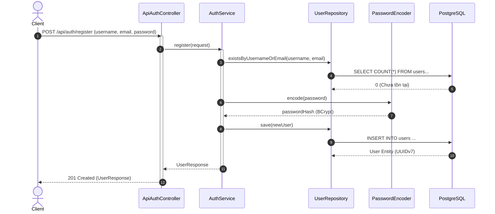

---

### 1.2. Đăng ký & Cấp định danh Khách (Guest Registration)

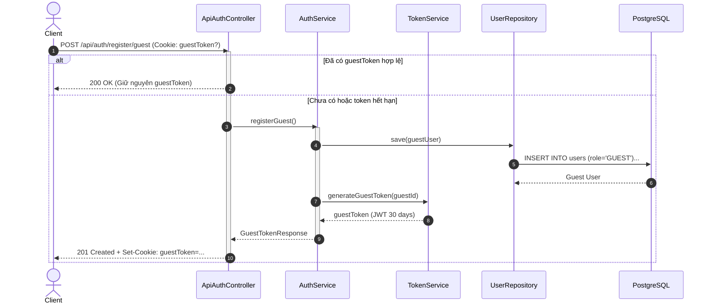

---

### 1.3. Đăng nhập tài khoản thường & Khởi tạo Redis Session (User Login)

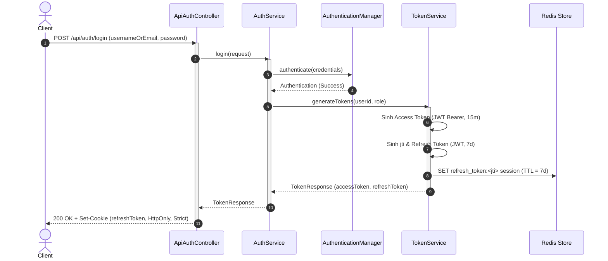

---

### 1.4. Xoay vòng Refresh Token & Chống tấn công Replay (Token Rotation)

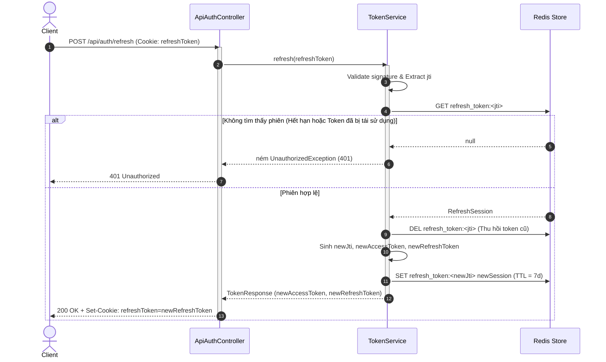

---

### 1.5. Đăng xuất tài khoản & Hủy phiên Redis (User Logout)

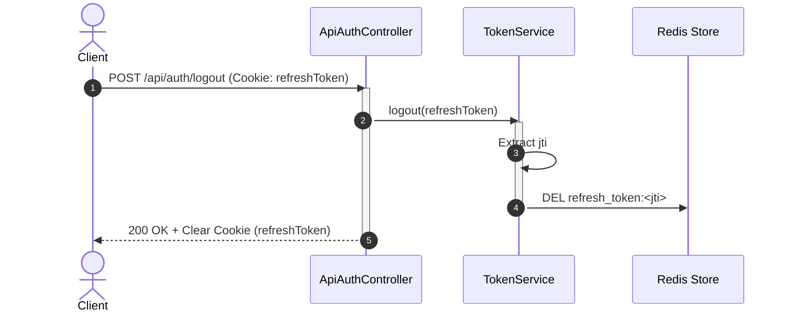

---

## 2. Phân hệ Người dùng & Trạng thái Hiện diện (Users & Presence)

### 2.1. Cập nhật hồ sơ cá nhân (Update User Profile)

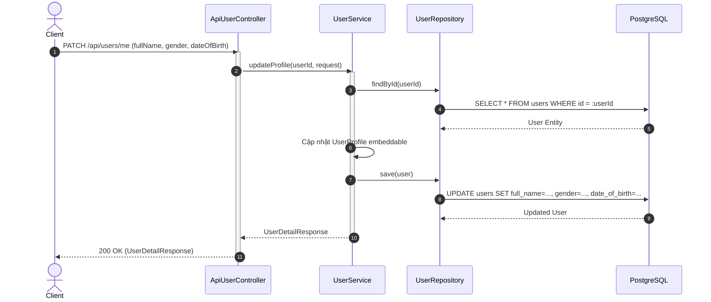

---

### 2.2. Tải lên ảnh đại diện & Xóa ảnh cũ (Upload Avatar)

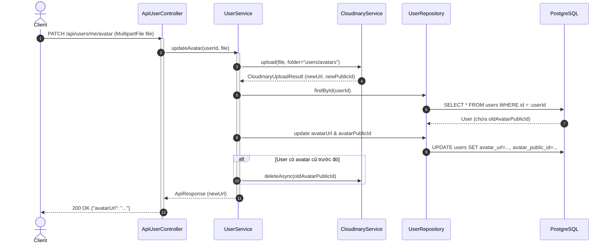

---

### 2.3. Vòng đời Trạng thái Hiện diện qua WebSocket (Presence Lifecycle)

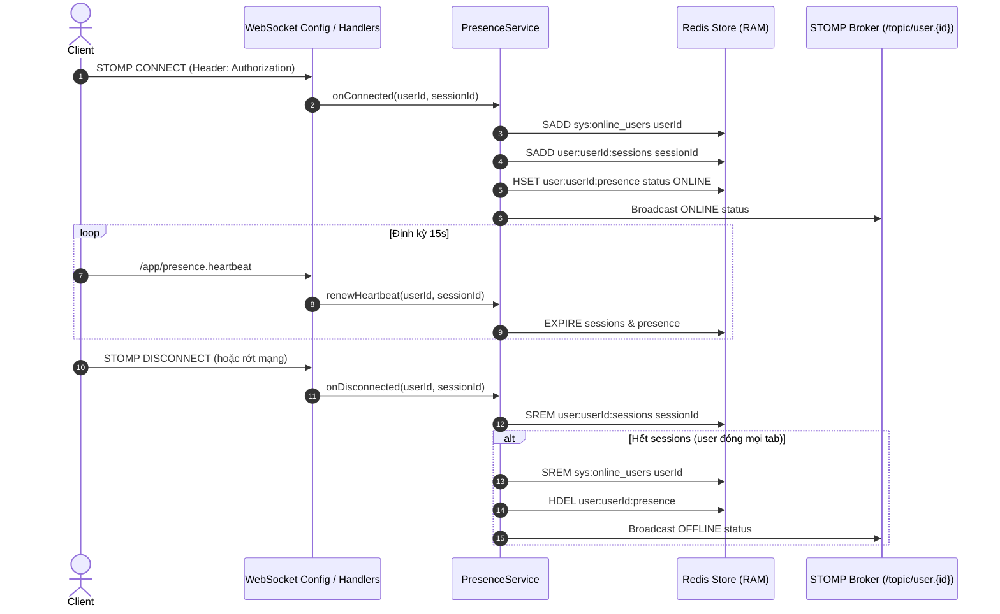

---

## 3. Phân hệ Quản lý Phòng chơi & Sảnh chờ (Chess Room & Lobby)

### 3.1. Tạo phòng chơi mới & Đăng ký Sảnh chờ (Create Room)

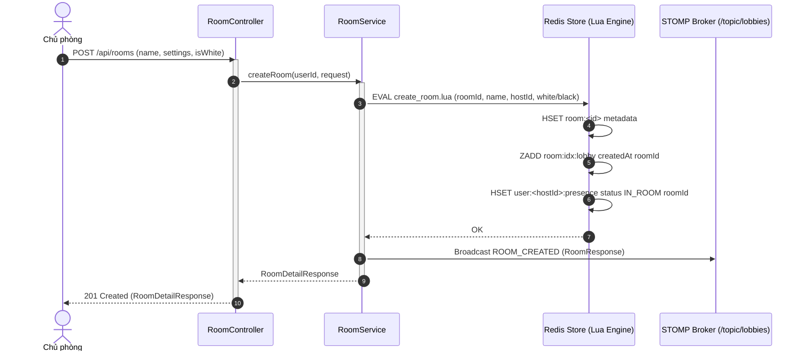

---

### 3.2. Tham gia phòng & Đổi vị trí ghế ngồi (Join Room & Switch Seat)

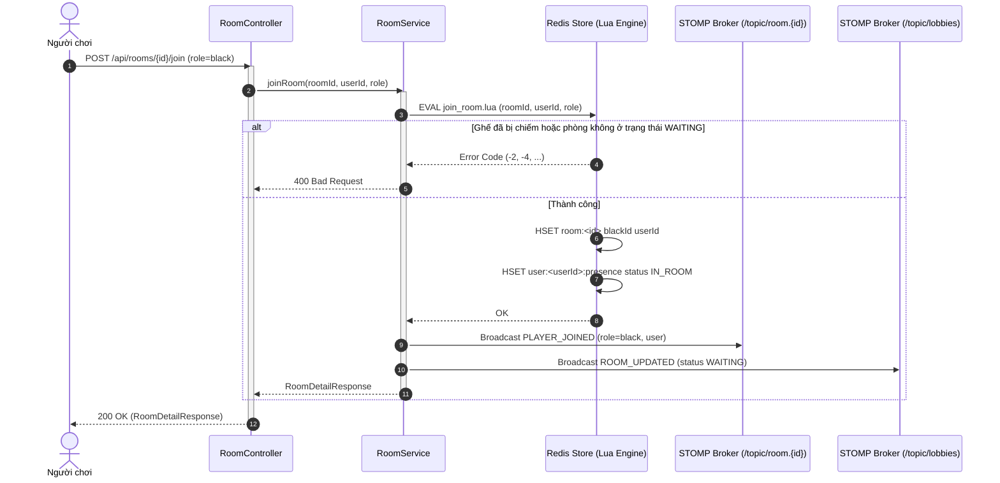

---

### 3.3. Rời phòng & Bàn giao Chủ phòng / Xóa phòng (Leave Room Lifecycle)

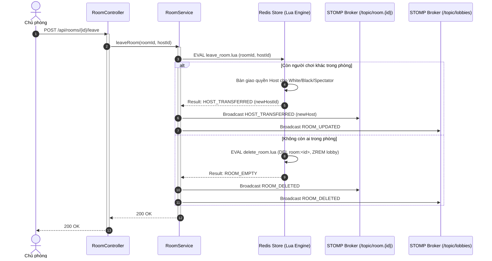

---

## 4. Phân hệ Trận đấu Cờ vua Thời gian thực (Chess Gameplay & Clock Engine)

### 4.1. Kỳ thủ Sẵn sàng & Đếm ngược 3s (Ready & Countdown)

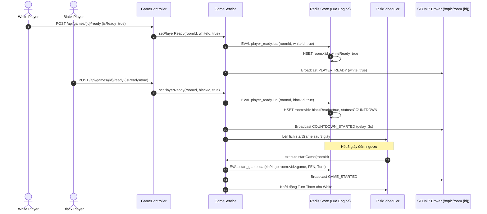

---

### 4.2. Thực hiện nước đi cờ & Cập nhật Đồng hồ (Make Move & Clock Update)

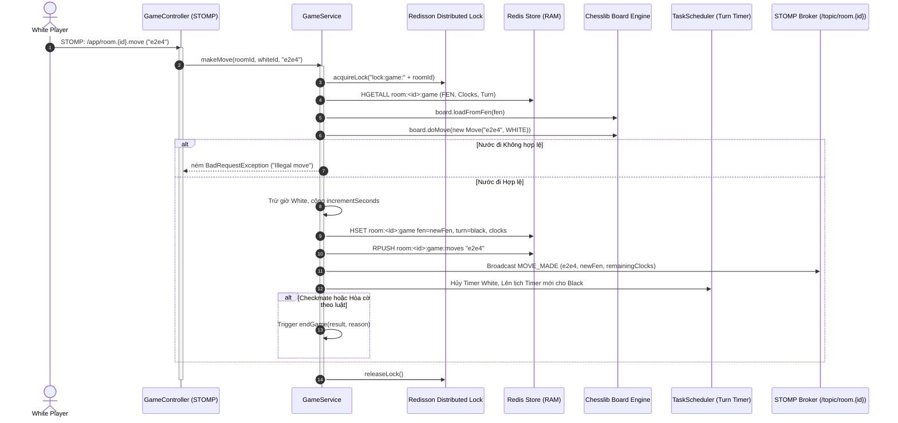

---

### 4.3. Xử lý Hết giờ Nước đi do Server Kích hoạt (Turn Timeout Handling)

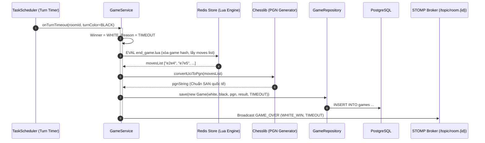

---

### 4.4. Đề nghị Hòa, Chấp nhận & Từ chối hòa (Draw Negotiation)

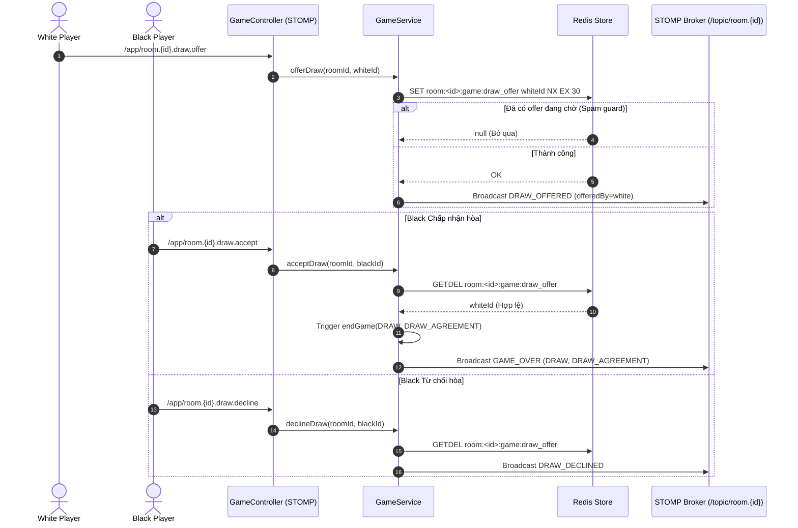

---

## 5. Phân hệ Diễn đàn & Kiểm duyệt Nội dung (Forums & AI Moderation)

### 5.1. Tạo bài viết & Kiểm duyệt Tự động qua Spring AI (Create Post & AI Moderation)

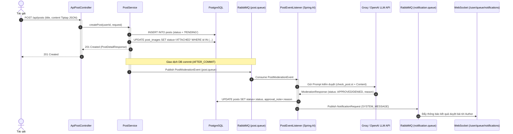

---

### 5.2. Vòng đời Ảnh bài viết & Dọn dẹp ảnh mồ côi (Post Images Lifecycle & Orphan Cleanup)

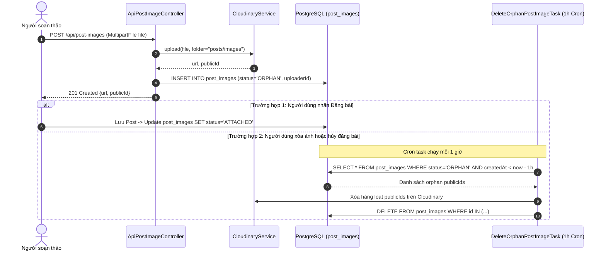

---

### 5.3. Bình luận Cấp 1 & Phản hồi Cấp 2 (Nested Comments & Replies)

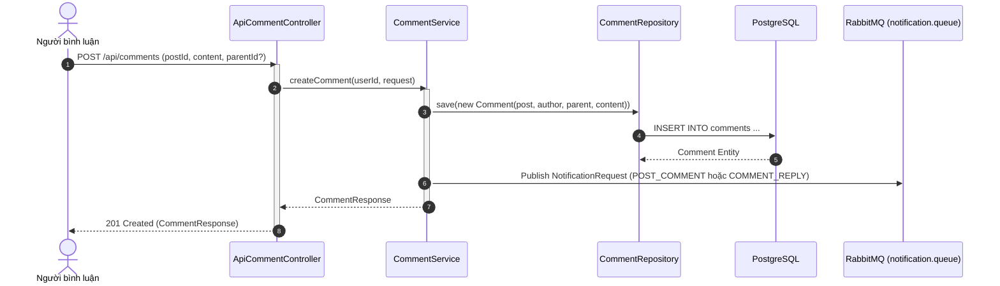

---

### 5.4. Tương tác Thích / Bỏ thích Bài viết & Bình luận (Like Interactions)

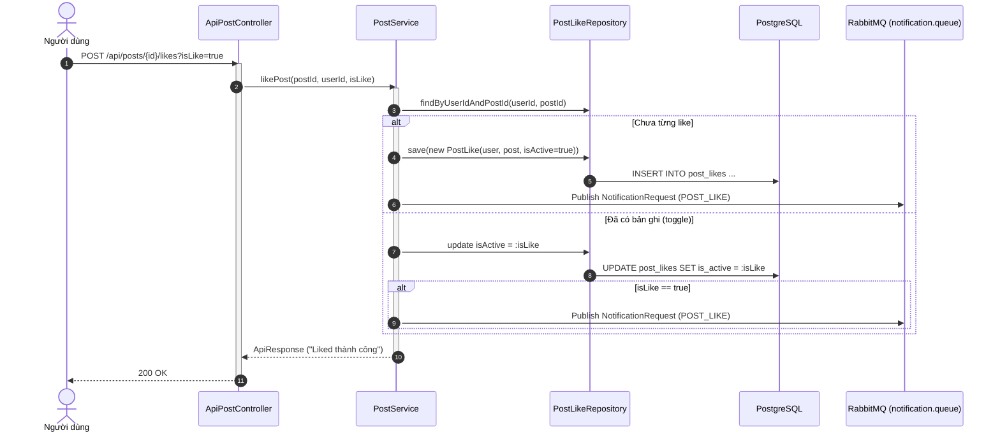

---

## 6. Phân hệ Thông báo & Đẩy Realtime (Notifications & Push Delivery)

### 6.1. Tiếp nhận & Đẩy thông báo qua WebSocket (Realtime Push Notification)

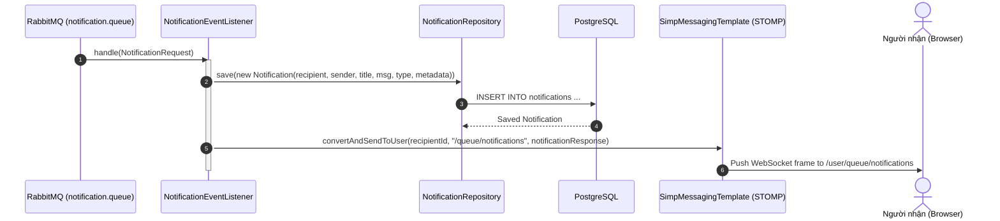
