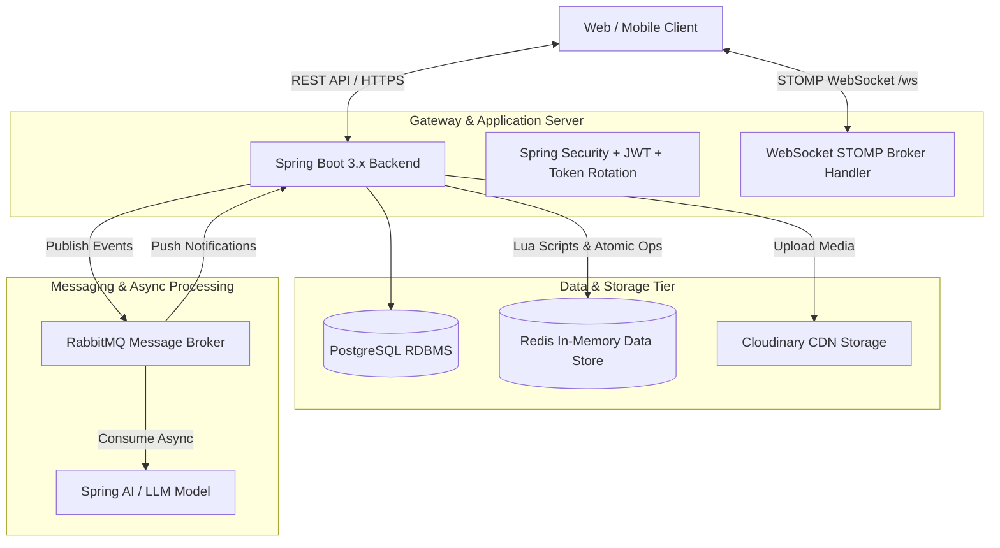
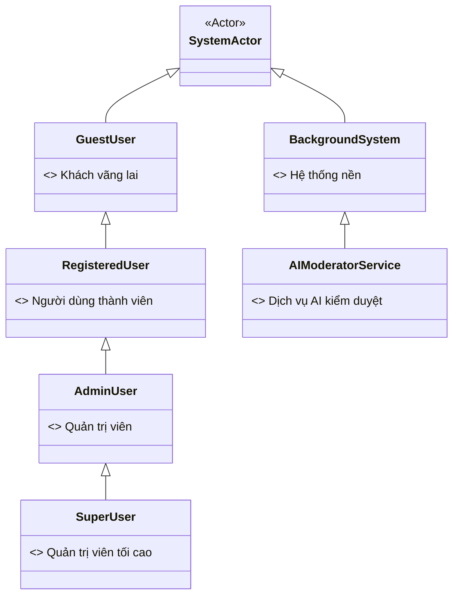
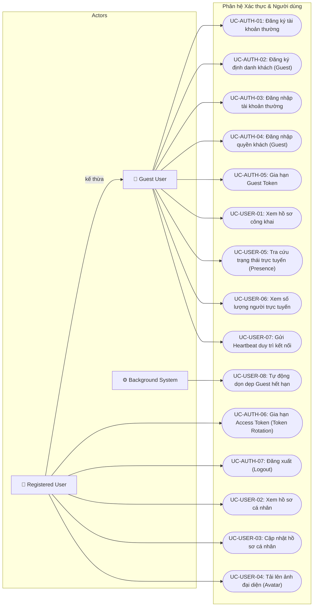
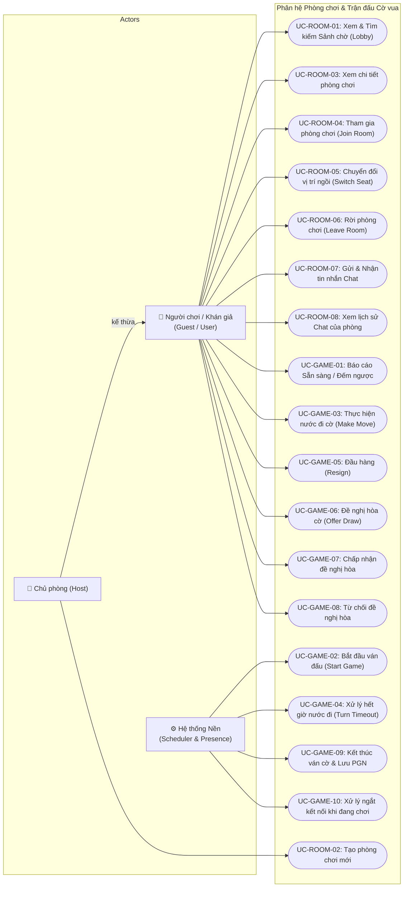
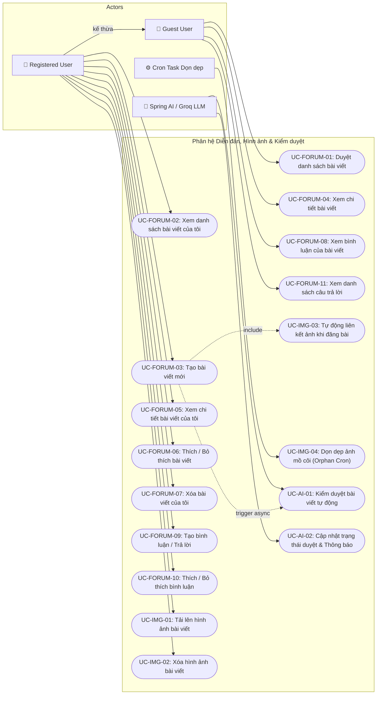
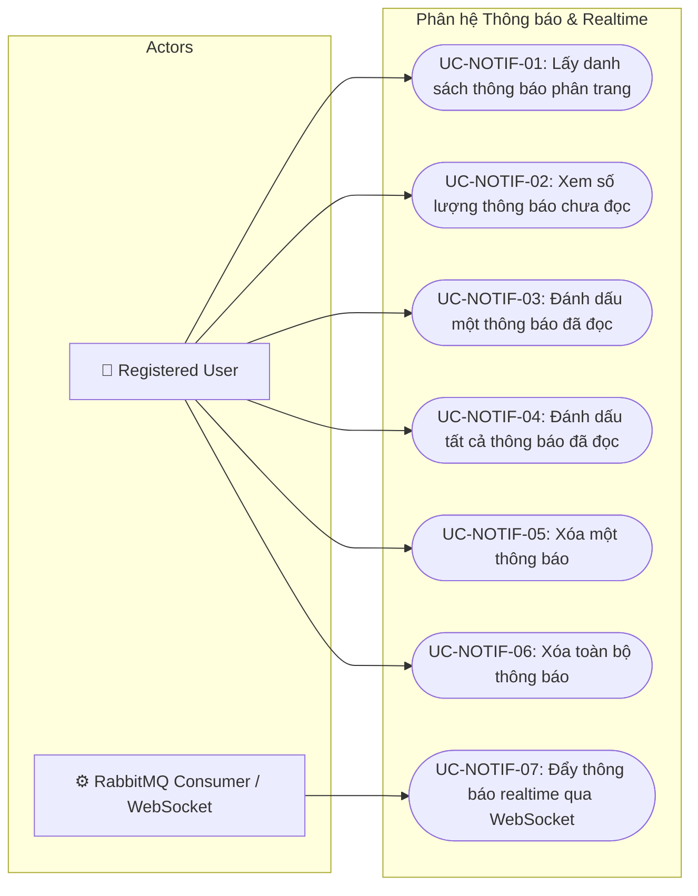

# Tài liệu Phân tích Use Case Hệ thống (Use Case Specification)
## Dự án: Web Game Chess Online & Community Platform

---

## 1. Tổng quan hệ thống (System Overview)

Hệ thống **Web Game Chess Online & Community Platform** là một nền tảng trực tuyến kết hợp giữa **chơi cờ vua thời gian thực (Real-time Chess Game)** và **mạng xã hội/diễn đàn cộng đồng (Community Forum)**. Hệ thống được xây dựng trên nền tảng kiến trúc hiện đại, phân tán, hướng sự kiện (Event-Driven) và tối ưu hóa trải nghiệm tương tác với độ trễ thấp.

### 1.1. Mục tiêu và Phạm vi
- **Phục vụ đa dạng đối tượng người dùng**: Cho phép người dùng vãng lai (Guest) tham gia trải nghiệm nhanh chóng mà không cần đăng ký tài khoản phức tạp, đồng thời cung cấp đầy đủ tính năng cá nhân hóa cho người dùng chính thức (Registered User).
- **Trải nghiệm chơi cờ thời gian thực chất lượng cao**: Hệ thống phòng chơi cờ (Lobby, Room) kết hợp cơ chế kiểm tra nước đi hợp lệ (`chesslib`), quản lý đồng hồ đếm giờ chính xác từ phía Server (Server-side turn timer), xử lý trạng thái trận đấu (Chiếu hết, Đầu hàng, Cầu hòa, Hết giờ, Pat), phân vai linh hoạt (Quân Trắng, Quân Đen, Khán giả) và tự động lưu trữ biên bản trận đấu (PGN format).
- **Diễn đàn trao đổi học thuật & chia sẻ bài viết**: Hỗ trợ trình soạn thảo văn bản đa dạng (Tiptap Rich-text Editor), đính kèm hình ảnh qua CDN Cloudinary, bình luận phân cấp (Nested Comments), tương tác Thích (Like/Unlike) và cơ chế dọn dẹp hình ảnh mồ côi (Orphan images cleanup).
- **Kiểm duyệt nội dung tự động bằng Trí tuệ nhân tạo (AI Moderation)**: Ứng dụng mô hình ngôn ngữ lớn (Spring AI ChatClient) để tự động kiểm duyệt nội dung bài đăng thông qua hàng đợi RabbitMQ, đảm bảo môi trường cộng đồng văn minh, lành mạnh.
- **Hệ thống hiện diện và thông báo tức thời**: Theo dõi trạng thái trực tuyến (Presence Tracking: `ONLINE`, `IN_ROOM`, `PLAYING`, `OFFLINE`) và gửi thông báo đa kênh theo thời gian thực qua giao thức WebSocket STOMP.

### 1.2. Kiến trúc Công nghệ Cốt lõi


---

## 2. Xác định các Tác nhân (Actors Identification & Hierarchy)

Hệ thống phân định rõ ràng quyền hạn và trách nhiệm của các tác nhân (bao gồm người dùng và các hệ thống/dịch vụ phụ trợ):



### 2.1. Chi tiết các Tác nhân Người dùng
1. **Khách vãng lai (Guest User / `ROLE_GUEST`)**:
   - Người dùng truy cập hệ thống nhưng chưa đăng ký tài khoản chính thức.
   - Được hệ thống cấp phát định danh ẩn danh thông qua `guestToken` (JWT) lưu tại Cookie trình duyệt.
   - **Quyền hạn**: Duyệt danh sách bài viết đã phê duyệt, xem chi tiết bài viết và bình luận, xem Sảnh chờ (Lobby), xem trạng thái hiện diện của người chơi, tham gia phòng chơi cờ (chơi hoặc làm khán giả), gửi nước đi cờ, chat trong phòng.
   - **Hạn chế**: Không được cập nhật hồ sơ cá nhân, không được upload ảnh đại diện, không được đăng bài viết, không được tạo bình luận, không được thích bài viết/bình luận, không được upload/xóa ảnh bài viết.

2. **Người dùng thành viên (Registered User / `ROLE_USER`)**:
   - Người dùng đã hoàn tất đăng ký tài khoản bằng email/username và mật khẩu.
   - Xác thực qua Access Token (Bearer JWT) và Refresh Token lưu trong HttpOnly Cookie với cơ chế xoay vòng phiên (Token Rotation).
   - **Quyền hạn**: Kế thừa toàn bộ quyền của Guest User, đồng thời có toàn quyền quản lý hồ sơ cá nhân, đổi ảnh đại diện, tạo phòng cờ, đăng bài viết (kèm hình ảnh), viết bình luận, tương tác Thích, nhận và quản lý thông báo thời gian thực.

3. **Quản trị viên (Admin User / `ROLE_ADMIN`)**:
   - Người dùng có quyền quản trị hệ thống, giám sát vận hành diễn đàn và người dùng.

4. **Quản trị viên tối cao (Superuser / `ROLE_SUPERUSER`)**:
   - Tài khoản đặc quyền cao nhất của hệ thống, được tự động khởi tạo qua `SuperUserInitializer` khi hệ thống bootstrap.

### 2.2. Chi tiết các Tác nhân Hệ thống & Dịch vụ Nền
1. **Hệ thống Nền (Background System / Scheduler & Cron Tasks)**:
   - **Dọn dẹp ảnh mồ côi (`DeleteOrphanPostImageTask`)**: Quét và xóa các ảnh upload lên Cloudinary nhưng không gắn vào bài viết sau 1 giờ.
   - **Dọn dẹp tài khoản khách hết hạn (`DeleteExpiredGuestUsersTask`)**: Định kỳ lúc 03:00 AM hàng ngày quét và xóa tài khoản Guest không hoạt động quá 30 ngày.
   - **Đồng hồ đếm giờ ván cờ (Server-side Turn Timer Scheduler)**: Tự động đếm ngược thời gian cho mỗi lượt đi và tự động kích hoạt kết thúc ván đấu khi kỳ thủ hết giờ (`TIMEOUT`).
   - **Bộ theo dõi kết nối (Presence Session Tracker)**: Lắng nghe sự kiện ngắt kết nối WebSocket để dọn dẹp hoặc chuyển giao quyền chủ phòng (`HOST_TRANSFERRED`), chuyển trạng thái người dùng sang `OFFLINE` sau khi hết thời gian chờ.

2. **Dịch vụ Kiểm duyệt AI (AI Moderation Service / Spring AI)**:
   - Nhận sự kiện `PostModerationEvent` từ hàng đợi RabbitMQ, thực hiện phân tích nội dung tiêu đề và văn bản bài viết theo bộ quy chuẩn cộng đồng, trả về kết quả `APPROVED` hoặc `DENIED` kèm lý do chi tiết.

3. **Dịch vụ Lưu trữ Đám mây (Cloudinary Media Service)**:
   - Cung cấp dịch vụ lưu trữ hình ảnh tải lên (ảnh đại diện người dùng, hình ảnh trong bài viết).

---

### 3. Sơ đồ Use Case Tổng quát (Use Case Diagrams)

### 3.1. Sơ đồ Use Case - Phân hệ Xác thực & Quản lý Người dùng



---

### 3.2. Sơ đồ Use Case - Phân hệ Phòng chơi & Trận đấu Cờ vua (Chess)



---

### 3.3. Sơ đồ Use Case - Phân hệ Diễn đàn, Hình ảnh & Kiểm duyệt AI



---

### 3.4. Sơ đồ Use Case - Phân hệ Thông báo & Thời gian thực



---

## 4. Đặc tả chi tiết từng Use Case (Detailed Use Case Specifications)

---

### PHÂN HỆ 1: XÁC THỰC & QUẢN LÝ PHIÊN (AUTHENTICATION & IDENTITY)

#### UC-AUTH-01: Đăng ký tài khoản thường (User Registration)
- **Tác nhân:** Khách vãng lai (Guest User / Anonymous).
- **Mô tả:** Cho phép người dùng đăng ký tài khoản thành viên mới bằng cách cung cấp tên đăng nhập (`username`), địa chỉ thư điện tử (`email`) và mật khẩu (`password`).
- **Tiền điều kiện:** Người dùng chưa đăng nhập hoặc muốn tạo tài khoản mới.
- **Hậu điều kiện:** Bản ghi người dùng được tạo trong bảng `users` với `role = 'USER'`, mật khẩu được băm (BCrypt), một bản ghi `user_profiles` rỗng được liên kết.
- **Luồng sự kiện chính (Main Flow):**
  1. Người dùng gửi yêu cầu `POST /api/auth/register` với JSON `RegisterUserRequest` (username, email, password).
  2. Hệ thống kiểm tra tính hợp lệ dữ liệu (username: 3-50 ký tự, email đúng format, password không để trống).
  3. Hệ thống kiểm tra sự tồn tại của `email` và `username` trong database.
  4. Hệ thống thực hiện băm mật khẩu bằng BCryptPasswordEncoder.
  5. Hệ thống khởi tạo đối tượng `User` và `UserProfile`, lưu vào PostgreSQL.
  6. Hệ thống trả về `201 Created` kèm thông tin `UserResponse`.
- **Luồng ngoại lệ (Alternative & Exception Flows):**
  - *Dữ liệu không hợp lệ*: Trả về `400 Bad Request` hoặc `422 Unprocessable Entity`.
  - *Trùng username hoặc email*: Trả về `409 Conflict` (Username/Email already exists).
- **Quy tắc & Ràng buộc:** Endpoint công khai, không yêu cầu token.

#### UC-AUTH-02: Đăng ký định danh khách ẩn danh (Register Guest)
- **Tác nhân:** Khách vãng lai (Guest).
- **Mô tả:** Cấp phát một tài khoản khách ẩn danh (`UserRole.GUEST`) và tạo JWT `guestToken` lưu vào Cookie của trình duyệt nếu người dùng chưa có hoặc token cũ không hợp lệ.
- **Tiền điều kiện:** Người dùng truy cập trang web lần đầu hoặc cookie guest bị xóa/hết hạn.
- **Hậu điều kiện:** Bản ghi `User` với vai trò `GUEST` được lưu trong DB, cookie `guestToken` được set vào response với thời hạn cấu hình (`app.user.guest-max-age-days`, mặc định 30 ngày).
- **Luồng sự kiện chính:**
  1. Client gửi `POST /api/auth/register/guest`.
  2. Hệ thống kiểm tra xem client đã gửi kèm cookie `guestToken` hợp lệ hay chưa.
  3. Nếu chưa có: Tạo mới User ẩn danh trong DB (với username sinh tự động `guest_xxxxx`), tạo JWT chứa claim `sub: guestId`, `type: "guest"`.
  4. Đặt cookie `guestToken` (Path `/`, Max-Age = cấu hình) và trả về `201 Created` kèm `GuestTokenResponse`.
  5. Nếu đã có token hợp lệ: Trả về `200 OK` giữ nguyên.

#### UC-AUTH-03: Đăng nhập tài khoản thường (User Login)
- **Tác nhân:** Người dùng đã có tài khoản (Registered User).
- **Mô tả:** Đăng nhập hệ thống bằng username/email và mật khẩu để nhận Access Token và Refresh Token.
- **Tiền điều kiện:** Tài khoản đã được kích hoạt (`isActive = true`, `isLocked = false`).
- **Hậu điều kiện:** Một session mới được lưu trong Redis `refresh_token:<jti>`, cookie `refreshToken` được set vào trình duyệt, trả về Access Token.
- **Luồng sự kiện chính:**
  1. Người dùng gửi `POST /api/auth/login` với `usernameOrEmail` và `password`.
  2. Hệ thống xác thực thông tin qua Spring Security `AuthenticationManager`.
  3. Sau khi xác thực thành công, hệ thống sinh Access Token (JWT Bearer, ngắn hạn) và Refresh Token (JWT chứa `jti`, dài hạn).
  4. Hệ thống lưu `jti` vào Redis key `refresh_token:<jti>` (TTL theo cấu hình số ngày).
  5. Đặt cookie `refreshToken` (`HttpOnly`, `Path=/api/auth`, `SameSite=Strict`).
  6. Trả về `200 OK` kèm body `TokenResponse` (accessToken, refreshToken).
- **Luồng ngoại lệ:**
  - *Sai thông tin đăng nhập hoặc tài khoản bị khóa/vô hiệu hóa*: Trả về `401 Unauthorized`.

#### UC-AUTH-04: Đăng nhập quyền khách (Guest Login)
- **Tác nhân:** Khách vãng lai (Guest).
- **Mô tả:** Đăng nhập vào hệ thống dưới vai trò `GUEST` bằng `guestToken` có sẵn từ Cookie để nhận Access Token tạm thời.
- **Tiền điều kiện:** Trình duyệt có cookie `guestToken` hợp lệ.
- **Hậu điều kiện:** Nhận cặp Access Token và Refresh Token mang vai trò `ROLE_GUEST`.
- **Luồng sự kiện chính:**
  1. Client gửi `POST /api/auth/login/guest` kèm cookie `guestToken`.
  2. Hệ thống kiểm tra chữ ký và tính hợp lệ của `guestToken` (loại token phải là `"guest"`).
  3. Hệ thống tạo Access Token và Refresh Token tương ứng với `guestId`.
  4. Lưu session vào Redis, set cookie `refreshToken` và trả về `TokenResponse`.
- **Luồng ngoại lệ:**
  - *Không có hoặc token khách không hợp lệ*: Trả về `401 Unauthorized`.

#### UC-AUTH-05: Gia hạn Guest Token (Refresh Guest Token)
- **Tác nhân:** Khách vãng lai (Guest).
- **Mô tả:** Kiểm tra và cấp lại `guestToken` mới để duy trì định danh khách dài hạn trên thiết bị.
- **Endpoint:** `POST /api/auth/refresh/guest-token`.
- **Luồng xử lý:** Xác thực `guestToken` hiện tại từ cookie hoặc request body, sinh `guestToken` mới với thời hạn mới, set cookie và trả về `GuestTokenResponse`.

#### UC-AUTH-06: Gia hạn Access Token & Xoay vòng Token (Refresh Token Rotation)
- **Tác nhân:** Người dùng / Khách đang có phiên làm việc.
- **Mô tả:** Đổi `refreshToken` hiện tại lấy một cặp Access Token và Refresh Token hoàn toàn mới, đồng thời vô hiệu hóa Refresh Token cũ để chống tấn công Replay Attack.
- **Tiền điều kiện:** `refreshToken` hợp lệ và session tương ứng tồn tại trong Redis.
- **Hậu điều kiện:** Session cũ trong Redis bị xóa, session mới được lưu, cookie `refreshToken` được cập nhật giá trị mới.
- **Luồng sự kiện chính:**
  1. Client gửi `POST /api/auth/refresh` kèm cookie `refreshToken`.
  2. Hệ thống giải mã JWT, kiểm tra `type == "refresh"` và trích xuất `jti`.
  3. Hệ thống truy vấn Redis key `refresh_token:<jti>`.
  4. Nếu tìm thấy session hợp lệ: Xóa ngay key `refresh_token:<jti>` cũ khỏi Redis.
  5. Sinh cặp Access Token và Refresh Token mới, lưu `jti` mới vào Redis.
  6. Ghi đè cookie `refreshToken` mới và trả về `200 OK` kèm `TokenResponse`.
- **Luồng ngoại lệ:**
  - *Token hết hạn, chữ ký sai, hoặc session không tìm thấy trong Redis (nguy cơ token bị tái sử dụng)*: Ném `UnauthorizedException` (401).

#### UC-AUTH-07: Đăng xuất (Logout)
- **Tác nhân:** Người dùng đang đăng nhập.
- **Mô tả:** Hủy phiên làm việc hiện tại, xóa session trong Redis và xóa cookie `refreshToken` trên Client.
- **Endpoint:** `POST /api/auth/logout`.
- **Luồng xử lý:** Đọc `refreshToken` từ cookie (nếu có), xóa key `refresh_token:<jti>` trong Redis, gửi header `Set-Cookie: refreshToken=; Max-Age=0; Path=/api/auth` để xóa cookie, trả về `200 OK`.

---

### PHÂN HỆ 2: NGƯỜI DÙNG & HIỆN DIỆN TRỰC TUYẾN (USERS & PRESENCE)

#### UC-USER-01: Tra cứu hồ sơ công khai người dùng (Get User by Username)
- **Tác nhân:** Mọi tác nhân (Guest, User).
- **Mô tả:** Tra cứu thông tin hiển thị công khai của một người dùng theo `username`.
- **Endpoint:** `GET /api/users/{username}` (Không yêu cầu xác thực).
- **Dữ liệu trả về:** `UserResponse` (id, username, email, avatarUrl, profile gồm fullName, gender, dateOfBirth).
- **Ngoại lệ:** Trả về `404 Not Found` nếu username không tồn tại.

#### UC-USER-02: Xem hồ sơ cá nhân hiện tại (Get My Profile)
- **Tác nhân:** Người dùng đã đăng nhập (User / Guest).
- **Endpoint:** `GET /api/users/me` (Yêu cầu `Authorization: Bearer <token>`).
- **Dữ liệu trả về:** `UserDetailResponse` bao gồm thông tin chi tiết tài khoản và role (`USER` hoặc `GUEST`).

#### UC-USER-03: Cập nhật thông tin cá nhân (Update My Profile)
- **Tác nhân:** Người dùng thành viên (`ROLE_USER`, cấm `GUEST`).
- **Endpoint:** `PATCH /api/users/me`.
- **Quyền hạn:** `@PreAuthorize("!hasRole('GUEST')")`.
- **Request Body:** `UpdateUserProfileRequest` (fullName, gender: `MALE`/`FEMALE`, dateOfBirth: định dạng `dd/MM/yyyy`).
- **Luồng xử lý:** Cập nhật thông tin trong bảng `user_profiles`, trả về `UserDetailResponse`.
- **Ngoại lệ:** `403 Forbidden` đối với GUEST, `400 Bad Request` nếu sai định dạng ngày sinh.

#### UC-USER-04: Tải lên ảnh đại diện (Upload User Avatar)
- **Tác nhân:** Người dùng thành viên (`ROLE_USER`, cấm `GUEST`).
- **Endpoint:** `PATCH /api/users/me/avatar` (`multipart/form-data`, param `file`).
- **Quyền hạn:** `@PreAuthorize("!hasRole('GUEST')")`.
- **Luồng xử lý:**
  1. Kiểm tra file hình ảnh hợp lệ (JPEG, PNG, WebP...).
  2. Gọi `CloudinaryService.upload` đẩy ảnh lên Cloudinary (folder `users/avatars`).
  3. Cập nhật `avatarUrl` và `avatarPublicId` vào `UserProfile`.
  4. Nếu người dùng đã có avatar cũ trước đó: Kích hoạt tác vụ xóa bất đồng bộ ảnh cũ trên Cloudinary qua `deleteAsync(oldPublicId)`.
  5. Trả về `200 OK` kèm `{"avatarUrl": "..."}`.
- **Ngoại lệ:** `403 Forbidden` đối với GUEST, `400 Bad Request` nếu file rỗng.

#### UC-USER-05: Tra cứu trạng thái hiện diện (Get User Presence)
- **Tác nhân:** Mọi tác nhân.
- **Endpoint:** `GET /api/presence/{userId}`.
- **Luồng xử lý:** Đọc thông tin từ Redis hash `presence:{userId}`. Trả về trạng thái hiện tại (`ONLINE`, `IN_ROOM`, `PLAYING`, hoặc mặc định `OFFLINE` nếu không có hash). Trả về kèm `roomId`, `role` nếu đang ở trong phòng.

#### UC-USER-06: Xem số lượng người trực tuyến (Get Online Count)
- **Tác nhân:** Mọi tác nhân.
- **Endpoint:** `GET /api/presence/online-count`.
- **Luồng xử lý:** Đếm số lượng phần tử duy nhất trong Redis Set `online_users` (không trùng lặp thiết bị), trả về số nguyên `Long`.

#### UC-USER-07: Gửi tín hiệu duy trì kết nối (WebSocket Heartbeat)
- **Tác nhân:** Client kết nối WebSocket.
- **Destination:** `/app/presence.heartbeat` (STOMP).
- **Luồng xử lý:** Client định kỳ gửi frame mỗi 15 giây. Phía server gia hạn TTL của session trên Redis để tránh bị ngắt kết nối ảo hoặc đánh dấu offline sai lệch.

#### UC-USER-08: Tự động dọn dẹp tài khoản khách hết hạn (Delete Expired Guest Users Task)
- **Tác nhân:** Hệ thống Nền (Cron Scheduler).
- **Tần suất:** Chạy lúc 03:00 AM hàng ngày (`@Scheduled(cron = "${app.user.clean-guest-cron:0 0 3 * * ?}")`).
- **Luồng xử lý:** Tính toán mốc thời gian `now - guestMaxAgeDays` (mặc định 30 ngày). Gọi `userRepository.deleteExpiredGuests(UserRole.GUEST, threshold)` để xóa vĩnh viễn các tài khoản khách không hoạt động và giải phóng dung lượng DB.

---

### PHÂN HỆ 3: PHÒNG CHƠI CỜ VUA & SẢNH CHỜ (CHESS LOBBY & ROOMS)

#### UC-ROOM-01: Xem & Tìm kiếm danh sách phòng tại Sảnh (Get Lobby Rooms)
- **Tác nhân:** Mọi người dùng đã đăng nhập (User, Guest).
- **Endpoint:** `GET /api/rooms` (Query params: `q`, `page`, `size`).
- **Luồng xử lý:**
  - Nếu không có `q`: Lấy danh sách ID phòng từ Redis ZSet `room:idx:lobby` bằng `ZREVRANGE`.
  - Nếu có `q`: Chạy Lua script `search_lobby.lua` tìm kiếm không phân biệt hoa thường trực tiếp trong Redis.
  - Thực hiện kỹ thuật **Hydrate theo Pipeline (Ponytail Architecture)**: Lấy toàn bộ hash thông tin phòng trong 1 round-trip Redis, sau đó truy vấn DB lấy thông tin hiển thị (username, avatar) của các chủ phòng/người chơi và ghép nối trả về `Page<RoomResponse>`.

#### UC-ROOM-02: Tạo phòng chơi cờ mới (Create Chess Room)
- **Tác nhân:** Người dùng có trạng thái `ONLINE` (User, Guest).
- **Endpoint:** `POST /api/rooms`.
- **Request Body:** `CreateRoomRequest` (name, settings: RoomSettings, white: boolean).
- **Ràng buộc nghiệp vụ:** Người dùng không được đang ở trong bất kỳ phòng nào khác.
- **Luồng xử lý:**
  1. Sinh `roomId` mới (UUID).
  2. Thực thi Lua script `create_room.lua` nguyên tử:
     - Tạo Hash `room:{roomId}` chứa metadata phòng.
     - Thêm `roomId` vào ZSet `room:idx:lobby` với score là timestamp.
     - Cập nhật Redis presence của Host thành `IN_ROOM` và gán vai trò tương ứng (`white` hoặc `black`).
  3. Phát sự kiện WebSocket `ROOM_CREATED` tới topic `/topic/lobbies`.
  4. Trả về `RoomResponse`.

#### UC-ROOM-03: Xem chi tiết phòng chơi (Get Room Details)
- **Tác nhân:** Người dùng muốn xem hoặc gia nhập phòng.
- **Endpoint:** `GET /api/rooms/{roomId}`.
- **Ràng buộc:** Nếu phòng được cài đặt riêng tư (`settings.isPrivate == true`), chỉ các thành viên trong phòng (Host, White, Black) mới được phép xem chi tiết.
- **Dữ liệu trả về:** `RoomDetailResponse` (bao gồm thông tin chi tiết hai bên cầm quân, trạng thái sẵn sàng `whiteReady`/`blackReady`, danh sách khán giả `spectators`, cấu hình phòng, và `gameData` nếu trận đấu đang diễn ra).

#### UC-ROOM-04: Tham gia phòng chơi (Join Room)
- **Tác nhân:** Người dùng đang ở trạng thái `ONLINE` và chưa ở trong phòng nào.
- **Endpoint:** `POST /api/rooms/{roomId}/join`.
- **Request Body:** `{ "role": "white" | "black" | "spectator" }` (mặc định là `"black"` nếu không truyền).
- **Luồng xử lý (Lua script nguyên tử `join_room.lua`):**
  - Kiểm tra phòng có tồn tại và đang ở trạng thái `WAITING` không.
  - Kiểm tra ghế yêu cầu (`white`/`black`) có đang trống không.
  - Nếu chọn `spectator`: Kiểm tra xem phòng có cấm khán giả (`spectatorLocked`) không.
  - Cập nhật người chơi vào Hash phòng hoặc ZSet `room:{roomId}:spectators`.
  - Cập nhật presence người dùng sang `IN_ROOM` (nếu là player).
  - Broadcast sự kiện `PLAYER_JOINED` tới `/topic/room.{roomId}` và `ROOM_UPDATED` tới `/topic/lobbies`.
- **Ngoại lệ:** Trả về `400 Bad Request` nếu phòng đầy, phòng đang chơi, ghế đã bị chiếm hoặc phòng khóa khán giả.

#### UC-ROOM-05: Chuyển đổi vị trí ngồi trong phòng (Switch Seat)
- **Tác nhân:** Người chơi hoặc Khán giả đang có mặt trong phòng.
- **Endpoint:** `POST /api/rooms/{roomId}/switch-seat`.
- **Request Body:** `{ "role": "white" | "black" | "spectator" }`.
- **Luồng xử lý:**
  - Thực thi Lua script `switch_seat.lua` nguyên tử: Kiểm tra phòng ở trạng thái `WAITING`, kiểm tra ghế đích còn trống, chuyển đổi dữ liệu giữa Hash phòng và ZSet khán giả, cập nhật presence.
  - Broadcast sự kiện `SEAT_SWITCHED` tới `/topic/room.{roomId}` và `ROOM_UPDATED` tới `/topic/lobbies`.

#### UC-ROOM-06: Rời phòng chơi (Leave Room)
- **Tác nhân:** Thành viên đang ở trong phòng (Host, Player, Spectator).
- **Endpoint:** `POST /api/rooms/{roomId}/leave`.
- **Luồng xử lý (Lua script `leave_room.lua` & Redisson Lock):**
  - **Trường hợp Khán giả rời phòng**: Xóa khỏi ZSet khán giả, broadcast `PLAYER_LEFT` trong phòng.
  - **Trường hợp Người chơi thường rời ghế**: Làm trống ghế trong Hash phòng, đặt lại presence của người chơi về `ONLINE`, broadcast `PLAYER_LEFT` trong phòng và `ROOM_UPDATED` ở Sảnh.
  - **Trường hợp Chủ phòng (Host) rời phòng**:
    - Tự động chuyển giao quyền Host cho thành viên kế tiếp theo thứ tự ưu tiên: `white` -> `black` -> `spectator` vào sớm nhất. Broadcast `HOST_TRANSFERRED`.
    - Nếu trong phòng không còn ai khác: Kích hoạt `delete_room.lua` để xóa toàn bộ dữ liệu phòng khỏi Redis, broadcast `ROOM_DELETED` tới cả Sảnh và Phòng.

#### UC-ROOM-07: Trò chuyện trong phòng (Send Room Chat Message)
- **Tác nhân:** Thành viên trong phòng.
- **Destination:** `/app/room.{roomId}.chat` (STOMP WebSocket).
- **Payload:** `{ "message": "Nội dung chat" }`.
- **Ràng buộc:** Nếu phòng bị khóa chat (`settings.chatLocked == true`), hệ thống từ chối tin nhắn.
- **Luồng xử lý:** Lưu tin nhắn vào Redis List `room:{roomId}:chat` (giới hạn 10 tin nhắn gần nhất qua `LTRIM`), broadcast sự kiện `CHAT_MESSAGE` tới `/topic/room.{roomId}`.

#### UC-ROOM-08: Xem lịch sử trò chuyện (Get Chat History)
- **Tác nhân:** Người dùng truy cập phòng.
- **Endpoint:** `GET /api/rooms/{roomId}/chat`.
- **Luồng xử lý:** Đọc danh sách tin nhắn từ Redis List `room:{roomId}:chat`, deserialize và trả về danh sách `ChatMessagePayload[]`.

---

### PHÂN HỆ 4: TRẬN ĐẤU CỜ VUA (CHESS GAMEPLAY & REALTIME)

#### UC-GAME-01: Báo cáo Sẵn sàng & Bắt đầu đếm ngược (Player Ready & Countdown)
- **Tác nhân:** Người chơi ngồi ghế Trắng hoặc Đen (`white`/`black`).
- **Endpoint:** `POST /api/games/{roomId}/ready?isReady=true|false`.
- **Luồng xử lý:**
  - Thực thi Lua script `player_ready.lua`.
  - Cập nhật trường `whiteReady` hoặc `blackReady` trong Hash phòng.
  - Broadcast sự kiện `PLAYER_READY` vào phòng.
  - **Kích hoạt đếm ngược**: Nếu cả 2 bên cùng sẵn sàng (`isReady = true`), chuyển trạng thái phòng sang `COUNTDOWN`, đặt `startAt = now + 3s`. Server lên lịch `TaskScheduler` (`start:{roomId}`) chuẩn bị bắt đầu trận đấu sau 3 giây. Broadcast `COUNTDOWN_STARTED` vào phòng và `ROOM_UPDATED` ở Sảnh.
  - **Hủy đếm ngược**: Nếu 1 trong 2 bên hủy sẵn sàng khi đang đếm ngược, hủy scheduled task, chuyển phòng về `WAITING`, broadcast `COUNTDOWN_CANCELLED`.

#### UC-GAME-02: Bắt đầu ván đấu (Start Game)
- **Tác nhân:** Hệ thống Nền (Scheduled Task sau khi đếm ngược 3 giây kết thúc).
- **Luồng xử lý:**
  1. Thực thi Lua script `start_game.lua`: Khởi tạo hash `room:{roomId}:game` với FEN xuất phát, thời gian ban đầu của 2 bên (`whiteRemainingMillis`, `blackRemainingMillis`), lượt đi đầu tiên (`turn = "white"`), thời điểm bắt đầu lượt (`turnStartedAt`). Chuyển phòng sang `IN_PROGRESS`.
  2. Cập nhật presence của 2 kỳ thủ sang `PLAYING`.
  3. Broadcast sự kiện `GAME_STARTED` tới `/topic/room.{roomId}` và `ROOM_UPDATED` tới `/topic/lobbies`.
  4. Server kích hoạt **Turn Timer Scheduler** cho bên Trắng với thời gian bằng thời gian còn lại của bên Trắng.

#### UC-GAME-03: Thực hiện nước đi cờ (Make Chess Move)
- **Tác nhân:** Kỳ thủ đang đến lượt đi.
- **Destination:** `/app/room.{roomId}.move` (STOMP).
- **Payload:** `MakeMoveRequest` (`move: "e2e4"` - chuẩn UCI notation).
- **Luồng xử lý (Bảo vệ bằng Distributed Lock Redisson `lock:game:{roomId}`):**
  1. Lấy thông tin ván cờ từ Redis `room:{roomId}:game`.
  2. Kiểm tra danh tính người gửi có đúng là người sở hữu màu quân đến lượt (`turn`) hay không.
  3. Nạp thế cờ hiện tại từ FEN vào bàn cờ `bhlangonijr.chesslib.Board`.
  4. Thực hiện nước đi `board.doMove(new Move(move, side))`. Nếu nước đi không hợp lệ theo luật cờ vua quốc tế, ném `BadRequestException("Illegal move.")`.
  5. **Tính toán thời gian**: Trừ thời gian đã trôi qua của người vừa đi, cộng thêm thời gian gia hạn (`incrementMillis`). Nếu thời gian còn lại <= 0, xử thua do hết giờ.
  6. Cập nhật FEN mới, đổi lượt `nextTurn`, lưu thời gian còn lại vào Redis Hash `room:{roomId}:game`.
  7. Thêm nước đi vào danh sách `RPUSH room:{roomId}:game:moves`.
  8. Broadcast sự kiện `MOVE_MADE` tới `/topic/room.{roomId}`.
  9. **Kiểm tra trạng thái kết thúc trận đấu theo luật cờ**:
     - Nếu `board.isMated()` (Chiếu hết) -> Gọi `endGame(WINNER, CHECKMATE)`.
     - Nếu `board.isStaleMate()` (Hết nước đi hợp lệ / Pat) -> Gọi `endGame(DRAW, STALEMATE)`.
     - Nếu `board.isDraw()` (Không đủ quân chiếu hết / Quy tắc 50 nước) -> Gọi `endGame(DRAW, DRAW)`.
  10. Nếu trận đấu tiếp tục: Hủy timer của lượt cũ, lên lịch `ScheduledFuture` Turn Timer mới cho đối thủ kế tiếp.

#### UC-GAME-04: Xử lý hết giờ nước đi (Turn Timeout Event)
- **Tác nhân:** Hệ thống Nền (Server-side Turn Timer Scheduler).
- **Mô tả:** Khi hết thời gian suy nghĩ của một lượt mà kỳ thủ không gửi nước đi, TaskScheduler tự động kích hoạt.
- **Luồng xử lý:** Gọi `endGameByTimeout(roomId, loserColor)` -> Kích hoạt `endGame(WINNER, TIMEOUT)`. Người chơi không cần phải gửi request để claim timeout.

#### UC-GAME-05: Đầu hàng (Resign Game)
- **Tác nhân:** Kỳ thủ đang trong trận đấu (`white` hoặc `black`).
- **Destination:** `/app/room.{roomId}.resign`.
- **Luồng xử lý:** Xác thực người gửi là người chơi trong phòng. Kích hoạt `endGame(fromLoser(playerColor), RESIGN)`. Broadcast sự kiện `GAME_OVER` với kết quả tương ứng.

#### UC-GAME-06: Đề nghị hòa cờ (Offer Draw)
- **Tác nhân:** Kỳ thủ đang trong trận đấu.
- **Destination:** `/app/room.{roomId}.draw.offer`.
- **Ràng buộc (Spam Guard):** Sử dụng Redis key `room:{roomId}:game:draw_offer` với lệnh `SET NX` và TTL = 30 giây (`app.chess.draw-offer-ttl-seconds`). Nếu đã có offer đang chờ xử lý, bỏ qua request.
- **Luồng xử lý:** Lưu ID người đề nghị hòa vào Redis kèm TTL 30s. Broadcast sự kiện `DRAW_OFFERED` tới `/topic/room.{roomId}`.

#### UC-GAME-07: Chấp nhận đề nghị hòa (Accept Draw)
- **Tác nhân:** Kỳ thủ đối phương (người nhận được đề nghị hòa).
- **Destination:** `/app/room.{roomId}.draw.accept`.
- **Luồng xử lý:** Sử dụng lệnh nguyên tử `GETDEL room:{roomId}:game:draw_offer`. Nếu tìm thấy offer và người gửi không phải là người tự tạo offer, gọi `endGame(DRAW, DRAW_AGREEMENT)`.

#### UC-GAME-08: Từ chối đề nghị hòa (Decline Draw)
- **Tác nhân:** Kỳ thủ đối phương.
- **Destination:** `/app/room.{roomId}.draw.decline`.
- **Luồng xử lý:** Sử dụng `GETDEL` xóa offer trong Redis, broadcast sự kiện `DRAW_DECLINED` tới phòng đấu.

#### UC-GAME-09: Kết thúc ván cờ & Lưu trữ biên bản trận đấu (End Game & Persist Game)
- **Tác nhân:** Hệ thống (được kích hoạt sau mọi tình huống kết thúc trận: Chiếu hết, Hết giờ, Đầu hàng, Hòa).
- **Luồng xử lý:**
  1. Hủy Turn Timer đang chạy của phòng.
  2. Thực thi Lua script nguyên tử `end_game.lua`: Xóa hash game `room:{roomId}:game`, lấy toàn bộ danh sách nước đi từ `room:{roomId}:game:moves` rồi xóa list, chuyển trạng thái phòng về `WAITING`.
  3. Cập nhật presence của 2 kỳ thủ về lại `IN_ROOM`.
  4. Sử dụng thư viện `chesslib` chuyển đổi danh sách nước đi UCI thành định dạng PGN chuẩn quốc tế (Standard Algebraic Notation - SAN kèm số thứ tự nước đi).
  5. Lưu bản ghi trận đấu vào bảng `games` trong PostgreSQL (lưu PGN, thời gian bắt đầu/kết thúc, cài đặt thời gian, kết quả `result` và nguyên nhân `result_reason`).
  6. Broadcast sự kiện `GAME_OVER` tới `/topic/room.{roomId}` và `ROOM_UPDATED` (status `WAITING`) tới `/topic/lobbies`.

#### UC-GAME-10: Xử lý mất kết nối khi đang chơi (Handling Playing Disconnect)
- **Tác nhân:** Hệ thống Nền (Lắng nghe sự kiện ngắt kết nối WebSocket).
- **Mô tả:** Khi một người chơi bị rớt mạng trong lúc ván đấu đang diễn ra (`PLAYING`), hệ thống giữ nguyên presence hash trên Redis để cho phép người chơi kết nối lại (reconnect). Đồng hồ đếm giờ phía server vẫn tiếp tục chạy. Nếu người chơi không kịp kết nối lại và hết giờ, server sẽ tự động xử thua do `TIMEOUT`.

---

### PHÂN HỆ 5: DIỄN ĐÀN & TƯƠNG TÁC BÀI VIẾT (FORUMS & COMMUNITY)

#### UC-FORUM-01: Duyệt danh sách bài viết đã duyệt (Browse Approved Posts)
- **Tác nhân:** Mọi tác nhân (Guest, User).
- **Endpoint:** `GET /api/posts` (Params: `search`, `sortBy`: `newest` / `mostViewed` / `mostLiked`, `page`, `size`).
- **Luồng xử lý:**
  - Lọc các bài viết có `status = 'APPROVED'`.
  - Nếu có từ khóa `search`: Thực hiện tìm kiếm toàn văn Full-Text Search kết hợp fallback `ILIKE` theo tiêu đề bài viết.
  - Sắp xếp linh hoạt theo tiêu chí `sortBy`.
  - Nếu người dùng đã đăng nhập: Kiểm tra trạng thái đã thích của người dùng đối với từng bài viết trong danh sách (trả về trường `liked: true/false`).
  - Trả về `Page<PostSimpleResponse>`.

#### UC-FORUM-02: Xem danh sách bài viết của tôi (View My Posts)
- **Tác nhân:** Người dùng thành viên (`ROLE_USER`).
- **Endpoint:** `GET /api/posts?mine=true&status=PENDING|APPROVED|DENIED`.
- **Quyền hạn:** Bắt buộc đăng nhập.
- **Luồng xử lý:** Trả về danh sách bài viết do chính người dùng hiện tại tạo, cho phép xem cả các bài viết đang chờ duyệt (`PENDING`) hoặc bị từ chối (`DENIED`) kèm lý do từ chối.

#### UC-FORUM-03: Tạo bài viết mới (Create Post)
- **Tác nhân:** Người dùng thành viên (`ROLE_USER`, cấm `GUEST`).
- **Endpoint:** `POST /api/posts`.
- **Request Body:** `CreatePostRequest` (title, content: chuỗi JSON từ Tiptap Editor).
- **Luồng xử lý:**
  1. Kiểm tra tính hợp lệ của cấu trúc JSON Tiptap (`doc` node).
  2. Lưu bài viết vào PostgreSQL với trạng thái ban đầu là `PENDING`, `author = currentUser`.
  3. Duyệt cây JSON (DFS) để trích xuất toàn bộ `data-public-id` của các ảnh được chèn trong bài.
  4. Cập nhật trạng thái các ảnh này trong bảng `post_images` từ `ORPHAN` sang `ATTACHED` và gán `post_id`.
  5. Sau khi commit transaction (`@TransactionalEventListener(AFTER_COMMIT)`), phát sự kiện `PostModerationEvent` lên sàn giao dịch RabbitMQ để kích hoạt kiểm duyệt AI.
  6. Trả về `201 Created` kèm `PostDetailResponse`.

#### UC-FORUM-04: Xem chi tiết bài viết & Tăng lượt xem (View Post Detail)
- **Tác nhân:** Mọi tác nhân.
- **Endpoint:** `GET /api/posts/{postId}`.
- **Luồng xử lý:**
  - Kiểm tra bài viết tồn tại và có `status = 'APPROVED'`.
  - Tự động tăng số lượt xem `viewCount` lên 1.
  - Lấy số lượng like, comment và trạng thái `liked` của user hiện tại.
  - Trả về `PostResponse`.
- **Ngoại lệ:** Trả về `404 Not Found` nếu bài viết không tồn tại hoặc chưa được phê duyệt.

#### UC-FORUM-05: Xem chi tiết bài viết của tôi (Get My Post Detail)
- **Tác nhân:** Tác giả bài viết (`ROLE_USER`).
- **Endpoint:** `GET /api/posts/{postId}/my`.
- **Luồng xử lý:** Trả về chi tiết bài viết bất kể trạng thái nào (`PENDING`, `APPROVED`, `DENIED`), kèm thông tin ghi chú duyệt `ApprovalInfo` (thời điểm duyệt, lý do từ chối nếu có). Không tăng số lượt xem.

#### UC-FORUM-06: Thích / Bỏ thích bài viết (Like / Unlike Post)
- **Tác nhân:** Người dùng thành viên (`ROLE_USER`, cấm `GUEST`).
- **Endpoint:** `POST /api/posts/{postId}/likes?isLike=true|false`.
- **Luồng xử lý:**
  - Kiểm tra bài viết tồn tại và ở trạng thái `APPROVED`.
  - Tìm bản ghi trong `post_likes`. Nếu chưa có thì tạo mới, nếu có thì bật/tắt cờ `isActive`.
  - Trả về thông báo thành công.

#### UC-FORUM-07: Xóa bài viết của tôi (Delete My Post)
- **Tác nhân:** Tác giả bài viết (`ROLE_USER`).
- **Endpoint:** `DELETE /api/posts/{postId}`.
- **Luồng xử lý:** Kiểm tra quyền sở hữu bài viết. Thực hiện xóa mềm (Soft Delete thông qua `@SQLDelete` cập nhật trường `deleted_at`).
- **Ngoại lệ:** Trả về `403 Forbidden` nếu người xóa không phải là tác giả.

#### UC-FORUM-08: Xem danh sách bình luận bài viết (Get Post Comments)
- **Tác nhân:** Mọi tác nhân.
- **Endpoint:** `GET /api/posts/{postId}/comments` (Params: `sortBy`, `page`, `size`).
- **Luồng xử lý:** Trả về danh sách bình luận cấp 1 (`parentId IS NULL`) kèm số lượng phản hồi (`replyCount`), số lượt thích (`likeCount`), thông tin tác giả và trạng thái `liked`.

#### UC-FORUM-09: Tạo bình luận mới hoặc Phản hồi bình luận (Create Comment / Reply)
- **Tác nhân:** Người dùng thành viên (`ROLE_USER`, cấm `GUEST`).
- **Endpoint:** `POST /api/comments`.
- **Request Body:** `CreateCommentRequest` (postId, content, commentParentId: optional).
- **Luồng xử lý:**
  - Nếu có `commentParentId`: Lưu bình luận dưới dạng phản hồi cấp 2.
  - Lưu vào bảng `comments` và trả về `CommentResponse`.
- **Ngoại lệ:** Trả về `403 Forbidden` đối với GUEST.

#### UC-FORUM-10: Thích / Bỏ thích bình luận (Like / Unlike Comment)
- **Tác nhân:** Người dùng thành viên (`ROLE_USER`, cấm `GUEST`).
- **Endpoint:** `POST /api/comments/{commentId}/likes?isLike=true|false`.
- **Luồng xử lý:** Cập nhật trạng thái trong bảng `comment_likes`.

#### UC-FORUM-11: Xem danh sách câu trả lời của bình luận (Get Comment Replies)
- **Tác nhân:** Mọi tác nhân.
- **Endpoint:** `GET /api/comments/{id}/replies` (Params: `sortBy`, `page`, `size`).
- **Luồng xử lý:** Lấy danh sách các bình luận con có `parentId = id`.

---

### PHÂN HỆ 6: QUẢN LÝ HÌNH ẢNH BÀI VIẾT (POST IMAGES LIFECYCLE)

#### UC-IMG-01: Tải lên hình ảnh bài viết (Upload Post Image)
- **Tác nhân:** Người dùng thành viên (`ROLE_USER`, cấm `GUEST`).
- **Endpoint:** `POST /api/post-images` (`multipart/form-data`, param `file`).
- **Luồng xử lý:**
  1. Tải ảnh lên Cloudinary (folder `posts/images`).
  2. Lưu bản ghi vào bảng `post_images` với `status = 'ORPHAN'`, `uploader_id = currentUser.id`, `public_id`, `url`.
  3. Trả về `201 Created` kèm `url` và `publicId` để frontend chèn vào thẻ `` của trình soạn thảo Tiptap dưới dạng `data-public-id`.

#### UC-IMG-02: Xóa hình ảnh bài viết (Delete Post Image)
- **Tác nhân:** Người dùng thành viên (`ROLE_USER`).
- **Endpoint:** `DELETE /api/post-images?publicId=...`.
- **Luồng xử lý:** Xóa ảnh trên Cloudinary và xóa bản ghi trong bảng `post_images`. Trả về `204 No Content`.

#### UC-IMG-03: Tự động liên kết hình ảnh vào bài viết (Attach Images on Post Commit)
- **Tác nhân:** Hệ thống (tự động kích hoạt trong UC-FORUM-03).
- **Mô tả:** Khi bài viết được đăng thành công, hệ thống trích xuất danh sách `public_id` từ JSON nội dung bài viết và thực hiện truy vấn SQL hàng loạt:
  ```sql
  UPDATE post_images 
  SET status = 'ATTACHED', post_id = :postId 
  WHERE public_id IN (:publicIds) AND uploader_id = :userId AND status = 'ORPHAN';
  ```

#### UC-IMG-04: Tự động dọn dẹp ảnh mồ côi (Delete Orphan Post Images Cron Task)
- **Tác nhân:** Hệ thống Nền (Cron Scheduler).
- **Tần suất:** Chạy mỗi 1 giờ (`@Scheduled(fixedRateString = "1h")`).
- **Mô tả:** Tránh lãng phí tài nguyên CDN và database khi người dùng upload ảnh vào trình soạn thảo nhưng sau đó hủy hoặc không bấm đăng bài.
- **Luồng xử lý:**
  1. Quét các bản ghi trong `post_images` thỏa mãn `status = 'ORPHAN'` và `createdAt < now - 1 hour`.
  2. Gọi Cloudinary API xóa hàng loạt ảnh theo danh sách `public_id`.
  3. Xóa các bản ghi tương ứng trong database.

---

### PHÂN HỆ 7: KIỂM DUYỆT BÀI VIẾT BẰNG AI (AI CONTENT MODERATION)

#### UC-AI-01: Tiếp nhận và Xử lý kiểm duyệt bài viết tự động qua RabbitMQ
- **Tác nhân:** Dịch vụ AI (Spring AI ChatClient & RabbitMQ Listener).
- **Mô tả:** Lắng nghe tin nhắn từ hàng đợi `post.moderation` để tự động kiểm duyệt bài viết.
- **Luồng xử lý:**
  1. `PostEventListener` nhận `PostModerationEvent` từ queue RabbitMQ.
  2. Lấy tiêu đề và nội dung bài viết từ DB.
  3. Đưa nội dung vào Prompt Template kiểm duyệt (`classpath:prompts/check_post.st`).
  4. Gọi mô hình AI qua Spring AI `ChatClient.prompt().call().entity(ModerationResponse.class)`.
  5. AI trả về JSON có cấu trúc gồm `status` (`APPROVED` hoặc `DENIED`) và `reason` (lý do cụ thể).

#### UC-AI-02: Cập nhật kết quả kiểm duyệt & Bắn thông báo hệ thống
- **Tác nhân:** Dịch vụ AI / Hệ thống Nền.
- **Luồng xử lý:**
  1. Cập nhật trạng thái bài viết trong DB sang `APPROVED` hoặc `DENIED` kèm ghi chú `reason`.
  2. Phát sự kiện `PostModerationCompletedEvent`.
  3. `PostCommitEventListener` gửi tin nhắn thông báo vào RabbitMQ queue `notification` với routing key `notification.push`:
     - Nếu được duyệt: Gửi thông báo "Bài viết của bạn đã được duyệt và hiển thị công khai."
     - Nếu bị từ chối: Gửi thông báo lý do từ chối cụ thể đến tác giả bài viết.

---

### PHÂN HỆ 8: THÔNG BÁO & GIAO TIẾP THỜI GIAN THỰC (NOTIFICATIONS & REALTIME)

#### UC-NOTIF-01: Lấy danh sách thông báo phân trang (Get My Notifications)
- **Tác nhân:** Người dùng thành viên (`ROLE_USER`).
- **Endpoint:** `GET /api/notifications` (Params: `page`, `size`, `sort`).
- **Luồng xử lý:** Trả về danh sách thông báo của người dùng phân trang theo thứ tự mới nhất (`Page<NotificationResponse>`).

#### UC-NOTIF-02: Xem số lượng thông báo chưa đọc (Get Unread Count)
- **Tác nhân:** Người dùng thành viên (`ROLE_USER`).
- **Endpoint:** `GET /api/notifications/unread-count`.
- **Luồng xử lý:** Đếm các thông báo có `recipientId = userId` và `isRead = false`. Trả về `{"count": N}`.

#### UC-NOTIF-03: Đánh dấu một thông báo đã đọc (Mark as Read)
- **Tác nhân:** Người sở hữu thông báo.
- **Endpoint:** `PATCH /api/notifications/{id}/read`.
- **Luồng xử lý:** Cập nhật `isRead = true` cho thông báo chỉ định.

#### UC-NOTIF-04: Đánh dấu tất cả thông báo đã đọc (Mark All as Read)
- **Tác nhân:** Người dùng thành viên.
- **Endpoint:** `PATCH /api/notifications/read-all`.
- **Luồng xử lý:** Cập nhật hàng loạt tất cả thông báo chưa đọc của user thành `isRead = true`.

#### UC-NOTIF-05: Xóa một thông báo (Delete Notification)
- **Tác nhân:** Người sở hữu thông báo.
- **Endpoint:** `DELETE /api/notifications/{id}`.
- **Luồng xử lý:** Xóa thông báo khỏi database.

#### UC-NOTIF-06: Xóa toàn bộ thông báo (Delete All Notifications)
- **Tác nhân:** Người dùng thành viên.
- **Endpoint:** `DELETE /api/notifications`.
- **Luồng xử lý:** Xóa toàn bộ thông báo thuộc về người dùng hiện tại.

#### UC-NOTIF-07: Đẩy thông báo thời gian thực qua WebSocket (Push Realtime Notification)
- **Tác nhân:** Hệ thống (RabbitMQ Consumer `NotificationEventListener`).
- **Luồng xử lý:**
  1. Nhận sự kiện `NotificationRequest` từ RabbitMQ.
  2. Lưu bản ghi thông báo mới vào bảng `notifications`.
  3. Đẩy thông báo thời gian thực đến destination riêng của người nhận:
     - `simpMessagingTemplate.convertAndSendToUser(userId, "/queue/notifications", notificationResponse)`.
  4. Trình duyệt của người nhận lập tức hiển thị thông báo mà không cần tải lại trang.

---

### PHÂN HỆ 9: KHỞI TẠO VÀ QUẢN TRỊ HỆ THỐNG (SYSTEM INITIALIZATION & HEALTH)

#### UC-SYS-01: Tự động khởi tạo tài khoản Superuser (Seed Superuser Account)
- **Tác nhân:** Hệ thống Nền khi khởi động (Spring `ApplicationRunner`).
- **Mô tả:** Kiểm tra cấu hình `app.superuser` (email, username, password). Nếu chưa tồn tại trong database, tự động tạo tài khoản với quyền `UserRole.SUPERUSER` để phục vụ công tác quản trị ban đầu.

#### UC-SYS-02: Kiểm tra tình trạng hoạt động của hệ thống (Health Check)
- **Tác nhân:** Mọi tác nhân / Hệ thống giám sát (Monitoring / Load Balancer).
- **Endpoint:** `GET /api/health`.
- **Phản hồi:** Trả về `200 OK` với chuỗi `"OK"`.

---

## 5. Ma trận Phân quyền & Truy vết Use Case (Use Case Traceability Matrix)

### 5.1. Ma trận Phân quyền theo Tác nhân (Actor Permission Matrix)

| Mã Use Case | Tên Use Case | Anonymous / Chưa đăng nhập | Guest User (`ROLE_GUEST`) | Registered User (`ROLE_USER`) | Admin / Superuser | Background Service |
| :--- | :--- | :---: | :---: | :---: | :---: | :---: |
| **UC-AUTH-01** | Đăng ký tài khoản thường | ✔ | ✔ | ✖ | ✖ | ✖ |
| **UC-AUTH-02** | Đăng ký định danh Guest | ✔ | ✖ | ✖ | ✖ | ✖ |
| **UC-AUTH-03** | Đăng nhập tài khoản thường | ✔ | ✔ | ✖ | ✖ | ✖ |
| **UC-AUTH-04** | Đăng nhập quyền Guest | ✖ | ✔ | ✖ | ✖ | ✖ |
| **UC-AUTH-05** | Gia hạn Guest Token | ✖ | ✔ | ✖ | ✖ | ✖ |
| **UC-AUTH-06** | Gia hạn phiên (Token Rotation) | ✖ | ✔ | ✔ | ✔ | ✖ |
| **UC-AUTH-07** | Đăng xuất (Logout) | ✖ | ✔ | ✔ | ✔ | ✖ |
| **UC-USER-01** | Xem hồ sơ công khai | ✔ | ✔ | ✔ | ✔ | ✖ |
| **UC-USER-02** | Xem hồ sơ cá nhân | ✖ | ✔ | ✔ | ✔ | ✖ |
| **UC-USER-03** | Cập nhật hồ sơ cá nhân | ✖ | ✖ (403) | ✔ | ✔ | ✖ |
| **UC-USER-04** | Tải lên ảnh đại diện (Avatar) | ✖ | ✖ (403) | ✔ | ✔ | ✖ |
| **UC-USER-05** | Tra cứu trạng thái hiện diện | ✔ | ✔ | ✔ | ✔ | ✖ |
| **UC-USER-06** | Xem số lượng người online | ✔ | ✔ | ✔ | ✔ | ✖ |
| **UC-USER-07** | Gửi WebSocket Heartbeat | ✖ | ✔ | ✔ | ✔ | ✖ |
| **UC-USER-08** | Dọn dẹp tài khoản Guest hết hạn | ✖ | ✖ | ✖ | ✖ | ✔ |
| **UC-ROOM-01** | Xem & Tìm kiếm Sảnh chờ | ✖ | ✔ | ✔ | ✔ | ✖ |
| **UC-ROOM-02** | Tạo phòng chơi cờ | ✖ | ✔ | ✔ | ✔ | ✖ |
| **UC-ROOM-03** | Xem chi tiết phòng chơi | ✖ | ✔ | ✔ | ✔ | ✖ |
| **UC-ROOM-04** | Tham gia phòng chơi (Join Room) | ✖ | ✔ | ✔ | ✔ | ✖ |
| **UC-ROOM-05** | Chuyển đổi vị trí ngồi | ✖ | ✔ | ✔ | ✔ | ✖ |
| **UC-ROOM-06** | Rời phòng chơi (Leave Room) | ✖ | ✔ | ✔ | ✔ | ✖ |
| **UC-ROOM-07** | Gửi tin nhắn Chat trong phòng | ✖ | ✔ | ✔ | ✔ | ✖ |
| **UC-ROOM-08** | Xem lịch sử Chat phòng | ✖ | ✔ | ✔ | ✔ | ✖ |
| **UC-GAME-01** | Báo cáo Sẵn sàng / Đếm ngược | ✖ | ✔ | ✔ | ✔ | ✖ |
| **UC-GAME-02** | Bắt đầu ván cờ (Start Game) | ✖ | ✖ | ✖ | ✖ | ✔ |
| **UC-GAME-03** | Thực hiện nước đi cờ (UCI) | ✖ | ✔ | ✔ | ✔ | ✖ |
| **UC-GAME-04** | Xử lý hết giờ nước đi | ✖ | ✖ | ✖ | ✖ | ✔ |
| **UC-GAME-05** | Đầu hàng ván cờ | ✖ | ✔ | ✔ | ✔ | ✖ |
| **UC-GAME-06** | Đề nghị hòa cờ | ✖ | ✔ | ✔ | ✔ | ✖ |
| **UC-GAME-07** | Chấp nhận đề nghị hòa | ✖ | ✔ | ✔ | ✔ | ✖ |
| **UC-GAME-08** | Từ chối đề nghị hòa | ✖ | ✔ | ✔ | ✔ | ✖ |
| **UC-GAME-09** | Kết thúc ván cờ & Lưu PGN | ✖ | ✖ | ✖ | ✖ | ✔ |
| **UC-GAME-10** | Xử lý ngắt kết nối khi đang chơi | ✖ | ✖ | ✖ | ✖ | ✔ |
| **UC-FORUM-01** | Duyệt bài viết đã duyệt | ✔ | ✔ | ✔ | ✔ | ✖ |
| **UC-FORUM-02** | Xem bài viết của tôi | ✖ | ✖ (400) | ✔ | ✔ | ✖ |
| **UC-FORUM-03** | Tạo bài viết mới | ✖ | ✖ (403) | ✔ | ✔ | ✖ |
| **UC-FORUM-04** | Xem chi tiết bài viết (+View) | ✔ | ✔ | ✔ | ✔ | ✖ |
| **UC-FORUM-05** | Xem chi tiết bài viết của tôi | ✖ | ✖ (403) | ✔ | ✔ | ✖ |
| **UC-FORUM-06** | Thích / Bỏ thích bài viết | ✖ | ✖ (403) | ✔ | ✔ | ✖ |
| **UC-FORUM-07** | Xóa bài viết của tôi | ✖ | ✖ (403) | ✔ | ✔ | ✖ |
| **UC-FORUM-08** | Xem bình luận bài viết | ✔ | ✔ | ✔ | ✔ | ✖ |
| **UC-FORUM-09** | Tạo bình luận / Phản hồi | ✖ | ✖ (403) | ✔ | ✔ | ✖ |
| **UC-FORUM-10** | Thích / Bỏ thích bình luận | ✖ | ✖ (403) | ✔ | ✔ | ✖ |
| **UC-FORUM-11** | Xem câu trả lời của bình luận | ✔ | ✔ | ✔ | ✔ | ✖ |
| **UC-IMG-01** | Tải lên hình ảnh bài viết | ✖ | ✖ (403) | ✔ | ✔ | ✖ |
| **UC-IMG-02** | Xóa hình ảnh bài viết | ✖ | ✖ (403) | ✔ | ✔ | ✖ |
| **UC-IMG-03** | Tự động gắn ảnh khi đăng bài | ✖ | ✖ | ✖ | ✖ | ✔ |
| **UC-IMG-04** | Dọn dẹp ảnh mồ côi (1h Cron) | ✖ | ✖ | ✖ | ✖ | ✔ |
| **UC-AI-01** | Kiểm duyệt bài viết qua AI | ✖ | ✖ | ✖ | ✖ | ✔ |
| **UC-AI-02** | Cập nhật kết quả & Bắn notif | ✖ | ✖ | ✖ | ✖ | ✔ |
| **UC-NOTIF-01** | Lấy danh sách thông báo | ✖ | ✖ | ✔ | ✔ | ✖ |
| **UC-NOTIF-02** | Xem số thông báo chưa đọc | ✖ | ✖ | ✔ | ✔ | ✖ |
| **UC-NOTIF-03** | Đánh dấu 1 thông báo đã đọc | ✖ | ✖ | ✔ | ✔ | ✖ |
| **UC-NOTIF-04** | Đánh dấu tất cả đã đọc | ✖ | ✖ | ✔ | ✔ | ✖ |
| **UC-NOTIF-05** | Xóa 1 thông báo | ✖ | ✖ | ✔ | ✔ | ✖ |
| **UC-NOTIF-06** | Xóa tất cả thông báo | ✖ | ✖ | ✔ | ✔ | ✖ |
| **UC-NOTIF-07** | Đẩy thông báo qua WebSocket | ✖ | ✖ | ✖ | ✖ | ✔ |
| **UC-SYS-01** | Khởi tạo Superuser khi start | ✖ | ✖ | ✖ | ✖ | ✔ |
| **UC-SYS-02** | Health Check hệ thống | ✔ | ✔ | ✔ | ✔ | ✔ |

---

### 5.2. Bảng ánh xạ Kỹ thuật (Technical Implementation Mapping)

| Mã Use Case | Phương thức & Endpoint / STOMP Destination | Thành phần Code & Service chính | Công nghệ & Lưu trữ liên quan |
| :--- | :--- | :--- | :--- |
| **UC-AUTH-01** | `POST /api/auth/register` | `ApiAuthController.register`, `AuthService.registerUser` | PostgreSQL (`users`, `user_profiles`), BCrypt |
| **UC-AUTH-02** | `POST /api/auth/register/guest` | `ApiAuthController.registerGuest`, `AuthService.registerGuest` | PostgreSQL, Cookie `guestToken` |
| **UC-AUTH-03** | `POST /api/auth/login` | `ApiAuthController.login`, `AuthService.login` | Redis (`refresh_token:<jti>`), Cookie `refreshToken` |
| **UC-AUTH-04** | `POST /api/auth/login/guest` | `ApiAuthController.loginGuest`, `AuthService.loginGuest` | Redis, Cookie `guestToken`, `refreshToken` |
| **UC-AUTH-05** | `POST /api/auth/refresh/guest-token` | `ApiAuthController.refreshQuestToken` | JWT TokenService, Cookie `guestToken` |
| **UC-AUTH-06** | `POST /api/auth/refresh` | `ApiAuthController.refreshToken`, `TokenService.refresh` | Redis Key `refresh_token:<jti>`, Token Rotation |
| **UC-AUTH-07** | `POST /api/auth/logout` | `ApiAuthController.logout`, `TokenService.deleteRefreshSession` | Redis DEL, Clear Cookie |
| **UC-USER-01** | `GET /api/users/{username}` | `ApiUserController.getUserByUsername`, `UserService` | PostgreSQL (`users`, `user_profiles`) |
| **UC-USER-02** | `GET /api/users/me` | `ApiUserController.getMyProfile`, `UserService` | PostgreSQL |
| **UC-USER-03** | `PATCH /api/users/me` | `ApiUserController.updateMyProfile`, `UserService` | PostgreSQL |
| **UC-USER-04** | `PATCH /api/users/me/avatar` | `ApiUserController.uploadMyAvatar`, `UserService` | Cloudinary CDN, PostgreSQL |
| **UC-USER-05** | `GET /api/presence/{userId}` | `PresenceController.getUserPresence`, `PresenceService` | Redis Hash `presence:{userId}` |
| **UC-USER-06** | `GET /api/presence/online-count` | `PresenceController.getOnlineCount`, `PresenceService` | Redis Set `online_users` |
| **UC-USER-07** | Send `/app/presence.heartbeat` | `PresenceController.heartbeat`, `PresenceService` | STOMP WebSocket, Redis TTL |
| **UC-USER-08** | Cron `@Scheduled` (03:00 AM) | `DeleteExpiredGuestUsersTask.execute` | PostgreSQL JPA Query |
| **UC-ROOM-01** | `GET /api/rooms` | `RoomController.getLobbyRooms`, `RoomService` | Lua `search_lobby.lua`, Redis ZSet `room:idx:lobby` |
| **UC-ROOM-02** | `POST /api/rooms` | `RoomController.createRoom`, `RoomService` | Lua `create_room.lua`, Redis Hash `room:{roomId}` |
| **UC-ROOM-03** | `GET /api/rooms/{roomId}` | `RoomController.getRoomDetails`, `RoomService` | Redis Hash & ZSet `room:{roomId}:spectators` |
| **UC-ROOM-04** | `POST /api/rooms/{roomId}/join` | `RoomController.joinRoom`, `RoomService` | Lua `join_room.lua`, STOMP `/topic/room.{roomId}` |
| **UC-ROOM-05** | `POST /api/rooms/{roomId}/switch-seat`| `RoomController.switchSeat`, `RoomService` | Lua `switch_seat.lua`, STOMP `/topic/room.{roomId}` |
| **UC-ROOM-06** | `POST /api/rooms/{roomId}/leave` | `RoomController.leaveRoom`, `RoomService` | Lua `leave_room.lua`, `delete_room.lua`, Redisson Lock |
| **UC-ROOM-07** | Send `/app/room.{roomId}.chat` | `RoomController.sendChatMessage`, `RoomService` | Redis List `room:{roomId}:chat`, STOMP Broadcast |
| **UC-ROOM-08** | `GET /api/rooms/{roomId}/chat` | `RoomController.getChatHistory`, `RoomService` | Redis List `room:{roomId}:chat` |
| **UC-GAME-01** | `POST /api/games/{roomId}/ready` | `GameController.ready`, `GameService` | Lua `player_ready.lua`, Spring `TaskScheduler` |
| **UC-GAME-02** | TaskScheduler Callback | `GameService.startGame` | Lua `start_game.lua`, Redis `room:{roomId}:game` |
| **UC-GAME-03** | Send `/app/room.{roomId}.move` | `GameController.makeMove`, `GameService` | `chesslib.Board`, Redisson Lock, Redis `game:moves` |
| **UC-GAME-04** | TaskScheduler Callback | `GameService.endGameByTimeout` | Turn Timer ScheduledFuture (`turn:{roomId}`) |
| **UC-GAME-05** | Send `/app/room.{roomId}.resign`| `GameController.resign`, `GameService` | Lua `is_player.lua`, `GameService.endGame` |
| **UC-GAME-06** | Send `/app/room.{roomId}.draw.offer` | `GameController.offerDraw`, `GameService` | Redis Key `room:{roomId}:game:draw_offer` (TTL 30s) |
| **UC-GAME-07** | Send `/app/room.{roomId}.draw.accept`| `GameController.acceptDraw`, `GameService` | Redis `GETDEL`, `GameService.endGame` |
| **UC-GAME-08** | Send `/app/room.{roomId}.draw.decline`| `GameController.declineDraw`, `GameService` | Redis `GETDEL`, STOMP `DRAW_DECLINED` |
| **UC-GAME-09** | Internal Service Method | `GameService.endGame`, `GameService.persistGame`| Lua `end_game.lua`, PostgreSQL (`games` table, PGN) |
| **UC-GAME-10** | SessionDisconnectEvent | `PresenceService.applyDisconnect`, `RoomService` | Lua `presence_disconnect.lua`, EventListener |
| **UC-FORUM-01** | `GET /api/posts` | `ApiPostController.getPosts`, `PostService` | PostgreSQL (`posts`, Full-Text Search / ILIKE) |
| **UC-FORUM-02** | `GET /api/posts?mine=true` | `ApiPostController.getPosts`, `PostService` | PostgreSQL (`posts`, `post_likes`) |
| **UC-FORUM-03** | `POST /api/posts` | `ApiPostController.createPost`, `PostService` | Tiptap JSON Parser, PostgreSQL, RabbitMQ |
| **UC-FORUM-04** | `GET /api/posts/{postId}` | `ApiPostController.getPost`, `PostService` | PostgreSQL (`posts.view_count` increment) |
| **UC-FORUM-05** | `GET /api/posts/{postId}/my` | `ApiPostController.getMyPost`, `PostService` | PostgreSQL (`posts`, `approval_info`) |
| **UC-FORUM-06** | `POST /api/posts/{postId}/likes` | `ApiPostController.likePost`, `PostService` | PostgreSQL (`post_likes`) |
| **UC-FORUM-07** | `DELETE /api/posts/{postId}` | `ApiPostController.deletePost`, `PostService` | PostgreSQL Soft Delete (`deleted_at`) |
| **UC-FORUM-08** | `GET /api/posts/{postId}/comments` | `ApiPostController.getComments`, `CommentService` | PostgreSQL (`comments`, `comment_likes`) |
| **UC-FORUM-09** | `POST /api/comments` | `ApiCommentController.createComment`, `CommentService` | PostgreSQL (`comments`) |
| **UC-FORUM-10** | `POST /api/comments/{id}/likes`| `ApiCommentController.likeComment`, `CommentService` | PostgreSQL (`comment_likes`) |
| **UC-FORUM-11** | `GET /api/comments/{id}/replies`| `ApiCommentController.getReplies`, `CommentService` | PostgreSQL (`comments.parent_id`) |
| **UC-IMG-01** | `POST /api/post-images` | `ApiPostImageController.uploadPostImage`, `PostImageService` | Cloudinary API, PostgreSQL (`post_images`) |
| **UC-IMG-02** | `DELETE /api/post-images` | `ApiPostImageController.deletePostImage`, `PostImageService` | Cloudinary API, PostgreSQL (`post_images`) |
| **UC-IMG-03** | Internal Service Method | `PostService.createPost`, `PostImageRepository` | PostgreSQL SQL Batch Update |
| **UC-IMG-04** | Cron `@Scheduled(fixedRate="1h")`| `DeleteOrphanPostImageTask.execute` | Cloudinary Batch Delete, PostgreSQL |
| **UC-AI-01** | RabbitMQ Listener | `PostEventListener.handleModeration` | Spring AI `ChatClient`, `check_post.st` |
| **UC-AI-02** | Internal Service Method | `PostService.updateModerationPost`, `PostCommitEventListener` | PostgreSQL, RabbitMQ Routing `notification.push` |
| **UC-NOTIF-01** | `GET /api/notifications` | `ApiNotificationController.getNotifications`, `NotificationService` | PostgreSQL (`notifications`) |
| **UC-NOTIF-02** | `GET /api/notifications/unread-count` | `ApiNotificationController.getUnreadCount` | PostgreSQL JPA Query |
| **UC-NOTIF-03** | `PATCH /api/notifications/{id}/read` | `ApiNotificationController.markAsRead` | PostgreSQL |
| **UC-NOTIF-04** | `PATCH /api/notifications/read-all` | `ApiNotificationController.markAllAsRead` | PostgreSQL |
| **UC-NOTIF-05** | `DELETE /api/notifications/{id}` | `ApiNotificationController.delete` | PostgreSQL |
| **UC-NOTIF-06** | `DELETE /api/notifications` | `ApiNotificationController.deleteAll` | PostgreSQL |
| **UC-NOTIF-07** | RabbitMQ Listener | `NotificationEventListener.handlePush` | STOMP `/user/queue/notifications`, PostgreSQL |
| **UC-SYS-01** | ApplicationRunner | `SuperUserInitializer.run` | PostgreSQL (`users`, `user_profiles`) |
| **UC-SYS-02** | `GET /api/health` | `ApiHealthController.healthCheck` | Spring Boot Controller |

---

## 6. Tổng kết & Đánh giá Tính hoàn thiện

Tài liệu Đặc tả Use Case này đã bao phủ toàn bộ 9 phân hệ chức năng và 58 Use Case chi tiết, phản ánh chính xác cấu trúc thực thi trong codebase:
1. **Bảo mật và Phân quyền chặt chẽ**: Cơ chế phân biệt rành mạch giữa `GUEST`, `USER`, `ADMIN`, `SUPERUSER` và bảo vệ phiên bằng Token Rotation trên Redis.
2. **Xử lý Thời gian thực chuẩn xác**: Trận đấu cờ vua được đồng bộ hóa hoàn toàn qua WebSocket STOMP kết hợp các đoạn mã Lua nguyên tử trên Redis, giải quyết triệt để xung đột tài nguyên và gian lận thời gian.
3. **Mô hình Hướng sự kiện (Event-Driven)**: Tách biệt rõ ràng các tác vụ tốn tài nguyên (Kiểm duyệt bài viết AI, Gửi thông báo đẩy, Dọn dẹp tài nguyên rác) thông qua hàng đợi RabbitMQ và Spring Scheduler.
4. **Khả năng Mở rộng & Dễ bảo trì**: Mã nguồn tuân thủ tiêu chuẩn Clean Architecture, tách biệt rõ ràng Controller, Service, Repository, DTO và Listener.
