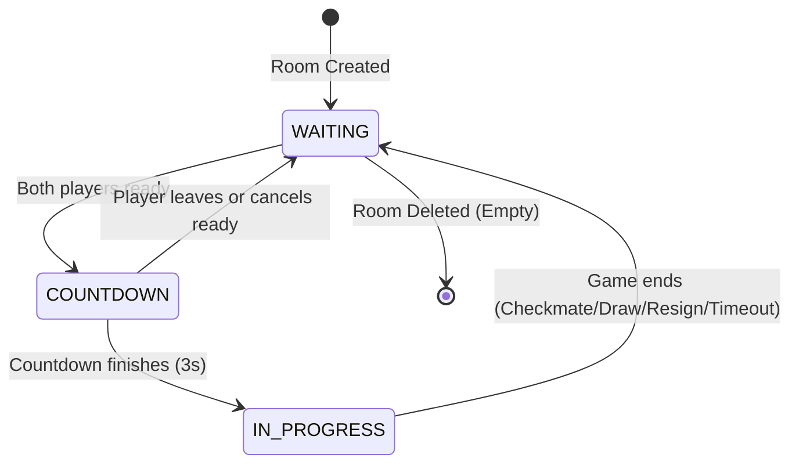
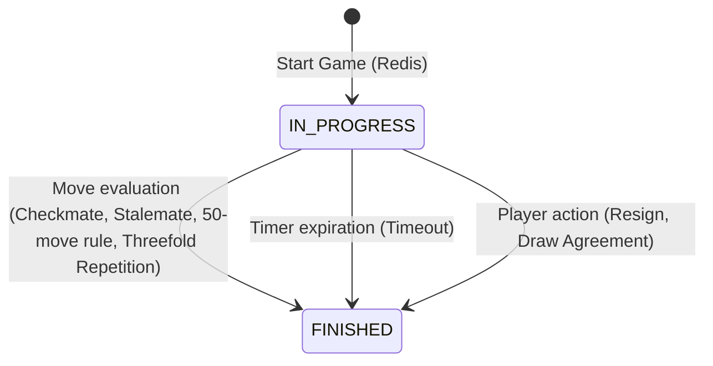
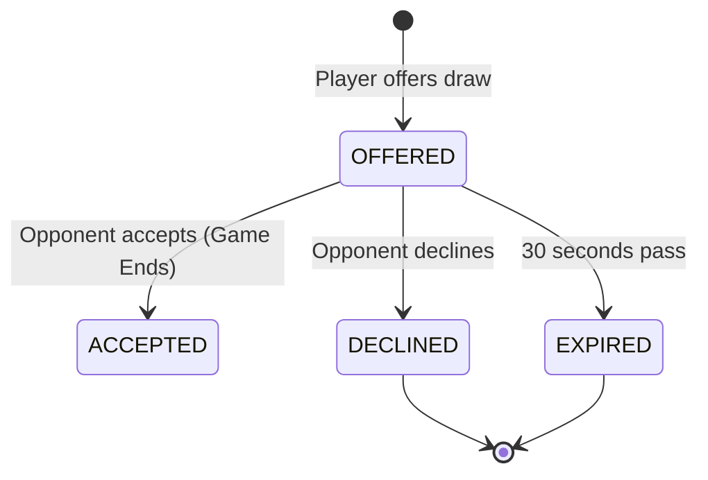
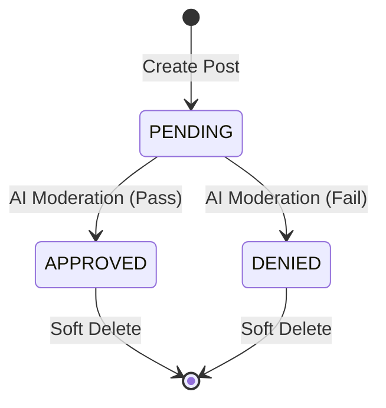
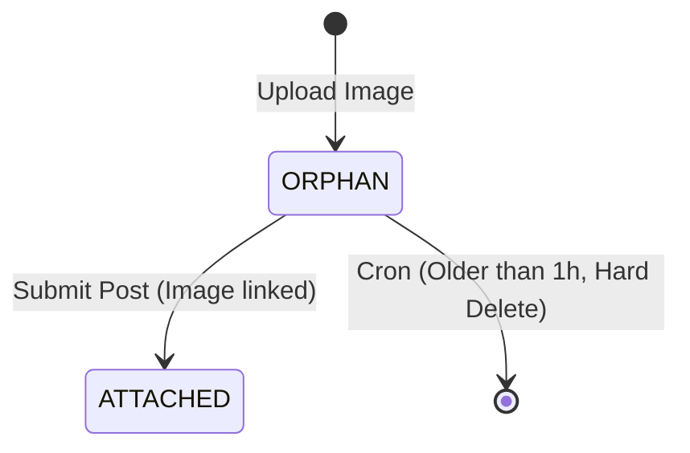

# State Machines
# State Machines

## User Presence State Machine
- **OFFLINE**: Initial state.
- **ONLINE**: User has >0 active WebSocket sessions. (Trigger: `handleConnect`)
- **IN_ROOM**: User is actively in a game room. (Set externally, respected by presence).
- **Transition: ONLINE -> OFFLINE**: All sessions expire or disconnect. (Trigger: `handleDisconnect`)
- **Transition: IN_ROOM -> OFFLINE (Grace)**: Disconnect while in room leaves user in a grace period for reconnection before full offline.

## Notification State Machine
- **UNREAD**: Initial state upon creation.
- **READ**: Triggered by user viewing the notification (`markAsRead` or `markAllAsRead`). Terminal state.
# Chess State Machines

## Room Status State Machine

## Game State Machine

## Draw Offer State Machine

# Forums State Machines

## Post Status State Machine

## PostImage Status State Machine

