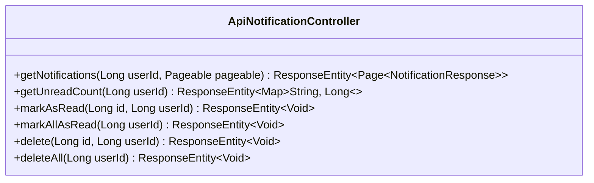

# Đặc tả API: Notifications (Notifications API Specification)

Tài liệu này đặc tả chi tiết về các API quản lý và xử lý thông báo của người dùng.

---

## 1. Tổng quan & Xác thực

Tất cả các API dưới đây có tiền tố (base path) là `/api/notifications`.
Mọi yêu cầu đều yêu cầu xác thực bằng Access Token thông qua Header `Authorization: Bearer <token>`.

---

## 2. Danh sách các API Endpoints



### 2.1. Lấy danh sách thông báo phân trang (Get Notifications)

- **Endpoint:** `GET /api/notifications`
- **Mô tả:** Lấy toàn bộ thông báo của người dùng hiện tại dưới dạng phân trang (mặc định 20 phần tử trên mỗi trang, sắp xếp theo ID giảm dần).
- **Headers:**
    - `Authorization: Bearer <Access_Token>` (Bắt buộc)
- **Query Parameters (Phân trang tiêu chuẩn Spring Data):**
    - `page` (Integer): Số trang (0-indexed). Mặc định là `0`.
    - `size` (Integer): Số phần tử trên một trang. Mặc định là `20`.
    - `sort` (String): Trường sắp xếp (ví dụ: `id,desc`).
- **Response:**
    - **Success:** `200 OK`
      ```json
      {
        "content": [
          {
            "id": 10,
            "sender": {
              "id": 2,
              "username": "another_user",
              "avatarUrl": "https://example.com/avatar2.jpg"
            },
            "type": "POST_LIKE",
            "title": "Lượt thích mới",
            "message": "another_user đã thích bài viết của bạn.",
            "metadata": {
              "postId": 42
            },
            "createdAt": "2026-07-16T15:47:22.000Z",
            "read": false
          }
        ],
        "pageable": {
          "sort": {
            "empty": false,
            "sorted": true,
            "unsorted": false
          },
          "offset": 0,
          "pageNumber": 0,
          "pageSize": 20,
          "paged": true,
          "unpaged": false
        },
        "totalPages": 1,
        "totalElements": 1,
        "last": true,
        "size": 20,
        "number": 0,
        "sort": {
          "empty": false,
          "sorted": true,
          "unsorted": false
        },
        "numberOfElements": 1,
        "first": true,
        "empty": false
      }
      ```
    - **Error:** `401 Unauthorized`.

---

### 2.2. Lấy số lượng thông báo chưa đọc (Get Unread Count)

- **Endpoint:** `GET /api/notifications/unread-count`
- **Mô tả:** Lấy tổng số lượng thông báo chưa đọc của người dùng hiện tại.
- **Headers:**
    - `Authorization: Bearer <Access_Token>` (Bắt buộc)
- **Response:**
    - **Success:** `200 OK`
      ```json
      {
        "count": 5
      }
      ```
    - **Error:** `401 Unauthorized`.

---

### 2.3. Đánh dấu một thông báo là đã đọc (Mark as Read)

- **Endpoint:** `PATCH /api/notifications/{id}/read`
- **Mô tả:** Đánh dấu thông báo cụ thể là đã đọc.
- **Headers:**
    - `Authorization: Bearer <Access_Token>` (Bắt buộc)
- **Path Parameters:**
    - `id` (Long): ID của thông báo cần đánh dấu.
- **Response:**
    - **Success:** `204 No Content` (Không trả về body).
    - **Error (Not Found / Unauthorized):** `404 Not Found` (nếu không tìm thấy thông báo hoặc thông báo không thuộc về người dùng hiện tại), `401 Unauthorized`.

---

### 2.4. Đánh dấu tất cả thông báo là đã đọc (Mark All as Read)

- **Endpoint:** `PATCH /api/notifications/read-all`
- **Mô tả:** Đánh dấu tất cả thông báo của người dùng hiện tại là đã đọc.
- **Headers:**
    - `Authorization: Bearer <Access_Token>` (Bắt buộc)
- **Response:**
    - **Success:** `204 No Content` (Không trả về body).
    - **Error:** `401 Unauthorized`.

---

### 2.5. Xóa một thông báo (Delete Notification)

- **Endpoint:** `DELETE /api/notifications/{id}`
- **Mô tả:** Xóa một thông báo cụ thể.
- **Headers:**
    - `Authorization: Bearer <Access_Token>` (Bắt buộc)
- **Path Parameters:**
    - `id` (Long): ID của thông báo cần xóa.
- **Response:**
    - **Success:** `204 No Content` (Không trả về body).
    - **Error (Not Found / Unauthorized):** `404 Not Found` (nếu không tìm thấy hoặc thông báo không thuộc sở hữu), `401 Unauthorized`.

---

### 2.6. Xóa tất cả thông báo (Delete All Notifications)

- **Endpoint:** `DELETE /api/notifications`
- **Mô tả:** Xóa toàn bộ thông báo của người dùng hiện tại.
- **Headers:**
    - `Authorization: Bearer <Access_Token>` (Bắt buộc)
- **Response:**
    - **Success:** `204 No Content` (Không trả về body).
    - **Error:** `401 Unauthorized`.

---

## 3. Định dạng lỗi & Xử lý lỗi chung

*(Tham chiếu cấu trúc lỗi chung từ Auth API Specification)*
